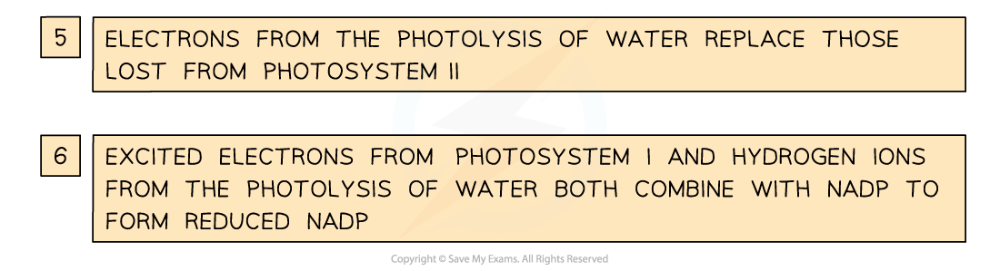
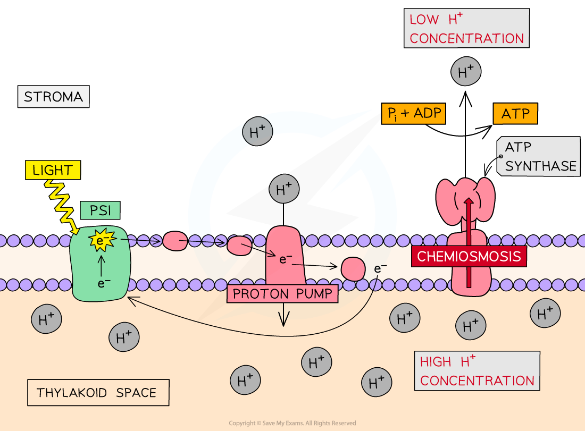

Light-dependent Reactions
-------------------------

* Photosynthesis takes place in two distinct stages

  + The <b>light-dependent reactions</b>, which rely on light directly
  + The <b>light-independent reactions</b>, which do not use light directly, though do rely on the products of the light-dependent reactions
* Both these sets of reactions take place within the <b>chloroplast</b>

  + The light-dependent reactions take place across the <b>thylakoid membrane</b>
  + The light-independent reactions take place in the <b>stroma</b>
* Light energy in the light-dependent reactions enables the splitting of water molecules in a reaction known as <b>photolysis</b>

  + Photolysis of one molecule of water, or H2O, produces

    - 2 <b>hydrogen ions</b> (2H+), also known as<b> protons</b>
    - 2 <b>electrons</b> (2e-)
    - One atom of <b>oxygen</b> (O)
  + The hydrogen ions and electrons are used during the light-dependent reactions while the oxygen is given off as a waste product
* During the light-dependent reactions <b>light energy</b> is converted into <b>chemical energy</b> in the form of <b>ATP</b> and <b>reduced NADP</b>

  + NADP is a type of molecule called a coenzyme; its role is to <b>transfer hydrogen</b> from one molecule to another
  + When NADP gains hydrogen, it is <b>reduced</b> and can be known as either <b>reduced NADP</b> or <b>NADPH</b>
  + Remember that

    - <b>Reduction</b> is <b>gain of electrons</b>, <b>gain of hydrogen</b>, or <b>loss of oxygen</b>
    - <b>Oxidation</b> is <b>loss of electrons</b>, <b>loss of hydrogen</b>, or <b>gain of oxygen</b>
  + Reduced NADP can <b>reduce</b> other molecules by <b>giving away hydrogen</b>
  + NADP can <b>oxidise</b> other molecules by <b>receiving hydrogen</b>
* The <b>useful products of the light-dependent reactions, ATP and NADPH</b>, are transferred to the <b>light-independent reactions </b>within the chloroplast

<i><b>The products of the light-dependent reaction are ATP, NADPH, and oxygen. Oxygen is given off as a waste product while ATP and NADPH pass to the light-independent reactions. The ADP and NADP produced during the light-independent reaction can pass back to the light-dependent reactions to allow more ATP and NADPH to be produced.</b></i>

#### Production of ATP and NADPH

* ATP and NADPH are produced during the light-dependent reactions as a result of a series of events that occur on the thylakoid membrane known as <b>photophosphorylation</b>

  + Photo = light
  + Phosphorylation = the addition of phosphate; in this case to ADP to form ATP
* Two types of photophosphorylation take place

  + <b>Non-cyclic photophosphorylation</b>

    - This produces both ATP and NADPH
  + <b>Cyclic photophosphorylation</b>

    - This produces ATP only
* Both cyclic and non-cyclic photophosphorylation involve

  + A series of <b>membrane proteins</b> which together make up the <b>electron transport chain</b>

    - Electrons pass from one protein to another along the electron transport chain, releasing energy as they do so
  + <b>Chemiosmosis</b>

    - The energy released as electrons pass down the electron transport chain is used to produce ATP

#### Non-cyclic photophosphorylation

* <b>Light energy </b>hits <b>photosystem II</b> in the thylakoid membrane

  + It is slightly confusing that photosystem II comes first in this sequence; the numbers simply reflect the order in which the photosystems were discovered
* Two <b>electrons</b> gain energy and are said to be <b>excited</b> to a <b>higher energy level</b>
* The excited electrons leave the photosystem and pass to the first protein in the <b>electron transport chain</b>

  + As the excited electrons leave photosystem II they are <b>replaced</b> by electrons from the <b>photolysis</b> of water
* The electrons pass down the <b>chain of electron carriers</b> known as an <b>electron transport chain</b>
* <b>Energy is released</b> as the electrons pass down the electron transport chain which enables <b>chemiosmosis</b> to occur

  + <b>H­­</b><b>+</b><b> ions </b>are <b>pumped</b> from a low concentration in the stroma to a high concentration in the thylakoid space, generating a concentration gradient across the thylakoid membrane
  + H­­+ ions <b>diffuse</b> back across the thylakoid membrane into the stroma <b>via ATP synthase enzymes</b> embedded in the membrane
  + The movement of H­­+ ions causes the ATP synthase enzyme to catalyse the <b>production of ATP</b>
* At the end of the electron transport chain the electrons from photosystem II are passed to photosystem I
* Light energy also hits photosystem I, exciting another pair of electrons which leave the photosystem
* The excited electrons from photosystem I also pass along an <b>electron transport chain</b>
* These electrons combine with <b>hydrogen ions</b> from the photolysis of water and the <b>coenzyme NADP</b> to form <b>reduced NADP</b>

<b>H</b><b>+</b><b> + 2e</b><b>-</b><b> + NADP</b><b>+</b><b> → NADPH</b>

* The reduced NADP and the ATP pass to the <b>light-independent reactions</b>

<i><b>Non-cyclic photophosphorylation involves photosystems I and II and produces both ATP and NADPH</b></i>

#### Cyclic photophosphorylation

* <b>Light </b>hits photosystem I
* Electrons are <b>excited</b> to a <b>higher energy level </b>and leave the photosystem
* The excited electrons pass along the <b>electron transport</b> <b>chain</b>, releasing energy as they do so
* The energy released as the electrons pass down the electron transport chain provides energy to drive the process of <b>chemiosmosis</b>

  + <b>H­­</b><b>+</b><b> ions </b>are <b>pumped</b> from a low concentration in the stroma to a high concentration in the thylakoid space, generating a concentration gradient across the thylakoid membrane
  + H­­+ ions <b>diffuse</b> back across the thylakoid membrane into the stroma <b>via ATP synthase enzymes</b> embedded in the membrane
  + The movement of H­­+ ions cause the ATP synthase enzyme to catalyse the <b>production of ATP</b>
* At the end of the electron transport chain the electrons <b>rejoin photosystem I</b> in a complete cycle; hence the term <b>cyclic</b> photophosphorylation
* The ATP produced enters the light-independent reaction

<i><b>Cyclic photophosphorylation involves Photosystem I and produces ATP</b></i>