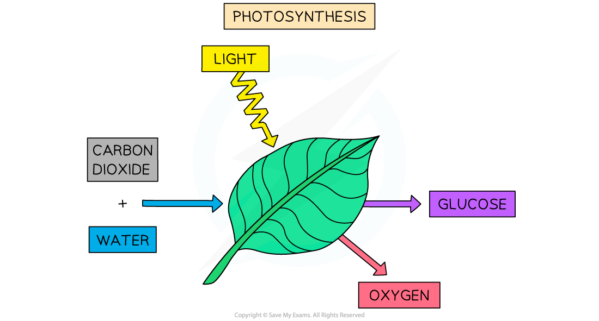
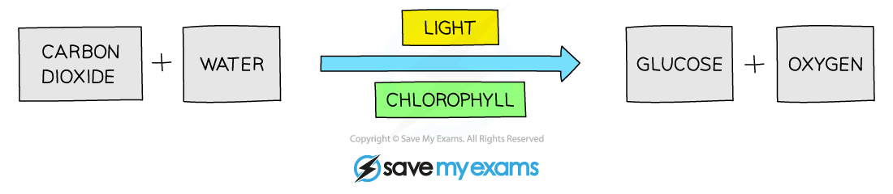
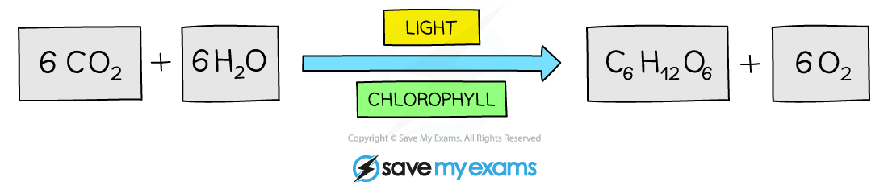

Photosynthesis: An Overview
---------------------------

* <b>Photosynthesis</b> is a series of chemical reactions that occurs in <b>producers </b>such as plants and algae
* Photosynthesis converts <b>light energy</b> into <b>chemical energy</b> which is then stored in the biomass of producers
* The light energy is used to <b>split strong bonds</b> in <b>water molecules</b> (H2O), releasing <b>hydrogen</b> and <b>oxygen</b>
* Oxygen is <b>released into the atmosphere</b> as a waste product
* Hydrogen is<b> combined with carbon dioxide</b> to produce <b>glucose</b>

  + <b>Chemical energy is stored</b> within the <b>bonds</b> in glucose molecules; glucose can therefore function as a <b>fuel</b> for respiration
  + It can be said that <b>hydrogen is stored in glucose</b> molecules

<i><b>Photosynthesis requires energy from light to split water molecules. The resulting hydrogen combines with carbon dioxide and is stored in glucose, which fuels respiration. Oxygen is released as a waste product.</b></i>