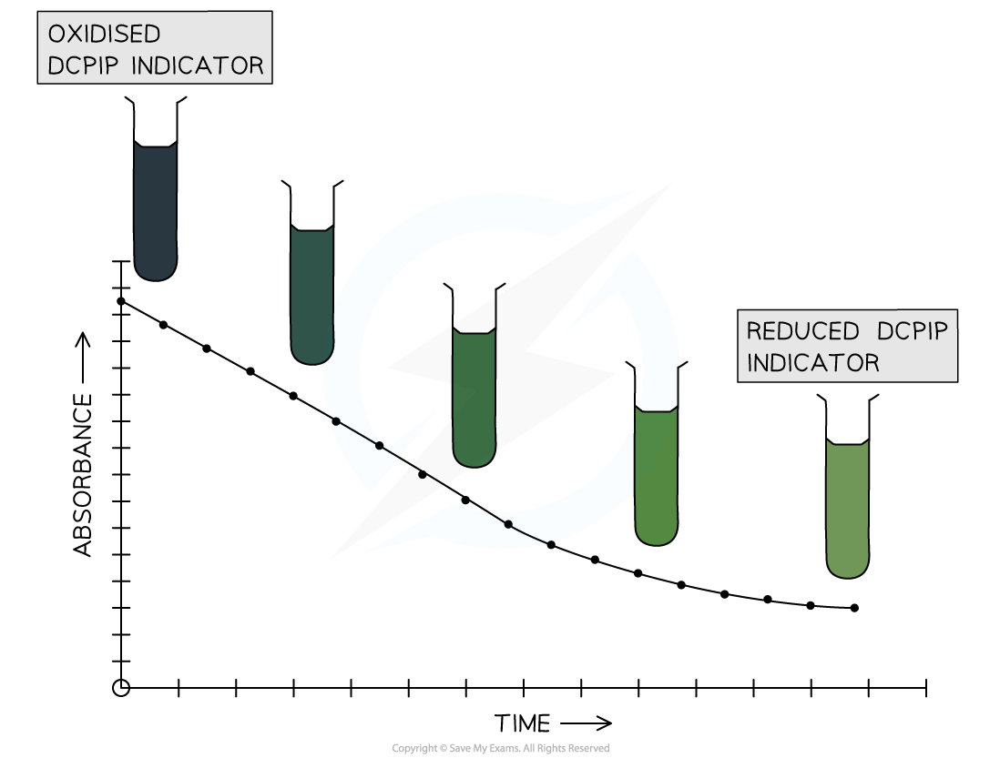

Practical: The Hill Reaction
----------------------------

* The <b>light-dependent reactions</b> of photosynthesis take place in the thylakoid membrane and involve the <b>release of high-energy electrons</b> from chlorophyll molecules in photosystems
* These electrons are picked up by the coenzyme<b> NADP </b>along with hydrogen ions from photolysis, forming <b>NADPH</b>, or <b>reduced NADP</b>

  + NADP is said to be the <b>electron acceptor</b> in this process
* The formation of NADPH in this way is known as the<b> Hill reaction</b>, named after scientist Robert Hill who discovered the process
* The <b>rate of the Hill reaction </b>can be studied using indicators such as <b>DCPIP</b> and <b>methylene blue</b>

  + When present these indicators <b>accept the electrons instead of NADP</b>
  + This causes the indicators to <b>change colour</b>

    - Oxidised DCPIP (<b>blue</b>) → DCPIP accepts electrons → reduced DCPIP (<b>colourless</b>)
    - Oxidised methylene blue (<b>blue</b>) → methylene blue accepts electrons → reduced methylene blue (<b>colourless</b>)
    - Note that the colour of the reduced solution may appear green due to the presence of chlorophyll
* The <b>rate</b> at which the indicator changes colour from its <b>oxidised</b> (blue) state to its <b>reduced</b> (colourless) state can be used as a measure of the <b>rate of the Hill reaction</b>

  + A faster colour change means a faster rate of reaction, and vice versa

<i><b>DCPIP and methylene blue are indicators that accept electrons, causing them to change from blue to colourless. The rate at which this colour change takes place indicates the rate at which the Hill reaction is taking place.</b></i>

#### Investigating the rate of the Hill reaction

#### Apparatus

* Leaves e.g. spinach
* Pestle and mortar or food blender
* Isolation solution containing sucrose, potassium chloride and a pH 7 buffer
* Funnel
* Filter paper or cloth
* Beaker
* Centrifuge and centrifuge tubes
* Glass rods
* Ice-cold water bath
* Colorimeter and cuvettes
* Test tubes and rack
* Lamp
* DCPIP indicator
* Dropping pipette

#### Method

1. Grind up the leaves with 20 cm3 isolation solution in a pestle and mortar or blend them in a food blender for 10 seconds

   * This <b>breaks apart the tissues</b> of the leaf
   * The isolation medium will <b>prevent cell damage</b> due to osmosis or extreme pH
2. Filter the resulting liquid into a clean beaker using a funnel and some filter paper or cloth

   * This removes <b>large pieces of leaf tissue</b>
3. Transfer the filtered liquid into a centrifuge tube and centrifuge for 10 minutes

   * This will result in a <b>pellet of chloroplasts</b> forming at the bottom of the tube
4. Discard the liquid in the centrifuge tube and keep the pellet

   * The liquid here is known as the <b>supernatant</b>
5. Place 2 cm3 fresh isolation medium and the chloroplast pellet into a clean test tube, stirring with a glass rod to re-suspend the chloroplasts in the liquid; this is now the <b>chloroplast extract</b>
6. Transfer the chloroplast extract to an ice-cold water bath

   * The cold temperature of the water bath <b>slows down the activity</b> of the chloroplasts
7. Place a test tube containing 0.5 cm3 chloroplast extract into a test tube rack set up at a set distance from a lamp

   * A beaker of water can be placed in between the lamp and the rack here to <b>prevent a temperature increase</b> due to heat from the lamp
8. Add 5 cm3 DCPIP solution to the chloroplast extract and mix together using a clean glass rod
9. Use a pipette to <b>immediately </b>remove a sample of the DCPIP-chloroplast mixture and place the sample into a clean cuvette

   * A <b>cuvette </b>is a small plastic container with clear, colourless sides designed for use in a colorimeter
10. Place the cuvette into a colorimeter and take a reading for absorbance

    * A <b>colorimeter</b> is a piece of equipment used to <b>measure how much light passes through or is absorbed by a solution</b>
    * The amount of light that passes through is <b>transmission</b> while the light absorbed is <b>absorbance</b>
11. Repeat steps 9-10 every minute for 10 minutes
12. Repeat steps 7-11 at least twice more, ensuring that the distance from the lamp and the timings of the samples are kept the same

#### Results

* The absorbance reading of the colorimeter should <b>decrease</b> over the 10 minute test period as the <b>DCPIP indicator is reduced</b> by electrons in the chloroplasts

  + The solution changes from <b>blue to colourless</b> as the <b>DCPIP is reduced, </b>reducing the amount of light that is absorbed by the solution
* A<b> graph of absorbance against time</b> can be plotted to show the <b>rate of the Hill reaction</b>
* Changing variables such as light intensity, light wavelength, or temperature of the chloroplast extract would allow the <b>effect of different variables on the rate of the Hill reaction</b> to be studied

<i><b>DCPIP indicator changes colour from blue to colourless as it is reduced.  Note that the presence of chloroplasts in the solution causes it to appear green rather than colourless.</b></i>