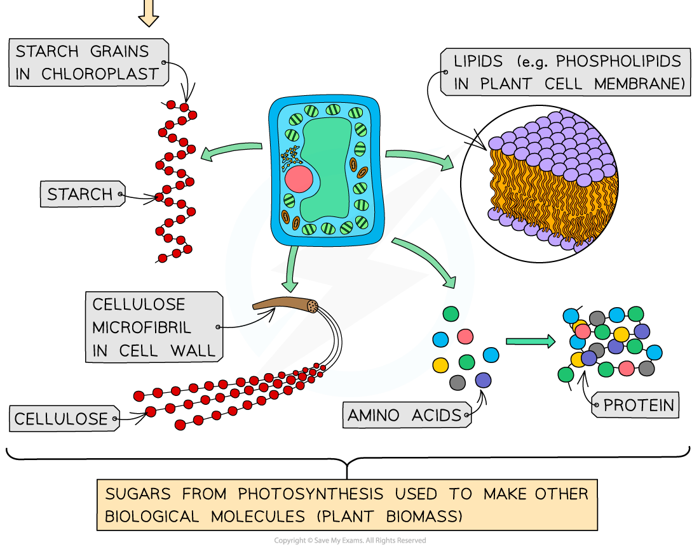

Products of Photosynthesis
--------------------------

* Intermediate molecules of the Calvin cycle such as <b>glycerate 3-phosphate (GP) </b>and <b>glyceraldehyde 3-phosphate (GALP)</b> are used to produce <b>other biological molecules</b> needed by plants
* <b>GP</b> is used to produce

  + <b>Amino acids</b> which can be used in protein synthesis for building polypeptides
  + <b>Fatty acids</b> which form the tails of lipid molecules such as triglycerides and phospholipids
* <b>GALP</b> is used to produce:

  + <b>Hexose sugars </b>e.g. glucose<b> </b>

    - Hexose sugars can be converted into other hexose sugars e.g. glucose can be converted to <b>sucrose</b> for transport in the phloem
    - Hexose sugars can be joined to make polysaccharides such as <b>starch</b> and <b>cellulose</b>
  + <b>Glycerol</b> can be used for building <b>lipid</b> molecules such as triglycerides and phospholipids
  + <b>Nucleic acids </b>form the basis of DNA and RNA
* Glucose can be used by the plant in respiration while other biological molecules are used to <b>build new plant </b>biomass

  + The molecules that make up plant biomass are <b>passed on to consumers</b> when plant tissue is eaten

<i><b>The products of photosynthesis include amino acids, polysaccarides, lipids and nucleic acids</b></i>