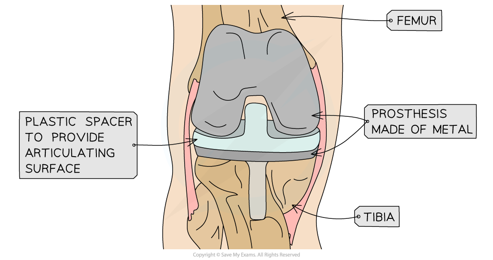

Modern Medicine & Participation in Sports
-----------------------------------------

#### Keyhole surgery

* <b>Sports injuries</b> are a common occurrence since the body is placed <b>under stress</b> when participating in sporting activities
* Some of these injuries can result in <b>permanent damage</b>, but with the correct treatment it is possible to make a full recovery from sports injuries
* <b>Advances in medical technology</b> has enabled professional athletes to recover from injuries that previously may have ended their career
* <b>Keyhole surgery </b>is one example of the medical advances that have been made

  + It is a <b>less invasive </b>procedure as only <b>small incisions</b> are made in the skin
  + A <b>small video camera</b> is inserted into the incision, along with <b>specialised medical instruments</b> with which to perform the surgery
  + There are multiple <b>advantages of keyhole surgery </b>compared to conventional surgery:

    - <b>Less blood loss</b> and <b>scarring</b> of the skin
    - <b>Less pain</b> after surgery and a <b>quicker recovery</b>
    - This leads to a <b>shorter hospital stay</b> and the patient can <b>quickly return</b> to doing normal activities
* An example of keyhole surgery is fixing a <b>damaged cruciate ligament</b>

  + The cruciate ligaments are found in the <b>middle of the knee</b> and it <b>connects</b> the <b>thigh bone</b> to the <b>lower leg bone</b>
  + The damaged ligament can be removed and <b>replaced by a graft</b> from another tendon in the patient's leg or from a donor's tendon

#### Prostheses

* Injuries may sometimes result in people <b>losing or damaging a body part</b> to the extent that they can no longer use it
* In some cases, a person may be born <b>without</b> certain body parts
* In both these cases, the missing or damaged body part may be replaced with an <b>artificial version</b> called a <b>prosthesis</b>

  + They may replace <b>entire limbs</b> (e.g. legs or hands) or <b>parts of limbs</b> (e.g. hip or knee joints)
  + Some prostheses may be <b>connected to electronic devices</b> that can 'read' information form the nervous system in order to operate the body part (e.g. hand prostheses enabling the user to move the fingers)
* Prostheses enables individuals to <b>participate in sport again,</b> even after serious injuries
* An example of the use of a prosthesis is <b>replacing a damaged knee joint</b>

  + The damaged cartilage and bone is replaced by a <b>metal device</b> on both long bones to create a smooth surface for articulation
  + A plastic spacer is often inserted between the metal ends of the prosthesis to provide <b>cushioning </b>and<b> reduce the impact</b> on the knee
  + The knee prosthesis enables those with serious knee injuries to be <b>more mobile</b> and even participate in <b>low-impact sports</b>

<i><b>A knee prosthesis can replace a damaged knee joint and provide mobility to a patient</b></i>

Use of Performance-enhancing Drugs in Sports
--------------------------------------------

* Drugs that can improve a person's performance in sport or athletic activities are known as <b>performance-enhancing drugs</b>
* When taken by people participating in competitive sporting events, it will give them an <b>unfair advantage</b> over their opponents
* There are many different kinds of performance-enhancing drugs that may affect the body in different ways

  + <b>Anabolic steroids</b> which <b>increase muscle size</b> to give the user <b>increased strength, speed</b> and <b>stamina</b> but may lead to organ damage and increased aggression
  + <b>Stimulants </b>which make the used <b>more alert</b> and able to <b>react faster</b>, they will have greater endurance but it may also lead to aggressive behaviour
  + <b>Narcotic analgesics</b> which are very <b>strong painkillers</b> that enables users to <b>maintain their performance </b>despite suffering from injuries
* Due to the <b>enhanced performance</b> and <b>health risks </b>associated with taking these drugs, they are <b>banned</b> from most competitive sports
* <b>Random drug tests</b> are performed on athletes and if the results are positive, they may be banned from competing and may lose any medals or awards that they have won in the past

#### Ethical positions on the use of performance-enhancing drugs

* There are two groups with opposing views on the use of performance-enhancing drugs

  + <b>Rationalists</b> think there may be times when their use is justified
  + <b>Absolutists</b> think that they are morally wrong and should be banned from all sport

#### Arguments for the use of performance-enhancing drugs

* This view is supported by <b>rationalists</b> who believe these drugs should be allowed under certain circumstances

  + Athletes should have the <b>freedom to choose</b> whether they want to deal with the risks of taking these drugs
  + Performance-enhancing drugs <b>may help overcome inequalities</b> in competitive sport, since athletes have do not have access to the same opportunities to improve themselves (e.g. facilities, training equipment or coaches)
  + <b>Competing at a higher level</b> may only be possible for some athletes if they are using performance-enhancing drugs

#### Arguments against the use of performance-enhancing drugs

* This view is supported by <b>absolutists</b> who believe these drugs should be banned from all sports and not be taken under any circumstance

  + Many performance-enhancing drugs are <b>illegal</b>
  + These drugs give athletes an <b>unfair advantage</b> over those who do not take them. Performance should be the result of training and hard work only
  + The <b>health risks</b> associated with these drugs are serious, and include a variety of side effects
  + There is the question of whether athletes are <b>fully informed</b> about the health risks involved with taking these drugs