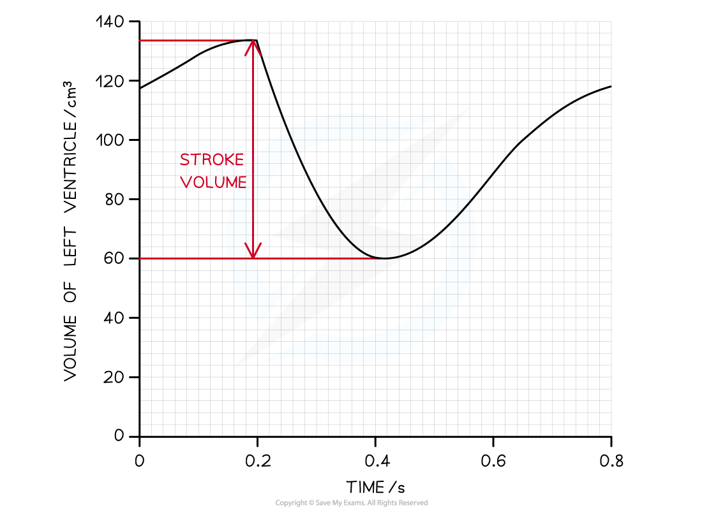

Calculating Cardiac Output
--------------------------

* <b>Cardiac output</b> (CO) is the term used to describe the volume of blood that is pumped by the heart (the left and right ventricle) per unit of time
* An average adult has a cardiac output of roughly 4.7 litres of blood per minute when at <b>rest</b>
* Individuals who are <b>fitter</b> often have <b>higher cardiac outputs</b> due to having thicker and stronger ventricular muscles in their hearts
* Cardiac output <b>increases</b> when an individual is <b>exercising</b>

  + This is so that the blood supply can match the increased metabolic demands of the cells
* The CO of an individual can be calculated using their <b>heart rate </b>and <b>stroke volume</b>
* <b>Heart rate</b> is the <b>number of times a heart beats per minute</b>

  + This can also be described as the number of cardiac cycles per minute
* <b>Stroke volume</b> is the <b>volume of blood pumped out of the left ventricle during one cardiac cycle</b>

<i><b>Graph showing the changes in the volume of the left ventricle within one cardiac cycle; this is the stroke volume</b></i>

### Cardiac output formula

* Cardiac output is found by multiplying the heart rate by the stroke volume:

<b>Cardiac output = heart rate x stroke volume</b>

* The equation can be rearranged to find the heart rate and stroke volume if required:

  + Heart rate = cardiac output ÷ stroke volume
  + Stroke volume = cardiac output ÷ heart rate
* <b>Cardiac output </b>is measured in <b>cm</b><b>3</b><b> min</b><b>-1</b>
* <b>Heart rate</b> is measured in <b>beats per min </b>(bpm)
* <b>Stroke volume</b> is measured in <b>cm</b><b>3</b>

#### Worked Example

A woman took 1.2 seconds to complete a single cardiac cycle. The stroke volume of her heart was measured at 75 cm3. Calculate the cardiac output, give your answer in dm3.

<b>Answer:</b>  
  
<b>Step 1: Find the heart rate</b>

One cardiac cycle (atrial systole, ventricular systole and diastole) takes 1.2 seconds

To find the number of cardiac cycles completed in a minute, multiply by 60

60 x 1.2 = 72 bpm

<b>  Step 2: Insert relevant figures into the equation</b>

Cardiac output = heart rate x stroke volume

Cardiac output = 72 x 75 = 5,400 cm3

Cardiac output = <u><b>5.40 dm</b></u><u><b>3</b></u>

#### Worked Example

An athlete runs a 10 km marathon, after which his heart rate was measured at 110 bpm and his cardiac output was determined to be 9,800 cm3.

Calculate the stroke volume after the marathon.

<b>Answer:</b>  
  
Stroke volume = cardiac output ÷ heart rate

Stroke volume = 9,800 ÷ 110

Stroke volume = <u><b>89.09 cm</b></u><u><b>3</b></u>

#### Examiner Tips and Tricks

1 dm3 is equal to 1000 cm3. It can be useful to convert all the figures found in the first question into the <b>same units</b> before starting your workout, that way you are less likely to make any mistakes!