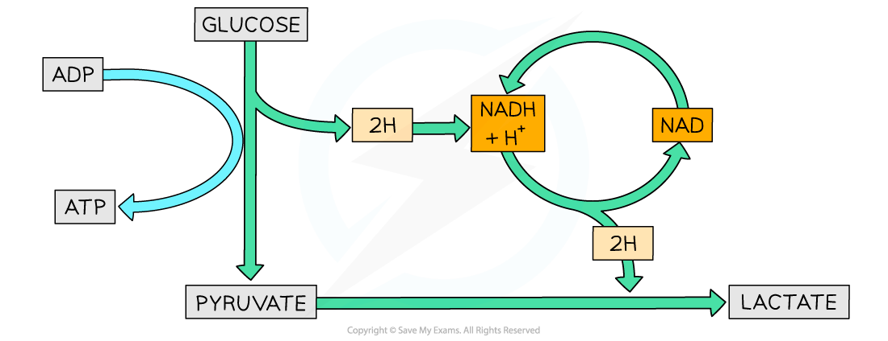

Anaerobic Respiration
---------------------

* Sometimes cells experience conditions with <b>little or no oxygen</b>
* There are several consequences when there is not enough oxygen available for respiration:

  + There is <b>no final acceptor</b> (oxygen)<b> of electrons</b> from the electron transport chain
  + The <b>electron transport chain stops</b> functioning
  + <b>No more ATP</b> is produced <b>via oxidative phosphorylation</b>
  + Reduced NAD and FAD <b>aren’t oxidised</b> by an electron carrier
  + No oxidised NAD and FAD are available for <b>dehydrogenation</b> in the Krebs cycle
  + The <b>Krebs cycle stops</b>
  + The <b>link reaction also stops</b>
* However, there is still a way for cells to produce some ATP in low oxygen conditions through <b>anaerobic respiration</b>

#### Anaerobic pathways

* Some cells are able to <b>oxidise the reduced NAD</b> produced during glycolysis so it can be used for further hydrogen transport
* This means that <b>glycolysis can continue</b> and <b>small amounts of ATP</b> are still produced
* Certain types of micro-organisms and mammalian muscle cells use <b>lactate fermentation</b>

#### Lactate fermentation

* In this pathway reduced NAD transfers hydrogen to pyruvate to form lactate
* <b>NAD</b> can now be <b>reused in glycolysis</b>
* <b>Pyruvate is reduced</b> to lactate by enzyme lactate dehydrogenase
* Pyruvate is the hydrogen acceptor
* The final product lactate can be further metabolised
* A small amount of ATP is produced

<i><b>The pathway of lactate fermentation</b></i>

Processing Lactate
------------------

* Lactate (lactic acid) can build up in the cells after a period of time
* After lactate is produced two things can happen:

  + It can be <b>oxidised back to pyruvate</b> which is then channelled into the Krebs cycle for ATP production
  + It can be <b>converted into glucose </b>by the liver cells for use during respiration or for storage (in the form of glycogen)

* The oxidation of lactate back to pyruvate needs extra oxygen

  + This extra oxygen is referred to as an <b>oxygen debt</b>
  + It explains why animals <b>breathe deeper and faster after exercise</b>