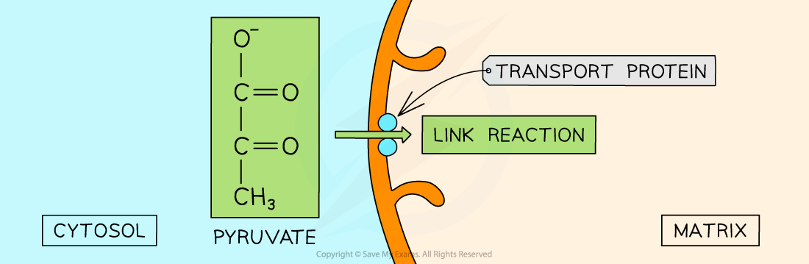

Link Reaction
-------------

* The end product of glycolysis is <b>pyruvate</b>
* Pyruvate contains a substantial amount of chemical energy that can be further utilised in respiration to produce more ATP
* The enzymes and coenzymes that are required for the link reaction are found in the mitochondrial matrix
* When <b>oxygen is available</b> pyruvate will <b>enter the mitochondrial </b><b>matrix</b> and <b>aerobic </b>respiration will continue
* Pyruvate moves across the double membrane of the mitochondria via <b>active transport</b>

  + It requires a transport protein and a small amount of ATP
* Once in the mitochondrial matrix <b>pyruvate</b> takes part in the <b>link reaction</b>

<i><b>Pyruvate enters the mitochondrial matrix from the cytosol (cytoplasm) by active transport</b></i>

* The link reaction takes place in the matrix of the mitochondria
* It is referred to as the link reaction because it <b>links</b> <b>glycolysis</b> to the <b>Krebs cycle</b>
* The steps are:

  + <b>Pyruvate is oxidised</b> (hydrogen is removed) by enzymes to produce <b>acetate, CH</b><b>3</b><b>CO(O)</b> (also known as acetic acid)
  + Pyruvate is also <b>decarboxylated</b> (carbon is removed) in the form of<b> carbon dioxide</b>
  + <b>Reduction of NAD</b> to NADH or reduce NAD by collecting hydrogen from pyruvate
  + <b>Acetate combines with coenzyme A </b>to form <b>acetyl coenzyme A (acetyl CoA)</b>
* <b>No ATP is produced </b>during the link reaction
* It produces:

  + Acetyl coA
  + Carbon dioxide (CO2)
  + Reduced NAD (NADH)

<b>pyruvate + NAD + CoA → acetyl CoA + carbon dioxide + reduced NAD</b>

<i><b>The link reaction occurs in the mitochondrial matrix. It dehydrogenates and decarboxylates the three-carbon pyruvate to produce the two-carbon acetyl CoA that can enter the Krebs Cycle</b></i>

* Every <b>molecule of glucose</b> produces <b>two pyruvate molecules</b>
* The link reaction and the Krebs cycle will therefore <b>occur twice</b> for every molecule of glucose
* Thus, each molecule of glucose will produce:

  + <b>Two</b> molecules of <b>acetyl CoA</b>
  + <b>Two</b> molecules of <b>CO</b><b>2</b>
  + <b>Two</b> molecules of <b>reduced NAD</b>

Krebs Cycle
-----------

* The Krebs cycle (sometimes called the citric acid cycle) consists of a <b>series of enzyme-controlled reactions</b>
* <b>2 carbon (2C) Acetyl CoA </b>enters the circular pathway from the <b>link reaction</b> in glucose metabolism

  + Acetyl CoA formed from <b>fatty acids </b>(after the breakdown of lipids) and <b>amino acids</b> enters directly into the Krebs Cycle from other metabolic pathways
* 4 carbon (<b>4C</b>) <b>oxaloacetate</b> accepts the <b>2C acetyl</b> fragment from acetyl CoA to form the 6 carbon (<b>6C)</b> <b>citrate</b>

  + Coenzyme A is released in this reaction to be reused in the next link reaction
* <b>Citrate is then converted back to oxaloacetate</b> through a series of oxidation-reduction (redox) reactions

<i><b>The Krebs Cycle uses acetyl CoA from the link reaction and the regeneration of oxaloacetate to produce reduced NAD, reduced FAD and ATP</b></i>

#### Regeneration of Oxaloacetate

* Oxaloacetate is regenerated in the Krebs cycle through a series of <b>redox reactions</b>
* <b>Decarboxylation</b> of citrate

  + Releasing <b>2 CO</b><b>2</b> as waste gas
* <b>Oxidation</b> (dehydrogenation) of citrate

  + Releasing H atoms that <b>reduce coenzymes NAD and FAD</b>
  + These will be used during oxidative phosphorylation
  + 3 NAD and 1 FAD → <b>3NADH + H</b><b>+</b><b> and 1 FADH</b><b>2</b>
* <b>Substrate linked phosphorylation</b>

  + A phosphate is transferred from one of the intermediates to ADP, forming <b>1 ATP</b> to supply energy

* Because <b>two acetyl-CoA molecules</b> are produced from each glucose molecule, <b>two cycles are required per glucose</b> molecule
* Therefore, at the end of two cycles, the<b> products are:</b>

  + Two ATP
  + Six NADH (reduced NAD)
  + Two FADH2 (reduced FAD)
  + Four CO2

#### Examiner Tips and Tricks

The Krebs cycle is often referred to as cyclical or circular. This is because the acceptor molecule oxaloacetate is regenerated throughout the reaction so that it can start all over again by adding another acetyl CoA.

You may be asked to name the important molecules in the Krebs cycle like oxaloacetate and citrate.

It is also worth noting how the number of carbon atoms in the substrate molecule changes as the cycle progresses.