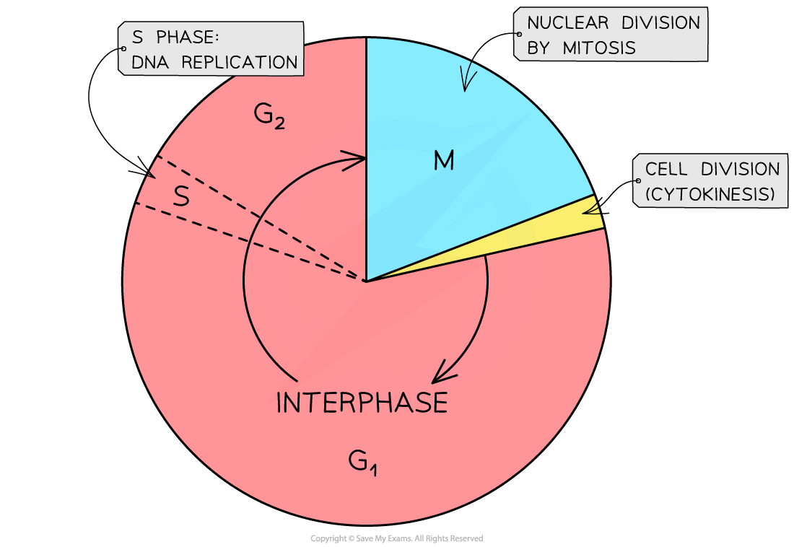

The Cell Cycle
--------------

* <b>Mitosis</b> is part of a <b>precisely controlled process</b> known as the <b>cell cycle</b>
* The cell cycle is the <b>regulated sequence of events</b> that occurs <b>between one cell division and the next</b>
* The cell cycle has three phases:

  + <b>Interphase</b>
  + <b>Nuclear division (mitosis)</b>
  + <b>Cell division (cytokinesis)</b>
* The length of the cell cycle is very variable depending on environmental conditions, the cell type and the organism

  + For example, onion root tip cells divide once every 20 hours (roughly) but human intestine epithelial cells divide once every 10 hours (roughly)
* The movement from one phase to another is triggered by chemical signals called <b>cyclins</b>

<i><b>The stages of the cell cycle</b></i>

#### Interphase

* During Interphase, the cell <b>increases in mass and size</b> and carries out its normal cellular functions (eg. synthesising proteins and replicating its DNA ready for mitosis)
* Interphase consists of <b>three</b> phases:

  + <b>G</b><b>1</b><b> phase</b>
  + <b>S phase</b>
  + <b>G</b><b>2</b><b> phase</b>
* It is at some point during the <b>G</b><b>1</b><b> phase</b> a <b>signal</b> is received telling the cell to <b>divide</b> again
* The <b>DNA in the nucleus replicates </b>(resulting in each chromosome consisting of two identical sister chromatids)
* This phase of the interphase stage of the cell cycle is called the <b>S phase</b> – <b>S</b> stands for <b>synthesis</b> (of DNA)

  + The S phase is relatively short
* The gap between the previous cell division and the S phase is called the <b>G</b><b>1</b><b> phase</b> – <b>G</b> stands for <b>gap</b>

  + <b>Cells make the RNA, enzymes and other proteins required for growth</b> during the G1 phase
* Between the S phase and next cell division event the <b>G</b><b>2</b><b> phase </b>occurs

  + During the G2 phase, the <b>cell continues to grow and the new DNA that has been synthesised is checked</b> and any errors are usually repaired
  + Other preparations for cell division are made (eg. production of tubulin protein, which is used to make microtubules for the mitotic spindle)
* <b>Interphase = G</b><b>1</b><b> + S + G</b><b>2</b>

#### Nuclear division (mitosis)

* Follows interphase
* Referred to as the <b>M phase </b>– <b>M</b> stands for <b>mitosis</b>
* <b>Cell growth stops</b> during the M phase

#### Cytokinesis

* Follows M phase
* Once the nucleus has divided into two genetically identical nuclei, the <b>whole cell divides </b>and one nucleus moves into each cell to <b>create two genetically identical daughter cells</b>
* In animal cells, cytokinesis involves <b>constriction of the cytoplasm</b> between the two nuclei and in plant cells a new cell wall is formed

#### Examiner Tips and Tricks

Make sure you know the order of the phases of the cell cycle but also what specifically occurs during the different phases. Don’t forget, interphase is itself made up of three distinct stages (G1, S and G2) and you need to know what happens during each of these.

For example, an exam question might ask you to identify the stage of the cell cycle during which a cell would be producing the most mRNA molecules and explain why. The correct answer would be the G1 phase, as this is when protein synthesis is occurring and the production of mRNA occurs during transcription (the first part of protein synthesis).