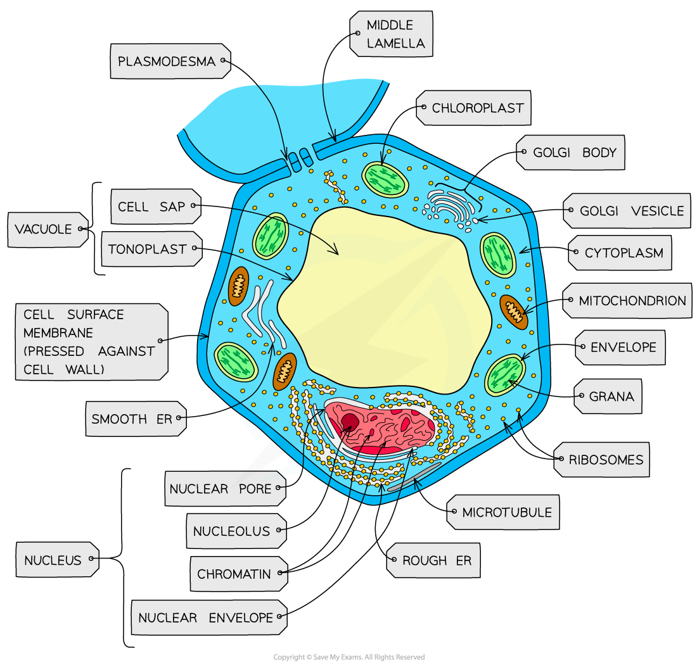
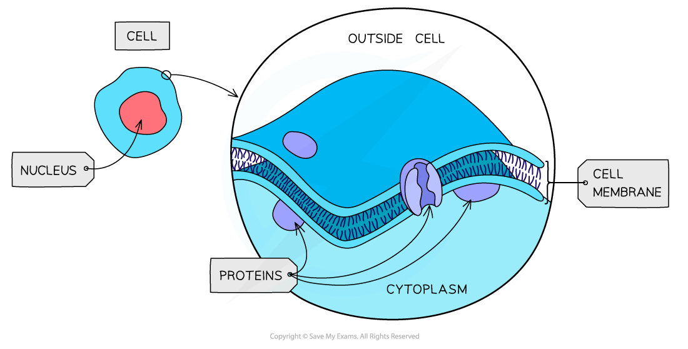
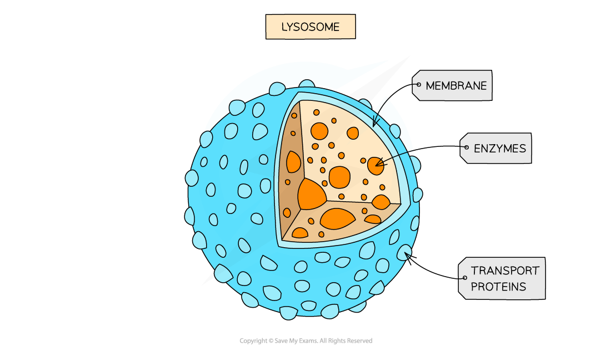

Eukaryotic Cells: Structure
---------------------------

* Cells can be divided into two broad types; <b>eukaryotic</b> and <b>prokaryotic</b> cells
* Eukaryotic cells have a <b>more complex ultrastructure</b> than prokaryotic cells

  + The term ultrastructure refers to the<b> internal structure of cells</b>
* The cytoplasm of eukaryotic cells is divided up into <b>membrane-bound compartments</b> called <b>organelles</b>
* Animal and plant cells are both types of eukaryotic cells that <b>share key structures</b> such as

  + Membrane-bound organelles, including a nucleus
  + Larger ribosomes known as 80S ribosomes
* <b>Key differences</b> between animal and plant cells include

  + Animal cells contain <b>centrioles</b> and some have <b>microvilli</b> while plant cells do not

    - Microvilli are folded regions of the cell surface membrane that increase cell surface area for absorption, e.g. in the small intestine
  + Plant cells have a <b>cellulose cell wall</b>, large permanent <b>vacuoles</b>, and <b>chloroplasts</b> while animal cells do not

<i><b>Animal cells are eukaryotic cells</b></i>

<i><b>Plant cells are eukaryotic cells with a cellulose cell wall, permanent vacuole, and chloroplasts</b></i>

#### Cell surface membrane

* All cells are surrounded by a cell surface membrane which <b>controls the exchange of material</b>s between the internal cell environment and the external environment

  + The membrane is described as being <b>partially permeable</b>, meaning that some substances can pass through the membrane while others cannot
* Cell membrane is formed from a phospholipid<b> bilayer </b>spanning a diameter of around 10 nm
* Many organelles inside cells are surrounded by cell membrane, so when referring to the outer membrane of a cell it is always a good idea to refer to it as the cell<b> surface</b> membrane

  + The cell surface membrane can also be referred to as the <b>plasma membrane</b>

<i><b>The cell surface membrane surrounds the cell, separating it from its external environment</b></i>

#### The nucleus

* Present in all eukaryotic cells, the nucleus is relatively <b>large</b> and separated from the cytoplasm by a <b>double membrane </b>called the <b>nuclear envelope,</b> which has many pores

  + Nuclear pores are important channels for allowing mRNA and ribosomes to travel out of the nucleus, as well as allowing enzymes, e.g. DNA polymerases, and signalling molecules to travel in
* The nucleus contains <b>chromatin, </b>the material from which chromosomes are made

  + Chromosomes are made of sections of <b>linear DNA</b> tightly wound around proteins called <b>histones</b>
* Usually, at least one or more darkly stained regions of the nucleus can be observed under a microscope; these regions are individually termed <b>nucleolus </b>(plural nucleoli) and are the sites of <b>ribosome production</b>

<i><b>The nucleus of a eukaryotic cell is surrounded by the nuclear envelope and contains chromatin as well as a region called the nucleolus. Note that the nucleus is shown here surrounded by another organelle; the endoplasmic reticulum</b></i>

#### Mitochondria

* The site of <b>aerobic</b> respiration within eukaryotic cells, mitochondria (singular mitochondrion) are just visible with a light microscope
* Mitochondria are surrounded by a <b>double-membrane</b> with the inner membrane folded to form structures called <b>cristae</b>
* The <b>matrix</b> of mitochondria contains enzymes needed for <b>aerobic respiration, </b>producing <b>ATP</b>
* Small circular pieces of <b>DNA, </b>known as<b> </b>mitochondrial DNA, and ribosomes are also found in the matrix

  + These are needed for replication of mitochondria before cell division

<i><b>Mitochondria are the site of aerobic respiration in eukaryotic cells</b></i>

#### Ribosomes

* Ribosomes can be found as free organelles in the cytoplasm of all cells or as part of the <b>rough endoplasmic reticulum </b>in eukaryotic cells
* They are not surrounded by a membrane
* Each ribosome is a complex of <b>ribosomal RNA (rRNA)</b> and <b>proteins</b>
* 80s ribosomes are found in eukaryotic cells
* 70s ribosomes are found in prokaryotes, mitochondria, and chloroplasts
* Ribosomes are the site of translation

<i><b>Ribosomes are formed in the nucleolus and are composed of almost equal amounts of RNA and protein</b></i>

#### Endoplasmic reticulum

* There are two types of endoplasmic reticulum; rough and smooth
* <b>Rough Endoplasmic Reticulum (RER)</b>

  + RER is formed from folds of membrane continuous with the <b>nuclear envelope</b>
  + The surface of RER is covered in <b>ribosomes</b>
  + The role of the RER is to <b>process protein</b>s made on the<b> </b>ribosomes
* <b>Smooth Endoplasmic Reticulum (SER)</b>

  + SER is also formed from folds of membrane but its function is distinct from the RER, being involved in the production, processing and storage of <b>lipids, carbohydrates </b>and <b>steroids</b>
  + SER does not have ribosomes on its surface

<i><b>The RER and SER are visible under the electron microscope; the presence or absence of ribosomes helps to distinguish between them</b></i>

#### The Golgi apparatus

* The Golgi apparatus consists of <b>flattened sacs of membrane</b> similar in appearance to the smooth endoplasmic reticulum

  + The Golgi apparatus is sometimes known as the <b>Golgi body</b>
  + The Golgi can be distinguished from the SER by its<b> regular, stacked appearance</b>; it can be described as looking like a wifi symbol!
* The role of the Golgi apparatus is to<b> modify proteins and lipids</b> before <b>packaging</b> them into <b>Golgi vesicles</b>

  + The vesicles then<b> transport the proteins and lipids</b> to their required destination

<i><b>The Golgi apparatus; the cis face lies near the rough endoplasmic reticulum, while the trans face lies near the cell membrane</b></i>

#### Lysosome

* Lysosomes are specialist forms of vesicle which contain hydrolytic<b> enzymes</b>
* The role of lysosomes is to break down waste materials such as worn-out organelles,

  + Lysosomes are used extensively by cells of the <b>immune system</b> and in programmed cell death, known as <b>apoptosis</b>

<i><b>Lysosomes contain digestive enzymes</b></i>

#### Centrioles

* Centrioles are made of hollow fibres knows as <b>microtubules</b>

  + Microtubules are filaments of protein that can be used to <b>move substances around</b> inside a cell, as well as to <b>support the shape of a cell</b> from the inside
* Two centrioles at right angles to each other form a <b>centrosome</b> which organises the spindle fibres during cell division
* Centrioles are not found in plants and fungi

<i><b>Centrioles are structures formed from microtubules; they are involved with the process of nuclear division in animal cells</b></i>

Rough Endoplasmic Reticulum & Golgi Apparatus: Function
-------------------------------------------------------

* In cells, <b>many organelles</b> are involved in the <b>production</b> and <b>secretion</b> of proteins

  + Organelles are <b>specialised parts of a cell</b> that carry out a particular function
  + Some organelles are membrane-bound, meaning that they are surrounded by membrane
* The <b>organelles</b> involved in protein synthesis include

  + Nucleus

    - Transcription of the DNA code occurs here
  + Ribosomes

    - Free ribosomes and those on the RER produce proteins in the process of translation
  + Rough endoplasmic reticulum (RER)
  + Golgi apparatus
  + Cell surface membrane

    - Proteins formed within the cell are secreted here

#### Rough endoplasmic reticulum

* Ribosomes on the RER produce proteins that can be <b>secreted out of the cell </b>or become <b>attached to the cell surface membrane</b>
* Proteins that have been passed into the lumen of the <b>rough endoplasmic reticulum</b> are <b>folded</b> and <b>processed </b>here

  + The term lumen refers to the inside space of the RER
* Note that free ribosomes found within the cytoplasm make proteins that stay within the cytoplasm rather than being moved to another organelle or being exported from the cell

#### The Golgi apparatus

* Processed proteins from the RER are transported to the <b>Golgi apparatus</b> in <b>vesicles</b> which fuse with the Golgi apparatus, releasing the proteins into the Golgi

  + The Golgi apparatus <b>modifies</b> the proteins, preparing them for <b>secretion</b>
* Proteins that go through the Golgi apparatus are usually

  + Exported, e.g. hormones such as insulin
  + Put into lysosomes, e.g. hydrolytic enzymes
  + Delivered to other membrane-bound organelles
* The modified proteins then leave the Golgi apparatus in <b>vesicles</b>

<i><b>The RER and Golgi apparatus are involved with producing, packaging and transporting proteins in a cell</b></i>