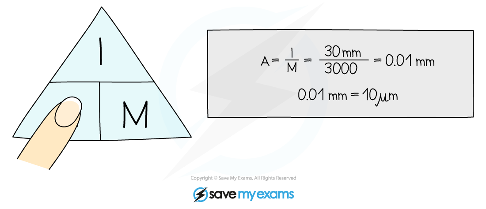
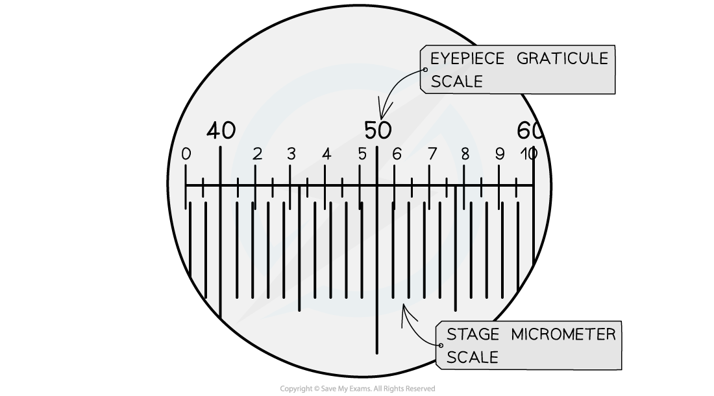

Magnification & Measuring Size
------------------------------

* <b>Magnification</b> is <b>how many times bigger</b> the image of a specimen observed is in comparison to the actual, real-life size of the specimen
* A <b>light microscope</b> has two types of lens:

  + An <b>eyepiece lens,</b> which often has a magnification of x10
  + A series of (usually 3) <b>objective lenses</b>, each with a different magnification
  + To calculate the <b>total magnification, </b>the magnification of the <b>eyepiece</b> lens and the <b>objective</b> lens are <b>multiplied</b> together:

<b>total magnification = eyepiece lens magnification x objective lens magnification</b>

* The <b>magnification</b> (M) of an object can also be calculated if both the size of the <b>image</b> (I), and the <b>actual size </b>of the specimen (A), is known

<b>magnification = </b> <b>image size </b><math><semantics><mo>÷</mo><annotation>{"language":"en","fontFamily":"Times New Roman","fontSize":"18"}</annotation></semantics></math><b> actual size</b>

* Remember to ensure that the image size (I) and the actual size (A) of the specimen have the <b>same units</b> before doing the calculation

<i><b>The equation for calculating magnification can be rearranged to calculate either actual size, image size, or magnification.</b></i>

#### Worked Example

An <b>image</b> of an animal cell is 30 mm in diameter and it has been <b>magnified</b> by a factor of  x3000.

What is the <b>actual</b> diameter of the cell?

#### Using an eyepiece graticule & stage micrometer

* A <b>graticule</b> is a small disc that has an <b>engraved ruler</b>
* It can be placed <b>into the eyepiece </b>of a microscope to act as a ruler in the field of view, so is sometimes known as an <b>eyepiece graticule</b>
* As an eyepiece graticule has no fixed units it must be <b>calibrated </b>for the objective lens that is in use

  + The graticule in the eyepiece remains the same size when the magnification of the microscope is altered, so recalibration is needed at each viewing magnification
* Calibration of the eyepiece graticule is done using a microscope slide with an engraved scale known as <b>a stage micrometer</b>

  + The <b>smallest</b> set of divisions on a stage micrometer usually measure<b> 0.01 mm</b>, or <b>10</b> <b>μm</b>
* By using the<b> eyepiece graticule and the stage micrometer together,</b> the size of each graticule unit can be calculated

  + After this is known the graticule can be used as a <b>ruler </b>to measure objects in the field of view

<i><b>The stage micrometer scale is used to find out how many micrometers each graticule unit represents</b></i>

#### Worked Example

Calculate the size of the units of the eyepiece graticule divisions in the image below.

Note that the large divisions in the top half of the image show the stage micrometer and that the smallest stage micrometer divisions are 0.01 mm across.

<b>Answer: </b>  
  
<b>Step 1: Observe the number of eyepiece unit divisions per micrometer unit</b>

In the image, the stage micrometer has three lines

Each micrometer division has 40 eyepiece graticule divisions within it

<b>Step 2: Calculate the size of each eyepiece graticule unit</b>

40 graticule divisions = 0.01 mm = 10 µm

1 graticule unit = 10 <b>÷</b> 40 = 0.25 µm

<b>Step 3: Calculate the size of an object using the size of each graticule unit</b>  
  
An object spans five eyepiece graticule units <b>SO</b>

5 x 0.25 µm = 1.25 µm

#### Examiner Tips and Tricks

The biggest pitfall with these kinds of calculations is forgetting to convert the units so that they match before embarking on a calculation. E.g. if image size is measured in mm but the actual size of an object is given in µm then both need to be converted into µm before using the equation triangle above.

To convert a measurement from mm into µm the measurement must be multiplied by 1000 (there are 1000 µm in 1 mm).