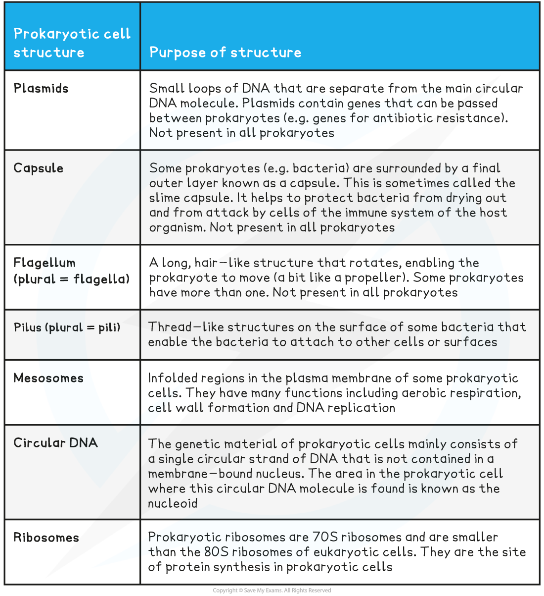
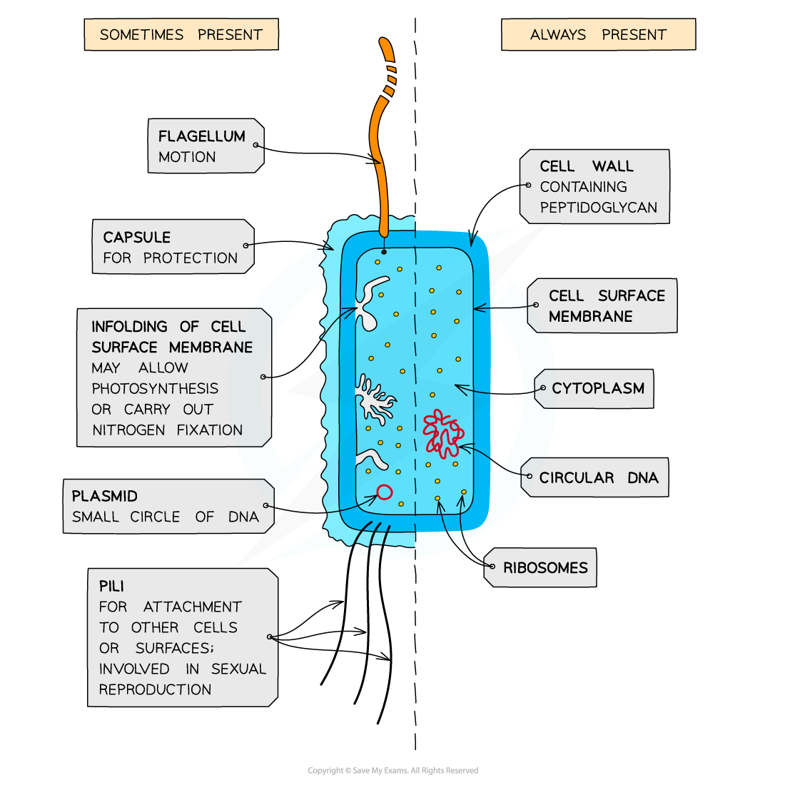
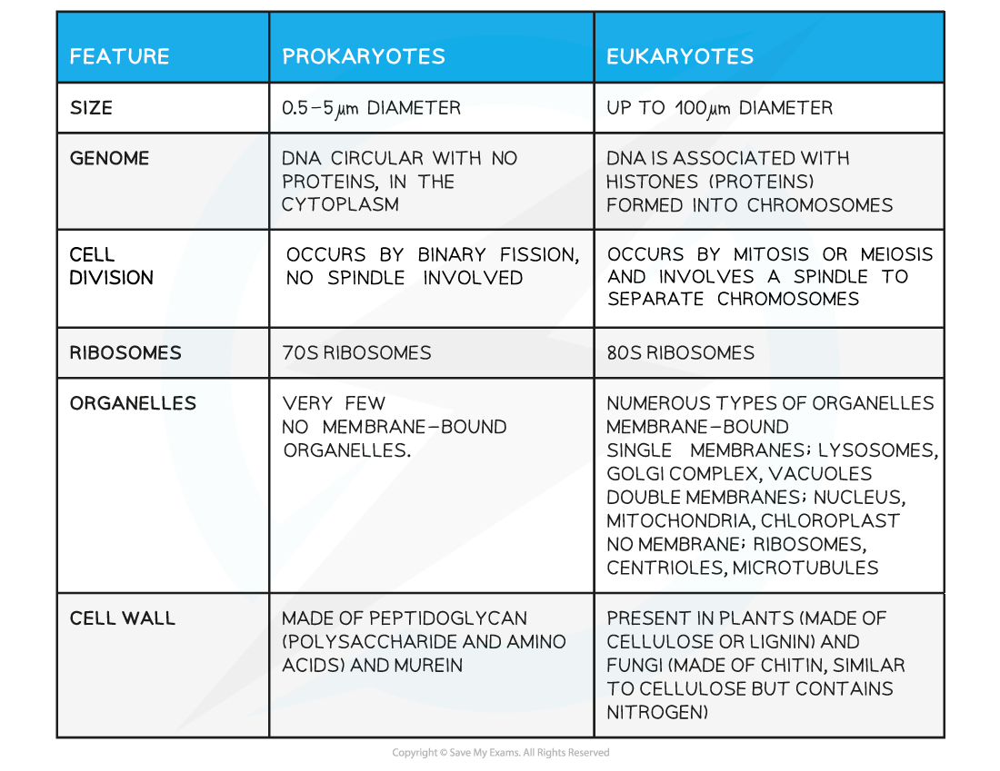

Prokaryotic Cells: Structure
----------------------------

* Animal and plant cells are types of eukaryotic <b>cells</b>, whereas bacteria are a type of <b>prokaryote</b>
* Prokaryotic cells are much <b>smaller</b> than eukaryotic cells
* They also differ from eukaryotic cells in having

  + A <b>cytoplasm</b> that <b>lacks membrane-bound organelles</b>
  + <b>Ribosomes</b> that are smaller (70 S) than those found in eukaryotic cells (80 S)
  + <b>No nucleus, </b>instead having a <b>single circular bacterial chromosome</b> that is free in the cytoplasm and is <b>not associated with proteins</b>
  + A cell wall that contains the glycoprotein <b>murein</b>

    - Murein is sometimes known as <b>peptidoglycan</b>
* In addition, many prokaryotic cells also have the following structures

  + Loops of DNA known as<b> plasmids</b>
  + <b>Capsules</b>
  + Flagella (singular flagellum)
  + Pili (singular pilus)
  + A cell membrane that contains folds known as <b>mesosomes</b>

<b>Additional Prokaryotic Structures Table</b>

<i><b>Bacteria are prokaryotic cells</b></i>

#### Prokaryotes vs eukaryotes

* There are a number of important structural and physiological differences between prokaryotic and eukaryotic cells
* These differences affect their metabolic processes and how they reproduce

<b>Comparison of Prokaryotic and Eukaryotic Cells Table</b>

#### Examiner Tips and Tricks

You will need to know all the <b>differences</b> between prokaryotic and eukaryotic cells; remember that not all of the structures mentioned here are present in <b>all</b> prokaryotic cells

Remember that <b>size is not a structural feature</b> so if you are asked for a structural difference between a prokaryotic and eukaryotic cell don't include size in your answer.