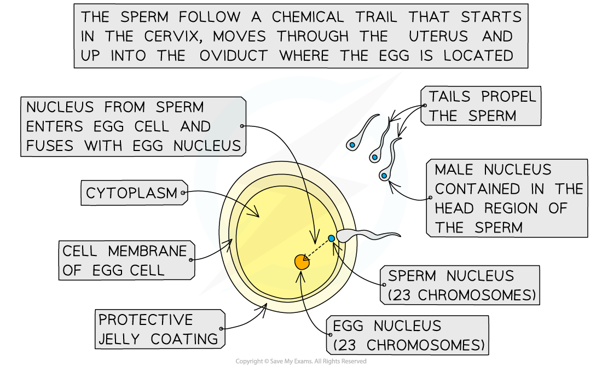

Fertilisation in Mammals
------------------------

* During sexual intercourse, semen is ejaculated high up into the <b>vagina</b> of the female, <b>near the cervix</b>
* The sperm cells then follow a <b>chemical trail released by the egg cell </b>and travel up through the cervix to reach the <b>uterus</b> (the womb)
* The sperm cells then travel into the <b>oviduct</b> containing the egg cell
* If a sperm cell meets the egg cell in the oviduct, <b>fertilisation can occur</b>

  + This is most likely to occur 1-2 days after the female has ovulated (i.e. released an egg cell from one of her ovaries into an oviduct)
* Fertilisation is the <b>fusion of the nuclei</b> from a<b> male gamete</b> (sperm cell) and a <b>female gamete </b>(egg cell)

  + During fertilisation, the head of a sperm cell releases <b>enzymes</b> that <b>digest</b> a path through the protective outer layer of the egg cell (the<b> zona pellucida</b>), allowing the sperm to pass through the egg cell membrane

    - This process is known as the <b>acrosome reaction</b>
  + Once this occurs, the egg cell immediately releases the contents of <b>vesicles</b> known as <b>cortical granules </b>into the space between the egg cell membrane and the zona pellucida
  + The chemicals contained within the cortical granules cause the <b>zona pellucida</b> to <b>rapidly thicken and harden</b>, preventing any more sperm cells from entering, <b>ensuring only one sperm cell can fertilise the egg cell</b>

    - This process is known as the<b> cortical reaction</b>
* The <b>nucleus</b> of the sperm cell then enters the egg and fuses with the nucleus of the egg cell
* When the male and female gamete nuclei fuse, they become a <b>zygote</b> (fertilised egg cell)
* This zygote contains the full 46 chromosomes (23 pairs of chromosomes), half of which came from the father and half from the mother
* The zygote divides by <b>mitosis</b> to form two new cells, which then continue to divide like this until an <b>embryo</b> is formed after a few days
* Cell division continues and eventually many of the new cells produced become <b>specialised</b> to perform particular functions and form all the body tissues of the offspring

<i><b>The process of fertilisation in mammals</b></i>