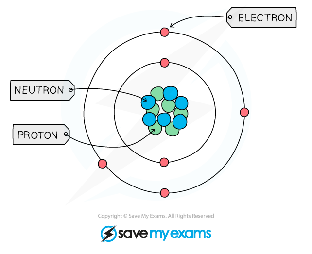
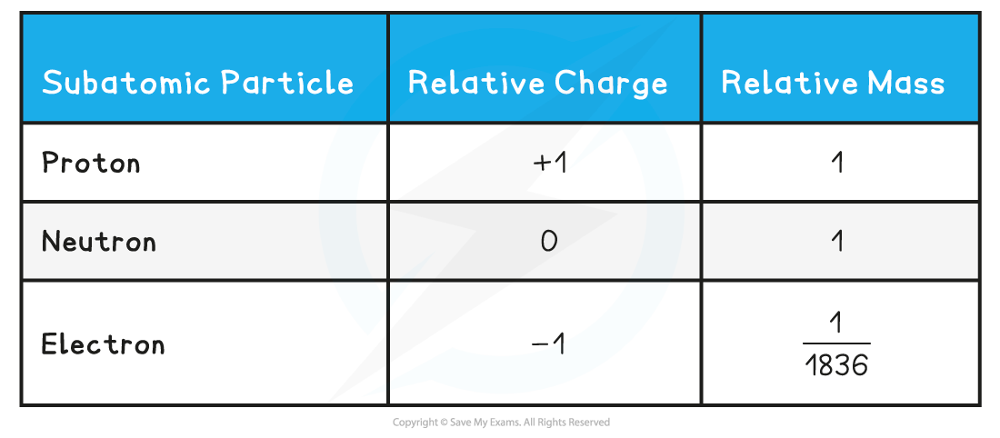
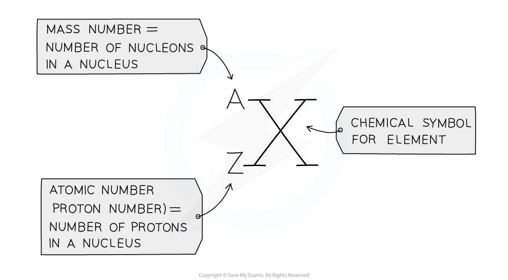

Structure of the Atom
---------------------

* All matter is composed of <b>atoms</b>, which are the smallest parts of an element that can take place in <b>chemical reactions</b>
* Atoms are mostly made up of <b>empty</b> <b>space</b> around a very small, dense <b>nucleus</b> that contains <b>protons</b> and <b>neutrons</b>
* The nucleus has an overall <b>positive</b> <b>charge</b>

  + The protons have a positive charge and the neutrons have a neutral charge
* <b>Negatively</b> <b>charged</b> electrons are found in orbitals in the empty space around the nucleus

<i><b>The basic structure of an atom (not to scale)</b></i>

Subatomic Mass & Charge
-----------------------

* <b>Subatomic</b> <b>particles</b> are the particles an element is made up of and include <b>protons</b>, <b>neutrons</b> and <b>electrons</b>
* These subatomic particles are so small that it is not possible to measure their masses and charges using <b>conventional</b> <b>units</b> (such as grams and coulombs)
* Instead, their masses and charges are compared to each other using <b>‘relative</b> <b>atomic</b> <b>masses’</b> and ‘<b>relative atomic charges</b>’
* These are not actual charges and masses but they are charges and masses of particles relative to each other

  + Protons and neutrons have a very similar mass so each is assigned a relative mass of 1 whereas electrons are 1836 times smaller than a proton and neutron
  + Protons are <b>positively</b> charged, electrons <b>negatively</b> charged and neutrons are <b>neutral</b>
* The relative mass and charge of the subatomic particles are:

<b>Relative mass & charge of subatomic particles table</b>

#### Examiner Tips and Tricks

The <b>relative</b> <b>mass</b> of an electron is <b>almost negligible. </b>The <b>charge</b> of a single <b>electron</b> is -1.602 x 10-19  coulombs whereas the charge of a <b>proton</b> is +1.602 x 10-19  coulombs, however, relative to each other, their charges are -1 and +1 respectively.

Atomic & Mass Numbers
---------------------

* The <b>atomic number </b>(or <b>proton number</b>) is the number of protons in the nucleus of an atom and has <b>symbol</b> <i><b>Z</b></i>

  + The atomic number is equal to the number of electrons present in a <b>neutral </b>atom of an element
  + Eg. the atomic number of lithium is 3 which indicates that the neutral lithium atom has 3 protons and 3 electrons
* The<b> mass</b> <b>number </b>(or <b>nucleon</b> <b>number</b>) is the total number of <b>protons</b> and <b>neutrons</b> in the nucleus of an atom and has <b>symbol </b><i><b>A</b></i>
* The number of <b>neutrons </b>can be calculated by:

<b>Number of neutrons = mass number - atomic number</b>

* Protons and neutrons are also called <b>nucleons</b>

#### Examiner Tips and Tricks

<i><b>The mass (nucleon) and atomic (proton) number are given for each element in the Periodic Table</b></i>