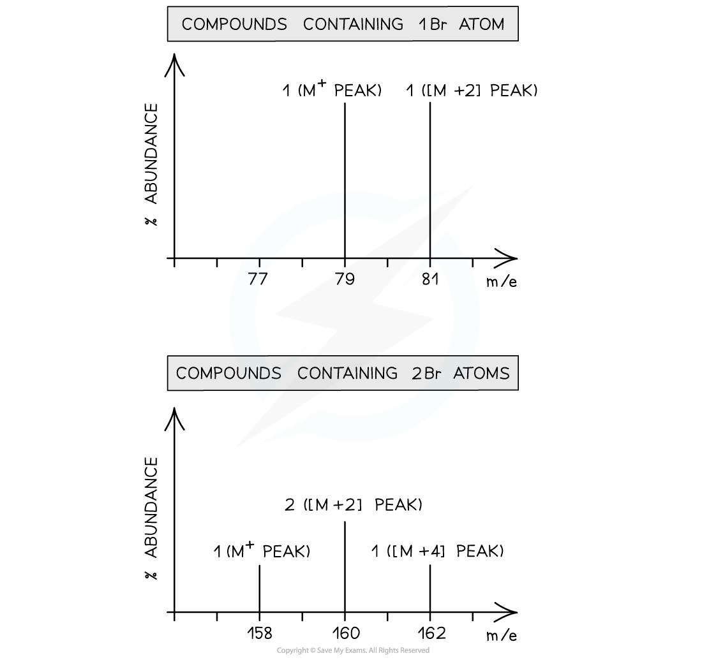

Interpreting Mass Spectra
-------------------------

* Isotopes are different atoms of the same element that contain the same number of protons and electrons but a different number of neutrons

  + These are atoms of the same elements but with different mass numbers
* Therefore, the mass of an element is given as relative atomic mass (Ar) by using the average mass of the isotopes

  + The relative atomic mass of an element can be calculated by using the relative abundance values

Ar = <math><semantics><mfrac><mrow><mfenced><mrow><mi>r</mi><mi>e</mi><mi>l</mi><mi>a</mi><mi>t</mi><mi>i</mi><mi>v</mi><mi>e</mi><mo> </mo><mi>a</mi><mi>b</mi><mi>u</mi><mi>n</mi><mi>d</mi><mi>a</mi><mi>n</mi><mi>c</mi><msub><mi>e</mi><mrow><mi>i</mi><mi>s</mi><mi>o</mi><mi>t</mi><mi>o</mi><mi>p</mi><mi>e</mi><mo> </mo><mn>1</mn></mrow></msub><mo> </mo><mo>×</mo><mi>m</mi><mi>a</mi><mi>s</mi><msub><mi>s</mi><mrow><mi>i</mi><mi>s</mi><mi>o</mi><mi>t</mi><mi>o</mi><mi>p</mi><mi>e</mi><mo> </mo><mn>1</mn></mrow></msub></mrow></mfenced><mo> </mo><mo>+</mo><mfenced><mrow><mi>r</mi><mi>e</mi><mi>l</mi><mi>a</mi><mi>t</mi><mi>i</mi><mi>v</mi><mi>e</mi><mo> </mo><mi>a</mi><mi>b</mi><mi>u</mi><mi>n</mi><mi>d</mi><mi>a</mi><mi>n</mi><mi>c</mi><msub><mi>e</mi><mrow><mi>i</mi><mi>s</mi><mi>o</mi><mi>t</mi><mi>o</mi><mi>p</mi><mi>e</mi><mo> </mo><mn>2</mn></mrow></msub><mo> </mo><mo>×</mo><mi>m</mi><mi>a</mi><mi>s</mi><msub><mi>s</mi><mrow><mi>i</mi><mi>s</mi><mi>o</mi><mi>t</mi><mi>o</mi><mi>p</mi><mi>e</mi><mo> </mo><mn>2</mn></mrow></msub></mrow></mfenced><mo> </mo><mi>e</mi><mi>t</mi><mi>c</mi></mrow><mn>100</mn></mfrac><annotation>{"language":"en","fontFamily":"Times New Roman","fontSize":"18"}</annotation></semantics></math>

* The relative abundance of an isotope is either given or can be read off the mass spectrum

#### Worked Example

<b>Calculating relative atomic mass of oxygen </b>A sample of oxygen contains the following isotopes:

What is the relative atomic mass, <i>A</i>r, of oxygen in this sample, to 2dp?

<b>Answer</b>

* <i>A</i>r = <math><semantics><mfrac><mrow><mfenced><mrow><mn>99</mn><mo>.</mo><mn>76</mn><mo> </mo><mo>×</mo><mo> </mo><mn>16</mn></mrow></mfenced><mo> </mo><mo>+</mo><mfenced><mrow><mn>0</mn><mo>.</mo><mn>04</mn><mo> </mo><mo>×</mo><mo> </mo><mn>17</mn></mrow></mfenced><mo> </mo><mo>+</mo><mfenced><mrow><mn>0</mn><mo>.</mo><mn>20</mn><mo> </mo><mo>×</mo><mn>18</mn></mrow></mfenced></mrow><mn>100</mn></mfrac><annotation>{"language":"en","fontFamily":"Times New Roman","fontSize":"18"}</annotation></semantics></math>

  + <i>A</i>r = 16.0044
  + <i>A</i>r = 16.00

#### Worked Example

<b>Calculating relative atomic mass of boron </b>Calculate the relative atomic mass of boron using its mass spectrum, to 1dp:

<b>Answer</b>

* <i>A</i>r = <math><semantics><mrow><mfrac><mrow><mo>(</mo><mn>19</mn><mo>.</mo><mn>9</mn><mo> </mo><mo>×</mo><mn>10</mn><mo>)</mo><mo> </mo><mo>+</mo><mo> </mo><mo>(</mo><mn>80</mn><mo>.</mo><mn>1</mn><mo> </mo><mo>×</mo><mn>11</mn><mo>)</mo></mrow><mn>100</mn></mfrac><mo> </mo><mo>=</mo><mo> </mo><mn>10</mn><mo>.</mo><mn>801</mn><mo> </mo><mo>=</mo><mo> </mo><mn>10</mn><mo>.</mo><mn>8</mn></mrow><annotation>{"language":"en","fontFamily":"Times New Roman","fontSize":"18"}</annotation></semantics></math>

#### Examiner Tips and Tricks

You can be expected to work with tables or graphs of data to calculate relative atomic mass

You can also be expected to do these calculations backwards to determine the abundance of one isotope given sufficient information

Predicting Mass Spectra
-----------------------

* You can also predict how a mass spectrum might appear for a given compound, e.g. ethanol, CH3CH2OH

  + The methyl, CH3+, fragment has a mass of 15.0
  + The ethyl, CH3CH2+, fragment has a mass of 29.0
  + The base ion, CH2OH+, fragment has a mass of 31.0
  + The whole molecule has a mass of 46.0
* Predicting mass spectra becomes more complex with the inclusion of halogen isotopes such as chlorine and bromine

#### Chlorine

Chlorine exists as two isotopes, 35Cl and 37Cl

* A compound containing <b>one </b>chlorine atom will therefore have two molecular ion peaks due to the two different isotopes it can contain

  + 35Cl = <b>M</b><b>+</b><b> </b>peak
  + 37Cl = [<b>M+2] </b>peak
  + The ratio of the peak heights is 3:1 (as the relative abundance of 35Cl is 3x greater than that of 37Cl)
* A diatomic chlorine molecule or a compound containing <b>two </b>chlorine atoms will have three molecular ion peaks due to the different combinations of chlorine isotopes they can contain

  + 35Cl + 35Cl = <b>M</b><b>+</b><b> </b>peak
  + 35Cl + 37Cl = [<b>M+2] </b>peak

    - There is an alternative of 37Cl + 35Cl doubling the [<b>M+2] </b>peak
  + 37Cl + 37Cl = [<b>M+4]</b> peak
  + The ratio of the peak heights is <b>9:6:1</b>

    - This ratio can be deduced by using the probability of each chlorine atom being 35Cl or 37Cl
    - 35Cl + 35Cl = <math><semantics><mfrac><mn>3</mn><mn>4</mn></mfrac><mo> </mo><mo>×</mo><mfrac><mn>3</mn><mn>4</mn></mfrac><mo> </mo><mo>=</mo><mo> </mo><mfrac><mn>9</mn><mn>16</mn></mfrac><annotation>{"language":"en","fontFamily":"Times New Roman","fontSize":"18"}</annotation></semantics></math>
    - 35Cl + 37Cl = <math><semantics><mfrac><mn>3</mn><mn>4</mn></mfrac><mo> </mo><mo>×</mo><mfrac><mn>1</mn><mn>4</mn></mfrac><mo> </mo><mo>=</mo><mo> </mo><mfrac><mn>3</mn><mn>16</mn></mfrac><annotation>{"language":"en","fontFamily":"Times New Roman","fontSize":"18"}</annotation></semantics></math> but this doubles for the 37Cl + 35Cl option, therefore, <math><semantics><mfrac><mn>6</mn><mn>16</mn></mfrac><annotation>{"language":"en","fontFamily":"Times New Roman","fontSize":"18"}</annotation></semantics></math>
    - 37Cl + 37Cl = <math><semantics><mfrac><mn>1</mn><mn>4</mn></mfrac><mo> </mo><mo>×</mo><mfrac><mn>1</mn><mn>4</mn></mfrac><mo> </mo><mo>=</mo><mo> </mo><mfrac><mn>1</mn><mn>16</mn></mfrac><annotation>{"language":"en","fontFamily":"Times New Roman","fontSize":"18"}</annotation></semantics></math>

* The presence of bromine or chlorine atoms in a compound gives rise to a [<b>M+2] </b>and possibly<b> [M+4] </b>peak<i><b> </b></i>

<i><b>Mass spectrum of compounds containing one chlorine atom (1) and two chlorine atoms (2)</b></i>

#### Bromine

* Bromine too exists as two isotopes, 79Br and 81Br
* A compound containing <b>one </b>bromine atom will have two molecular ion peaks

  + 79Br = <b>M</b><b>+</b><b> </b> peak
  + 81Br = [<b>M+2] </b>peak
  + The ratio of the peak heights is 1:1 (they are of <b>similar </b>heights as their relative abundance is the same!)
* A diatomic molecule of bromine or a compound containing <b>two </b>bromine atoms will have three molecular ion peaks

  + 79Br + 79Br= <b>M</b><b>+</b><b> </b>peak
  + 79Br+ 81Br = [<b>M+2] </b>peak
  + 81Br + 81Br= [<b>M+4]</b> peak
  + The ratio of the peak heights is <b>1:2:1</b>

<i><b>Mass spectrum of compounds containing one bromine atom</b></i>

Mass Spectra & Mr
-----------------

* When a compound is analysed in a mass spectrometer, vaporised molecules are bombarded with a beam of high-speed electrons
* These knock off an electron from some of the molecules, creating <b>molecular ions:</b>

* The relative abundances of the detected ions form a <b>mass spectrum</b>: a kind of molecular fingerprint that can be identified by computer using a spectral database
* The peak with the highest <i><b>m/z</b></i><b> </b>value is the molecular ion (<b>M</b><b>+</b>) peak which gives information about the <b>molecular</b> <b>mass</b> of the compound
* This value of m/z is equal to the <b>relative molecular mass</b> of the compound

#### The M+1 peak

* The [<b>M+1] </b>peak is a smaller peak which is due to the natural abundance of the isotope <b>carbon-13</b>
* The height of the <b>[M+1]</b> peak for a particular ion depends on how many carbon atoms are present in that molecule; The more carbon atoms, the larger the <b>[M+1]</b> peak is

  + For example, the height of the <b>[M+1]</b> peak for an hexane (containing six carbon atoms) ion will be greater than the height of the<b> [M+1]</b> peak of an ethane (containing two carbon atoms) ion

#### Worked Example

Determine whether the following mass spectrum belongs to propanal or butanal

<b>Answer:</b>

* The mass spectrum corresponds to <b>propanal</b> as the molecular ion peak is at <i>m/z</i> = 58

  + Propanal arises from the CH3CH2CHO+ ion which has a molecular mass of 58
  + Butanal arises from the CH3CH2CH2CHO+ ion which has a molecular mass of 72

#### Examiner Tips and Tricks

A mass spectrum can give lots of information about fragments of the overall compound being analysed

Your specification states that this is not expected knowledge, you are only required to know the implications of the M+1 peak from a mass spectrum