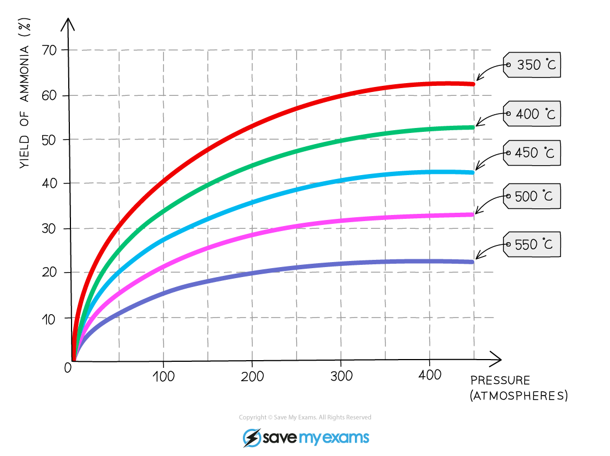

Industrial Compromises
----------------------

* The Haber Process is, once again, a good example of the need for a compromise of reaction conditions in industrial processes

N2 (g) + 3H2 (g) ⇌ 2NH3 (g)

* The reaction is exothermic in the forward direction

  + Therefore, an increase in temperature may increase the rate of reaction but it will decrease the overall yield as the equilibrium shifts to the left
* An increase in pressure will increase the yield

  + This is because there are 4 moles of reactant compared to only 2 moles of product

* The overall effect of changing the pressure at different temperatures can be seen:

<i><b>The yield of ammonia with varying conditions for the Haber Process</b></i>

* Temperature is the first compromise in conditions
* 450 oC is used as this still produces an acceptable yield of ammonia (roughly 35%) but also within an acceptable time frame

  + Higher temperatures are not used because of the lower yields combined with the increased costs to achieve these temperatures
  + Lower temperatures are not used because the rate is too slow despite an increased yield

#### Examiner Tips and Tricks

In very simplistic terms, this temperature compromise can be thought of as the following question:

Is it better to produce 100 g per hour or 1000 g per day?

* For 100 g per hour, less product is being made but it is being made more quickly
* For 1000g per day, more product is being made but it is being made much more slowly
* Overall, 100 g per hour is better as this results in a total of 2400 g per day

* The second compromise in conditions is pressure
* A pressure of around 20 MPa (or 200 atmospheres) is used, which produces an acceptable yield (around 35%)

  + Doubling the pressure to around 40 MPa (roughly 400 atmospheres, only increases the yield by around 7%
  + However, this comes with the financial and energy costs of producing the pressure requires along with the health and safety considerations of working at such high pressure
* While industry aims for a high yield where possible, sometimes this is balanced and compromised by:

  + Financial and profit considerations - is the cost of altered reaction conditions balanced out by a sufficient increase in yield and, therefore, profit?
  + Energy and environmental considerations - will altering the reaction conditions have an effect on the energy needs (linking back to finance) and will there be an increased use of fossil fuels resulting from the change of conditions?
  + Health and safety considerations - are the proposed reaction conditions actually safe to work with? What potential harm to workers and the manufacturing plant could happen? Is this balanced out by the increase in yield and, therefore, profit?

#### Examiner Tips and Tricks

The Haber Process has been used as the example for industrial considerations as you should be relatively familiar with this process

However, you can be expected to apply the ideas shown here to any potential industrial reaction