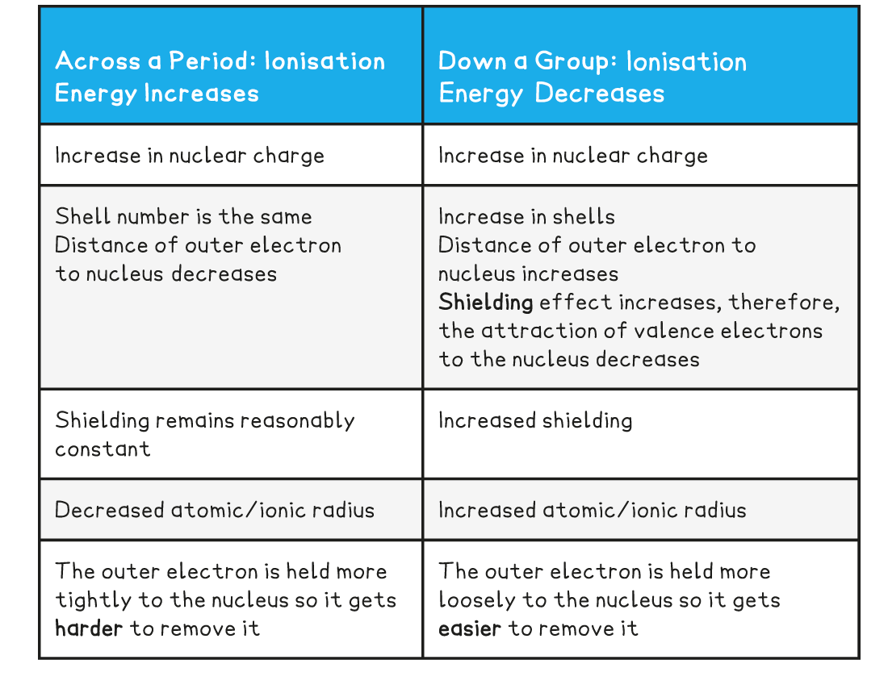

Factors Affecting Ionisation Energy
-----------------------------------

#### Ionisation energy

* The <b>ionisation</b> <b>Energy</b> (<i><b>IE</b></i>) of an element is the amount of energy required to remove <b>one mole </b>of electrons from <b>one mole</b> of gaseous atoms of an element to form <b>one mole </b>of gaseous ions
* Ionisation energies are measured under <b>standard conditions </b>which are 298 K and 101 kPa
* The units of IE are <b>kilojoules</b> <b>per</b> <b>mole</b> (kJ mol-1)
* The <b>first ionisation energy </b>(<i>IE</i>1) is the energy required to remove <b>one mole of electrons</b> from one mole of gaseous atoms of an element to form one mole of gaseous 1+ ions

  + E.g. the first ionisation energy of gaseous calcium:

<b>Ca (g) → Ca</b><b>+</b><b> (g) + e</b><b>-</b><b>         </b><i><b> IE</b></i><b>1</b><b> = +590 kJ mol</b><b>-1</b>

#### Successive ionisation energies of an element

* More than one electron can be removed form an atom and each time you remove an electron there is a successive ionisation energy
* These are called second, third ionisation energy and so on
* The <b>second ionisation energy</b> (<i>IE</i>2) is defined as

  + is the energy required to remove <b>one mole of electrons</b> from one mole of gaseous 1+ ions to form one mole of gaseous 2+ ions
* And can be represented as can be represented as

<b>X</b><b>+</b><b> (g) → X</b><b>2+ </b><b>(g) + e</b><b>-</b>

<b>OR (for calcium)</b>

<b>Ca</b><b>+</b><b> (g) → Ca</b><b>2+ </b><b>(g) + e</b><b>-</b><b>  </b><i><b>IE</b></i><b>2</b><b> = 1145 kJ mol</b><b>-1</b>

* <b>The third ionisation energy </b>(<i>IE</i>3)<i> of</i> an element can be represented as

<b>X</b><b>2+</b><b> (g) → X</b><b>3+ </b><b>(g) + e</b><b>-</b>

<b>OR (for calcium)</b>

<b>Ca</b><b>2+</b><b> (g) → Ca</b><b>3+</b><b> (g) + e</b><b>-</b><b>  </b><i><b>IE</b></i><i><b>3</b></i><b> = 4912 kJ mol</b><b>-1</b>

* The <b>successive</b> ionisation energies of an element <b>increase</b>
* This is because once you have removed the outer electron from an atom, you have formed a <b>positive ion</b>
* Removing an electron from a positive ion is <b>more difficult</b> than from a neutral atom
* As more electrons are removed, the <b>attractive forces increase</b> due to decreasing shielding and an increase in the proton to electron ratio
* The increase in ionisation energy, however, is not constant and is dependent on the atom’s electronic configuration
* Taking calcium as an example:

<b>Ionisation Energies of Calcium Table</b>

First Ionisation Energy - Period
--------------------------------

#### Trends in Ionisation Energies

* Ionisation energies show<b> periodicity</b> - a trend across a period of the Periodic Table
* As could be expected from their electron configuration, the group 1 metals have a relatively low ionisation energy, whereas the noble gases have very high ionisation energies
* The size of the first ionisation energy is affected by four factors:

  + <b>Size of the nuclear charge</b>
  + <b>Distance of outer electrons from the nucleus</b>
  + <b>Shielding effect of inner electrons</b>
  + <b>Spin-pair repulsion</b>

#### Ionisation energy across a period

* The ionisation energy across a period generally <b>increases</b> due to the following factors:

  + Across a period the <b>nuclear charge increases</b>
  + This causes the <b>atomic radius</b> of the atoms to <b>decrease</b>, as the outer shell is pulled closer to the nucleus, so the distance between the nucleus and the outer electrons <b>decreases</b>
  + The <b>shielding </b>by inner shell electrons remain reasonably constant as electrons are being added to the same shell
  + It becomes <b>harder to remove an electron</b> as you move across a period; <b>more energy</b> is needed
  + So, the ionisation energy increases

#### Dips in the trend

* There is a slight <b>decrease </b>in IE1 between <b>beryllium </b>and <b>boron</b> as the fifth electron in boron is in the 2p subshell, which is further away from the nucleus than the 2s subshell of beryllium

  + <b>Beryllium</b> has a first ionisation energy of <b>900 kJ mol</b><b>-1</b> as its electron configuration is <b>1s</b><b>2</b><b> 2s</b><b>2</b>
  + <b>Boron</b> has a first ionisation energy of <b>800 kJ mol</b><b>-1</b> as its electron configuration is <b>1s</b><b>2</b><b> 2s</b><b>2</b><b> 2p</b><b>x</b><b>1</b>
* There is a slight <b>decrease </b>in IE1 between <b>nitrogen </b>and<b> oxygen </b>due to <b>spin-pair repulsion</b> in the 2px orbital of oxygen

  + <b>Nitrogen</b> has a first ionisation energy of <b>1400 kJ mol</b><b>-1</b> as its electron configuration is 1s2 2s2 2px1 2py1 2pz1
  + <b>Oxygen </b>has a first ionisation energy of <b>1310 kJ mol</b><b>-1</b> as its electron configuration is 1s2 2s2 <b>2p</b><b>x</b><b>2</b> 2py1 2pz1
  + In oxygen, there are 2 electrons in the 2px orbital, so the repulsion between those electrons makes it slightly easier for one of those electrons to be removed

#### From one period to the next

* There is a large <b>decrease </b>in ionisation energy between the <b>last</b> element in one period, and the <b>first</b> element in the next period
* This is because:

  + There is increased <b>distance</b> between the nucleus and the outer electrons as you have added a new shell
  + There is increased <b>shielding</b> by inner electrons because of the added shell
  + These two factors outweigh the increased <b>nuclear</b> <b>charge</b>

First Ionisation Energy - Group
-------------------------------

#### Ionisation energy down a group

* The ionisation energy down a group <b>decreases</b> due to the following factors:

  + The number of protons in the atom is increased, so the <b>nuclear charge </b>increases
  + But, the atomic radius of the atoms increases as you are adding more shells of electrons, making the atoms bigger
  + So, the <b>distance </b>between the nucleus and outer electron <b>increases </b>as you descend the group
  + The <b>shielding </b>by inner shell electrons <b>increases </b>as there are more shells of electrons
  + These factors outweigh the increased nuclear charge, meaning it becomes <b>easier to remove the outer electron</b> as you descend a group
  + So, the ionisation energy decreases

<b>Ionisation Energy Trends across a Period & going down a Group Table</b>

