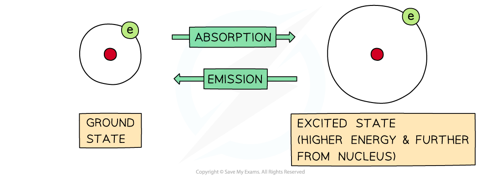
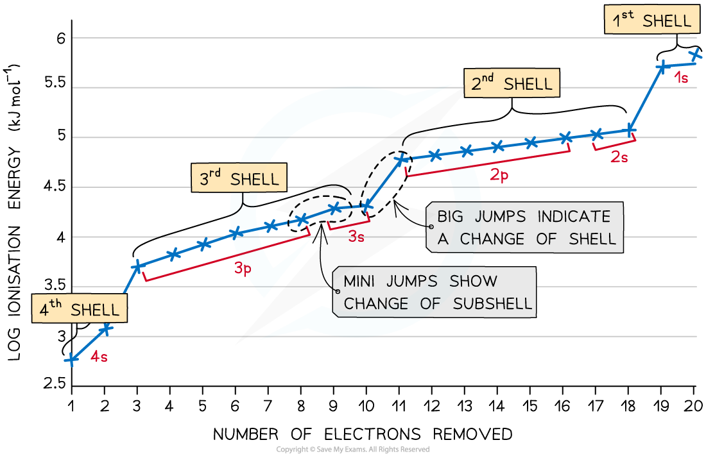

Developing Electronic Configuration
-----------------------------------

* Electrons move rapidly around the nucleus in energy shells
* If their energy is increased, then they can jump to a higher energy level
* The process is reversible, so electrons can return to their original energy levels

  + When this happens, they emit energy
* The frequency of energy is exactly the same, it is just being emitted rather than absorbed:

<i><b>The difference between absorption and emission depends on whether electrons are jumping from lower to higher energy levels or the other way around</b></i>

* The energy they emit is a mixture of different frequencies
* This is thought to correspond to the many possibilities of electron jumps between energy shells
* If the emitted energy is in the visible region, it can be analysed by passing it through a diffraction grating
* The result is a <b>line emission spectrum</b>

#### Line emission spectra

<i><b>The line emission (visible) spectrum of hydrogen</b></i>

* Each line is a specific energy value

  + This suggests that electrons can only possess a limited choice of allowed energies
* These packets of energy are called '<b>quanta</b>' (plural <b>quantum</b>)
* What you should notice about this spectrum is that the lines get closer together towards the blue end of the spectrum
* This is called <b>convergence</b> and the set of lines is <b>converging</b> towards the higher energy end, so the electron is reaching a maximum amount of energy
* This maximum corresponds to the <b>ionisation energy</b> of the electron
* These lines were first observed by the Swiss school teacher Johannes <b>Balmer</b>, and they are named after him
* We now know that these lines correspond to the electron jumping from higher levels down to the <b>second</b> or <b>n = 2</b> energy level

#### Successive ionisation energies

* The <b>first</b> electron removed has a low <i>IE</i>1 as it is easily removed from the atom due to the spin-pair repulsion of the electrons in the 4s orbital
* The <b>second</b> electron is more difficult to remove than the first electron as there is no <b>spin-pair repulsion</b>
* The <b>third </b>electron is much more difficult to remove than the second one corresponding to the fact that the third electron is in a <b>principal quantum</b> shell which is closer to the nucleus (3p)
* Removal of the <b>fourth </b>electron is more difficult as the orbital is no longer full, and there is less <b>spin-pair repulsion</b>
* The graph shows there is a large increase in successive ionisation energy as the electrons are being removed from an increasingly positive ion
* The big jumps on the graph show the change of <b>shell</b> and the small jumps are the change of <b>subshell</b>

<i><b>Successive ionisation energies for the element calcium</b></i>

Filling Quantum Shells
----------------------

#### Shells

* The arrangement of electrons in an atom is called the <b>electron</b> <b>configuration</b>
* Electrons are arranged around the nucleus in <b>principal energy levels </b>or <b>principal quantum shells</b>
* <b>Principal quantum numbers </b>(<b>n</b>) are used to number the energy levels or quantum shells

  + The <b>lower </b>the principal quantum number, the closer the shell is to the nucleus

    - So, the first shell which is the closest to the nucleus is n = 1
  + The <b>higher </b>the principal quantum number, the greater the energy of the shell and the further away from the nucleus
* Each principal quantum number has a <b>fixed </b>number of electrons it can hold, which is equal to 2n2

  + n = 1 : up to 2 electrons
  + n = 2 : up to 8 electrons
  + n = 3 : up to 18 electrons
  + n = 4 : up to 32 electrons