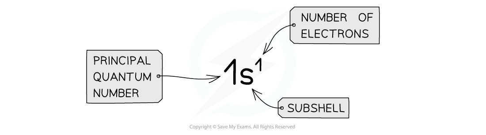
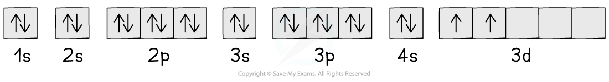

Electronic Configurations of Atoms & Ions
-----------------------------------------

* The <b>principal quantum shells </b>increase in energy with increasing <b>principal quantum number</b>

  + E.g. <i>n</i> = 4 is higher in energy than <i>n</i> = 2
* The <b>subshells </b>increase in energy as follows: s ＜ p ＜ d ＜ f

  + The only exception to these rules is the 3d orbital which has slightly higher energy than the 4s orbital
  + Because of this, the 4s orbital is filled before the 3d orbital
* All the orbitals in the <b>same </b>subshell have the same energy and are said to be <b>degenerate</b>

  + E.g. px, py and pz are all equal in energy

<i><b>Relative energies of the shells and subshells</b></i>

* The <b>electron configuration</b> gives information about the number of electrons in each <b>shell, subshell </b>and<b> orbital</b> of an atom
* The subshells are filled in order of increasing energy

<i><b>The electron configuration shows the number of electrons occupying a subshell in a specific shell</b></i>

* Writing out the <b>electron</b> <b>configuration</b> tells us how the electrons in an atom or ion are arranged in their shells, subshells and orbitals
* This can be done using the<b> full </b>electron configuration or the <b>shorthand</b> version

  + The <b>full</b> electron configuration describes the arrangement of all electrons from the 1s subshell up
  + The <b>shorthand</b> electron configuration includes using the symbol of the <b>nearest preceding</b> <b>noble</b> <b>gas</b> to account for however many electrons are in that noble gas
* <b>Ions </b>are formed when atoms <b>lose </b>or <b>gain </b>electrons

  + Negative ions are formed by <b>adding</b> electrons to the outer subshell
  + Positive ions are formed by <b>removing</b> electrons from the outer subshell
  + The transition metals <b>fill </b>the 4s subshell before the 3d subshell but <b>lose</b> electrons from the 4s first and not from the 3d subshell (the 4s subshell is lower in energy

#### Full Electron Configurations

* Hydrogen has 1 single electron

  + The electron is in the s orbital of the first shell
  + Its electron configuration is 1s1
* Potassium has 19 electrons

  + The first 2 electrons fill the s orbital of the first shell
  + They then continue to fill subsequent orbitals and subshells in order of increasing energy
  + The 4s orbital is lower in energy than the 3d subshell, so it is therefore filled first
  + The full electron configuration of potassium is <b>1s</b><b>2</b><b> 2s</b><b>2</b><b> 2p</b><b>6</b><b> 3s</b><b>2</b><b> 3p</b><b>6</b><b> 4s</b><b>1</b>

#### Shorthand Electron Configurations

* Using potassium as an example again:

  + The nearest preceding noble gas to potassium is <b>argon</b>
  + This accounts for 18 electrons of the 19 electrons that potassium has
  + The shorthand electron configuration of potassium is <b>[Ar] 4s</b><b>1</b>

#### Worked Example

Write down the full and shorthand electron configuration of the following elements:

1. Calcium
2. Gallium
3. Ca2+

<b>Answer</b>

<b>Answer 1:</b>

* Calcium has 20 electrons so the <b>full</b> <b>electronic</b> <b>configuration</b> is:

   1s2 2s2 2p6 3s2 3p6 4s2

* The 4s orbital is lower in energy than the 3d subshell and is therefore filled first

  + The <b>shorthand</b> version is [Ar] 4s2 since argon is the nearest preceding noble gas to calcium which accounts for 18 electrons

<b>Answer 2:</b>

* Gallium has 31 electrons so the <b>full</b> <b>electronic</b> <b>configuration</b> is:

   1s2 2s2 2p6 3s2 3p6 3d10 4s2 4p1

   [Ar] 3d10 4s2 4p1

* Even though the 4s is filled first, the full electron configuration is often written in numerical order. So, if there are electrons in the 3d sub-shell, then these will be written before the 4s

<b>Answer 3:</b>

* What this means is that if you ionise calcium and remove two of its outer electrons, the electronic configuration of the Ca2+ ion is identical to that of argon

<b>   Ca</b><b>2+</b> is 1s2 2s2 2p6 3s2 3p6                                                           

<b>   Ar</b> is also 1s2 2s2 2p6 3s2 3p6

#### Exceptions

* Chromium and copper have the following electron configurations, which are different to what you may expect:

  + Cr is [Ar] 3d5 4s1 <b>not</b> [Ar] 3d4 4s2
  + Cu is [Ar] 3d10 4s1 <b>not</b> [Ar] 3d9 4s2
* This is because the [Ar] 3d5 4s1 and [Ar] 3d10 4s1 configurations are <b>energetically stable</b>

#### Presenting the Electron Configuration

* Electrons can be imagined as small <b>spinning charges </b>which rotate around their own axis in either a <b>clockwise</b> or <b>anticlockwise direction</b>
* The spin of the electron is represented by its direction
* Electrons with similar <b>spin </b>repel each other which is also called <b>spin-pair repulsion</b>
* Electrons will therefore occupy separate orbitals in the same subshell where possible, to minimize this repulsion and have their <b>spin </b>in the same direction

  + E.g. if there are three electrons in a <b>p subshell</b>, one electron will go into each px, py and pz orbital

<i><b>Electron configuration: three electrons in a p subshell</b></i>

* Electrons are only paired when there are no more empty orbitals available within a subshell, in which case the spins are the <b>opposite </b>spins to minimize repulsion

  + E.g. if there are four electrons in a p subshell, one p orbital contains 2 electrons with opposite spin and two orbitals contain one electron only
  + The first 3 electrons fill up the empty p orbitals one at a time, and then the 4th one pairs up in the px orbital

<i><b>Electron configuration: four electrons in a p subshell</b></i>

#### Box Notation

* The <b>electron configuration </b>can be represented using the <b>electrons in boxes </b>notation
* Each box represents an <b>atomic orbital</b>
* The boxes are arranged in order of <b>increasing </b>energy from bottom to top
* The electrons are represented by opposite arrows to show the <b>spin </b>of the electrons

  + E.g. the box notation for titanium is shown below
  + Note that since the 3d subshell cannot be either full or half full, the second 4s electron is not promoted to the 3d level and stays in the 4s orbital

<i><b>The electrons in titanium are arranged in their orbitals as shown. Electrons occupy the lowest energy levels first before filling those with higher energy</b></i>

Classifying Elements
--------------------

* The Periodic Table is split up into four main blocks depending on their electron configuration
* Elements can be classified as an s-block element, p-block element and so on, based on the position of the outermost electron:

  + s block elements - Have their valence electron(s) in an s orbital
  + p block elements - Have their valence electron(s) in a p orbital
  + d block elements - Have their valence electron(s) in a d orbital
  + f block elements - Have their valence electron(s) in an f orbital

Electronic Configuration & Chemical Properties
----------------------------------------------

* The way an element reacts with other elements is determined by an number of factors, but in particular the <b>electronic configuration</b> of its atoms
* The Periodic Table is arranged in <b>periods (horizontal</b>) and <b>groups (vertical)</b>

  + All the elements in the same period have the same number of shells (principle quantum number)
  + All the elements in the same group have the same number of outer electrons
* The elements in each group of period show particular trends and characteristics in their chemical and physical properties that can be explained in terms of their atomic numbers
* This provides valuable information about what is <b>likely to happen</b> when particular elements react
* The properties of the elements are a function of their atomic numbers
* Using this information as well as the location of the elements in the different blocks we can predict the properties
* For example:

  + Helium, neon and argon all have electronic structures with full sub shells as well as high ionisation energies

    - This confirms that the electronic arrangement is very stable explaining why they rarely react with other chemicals