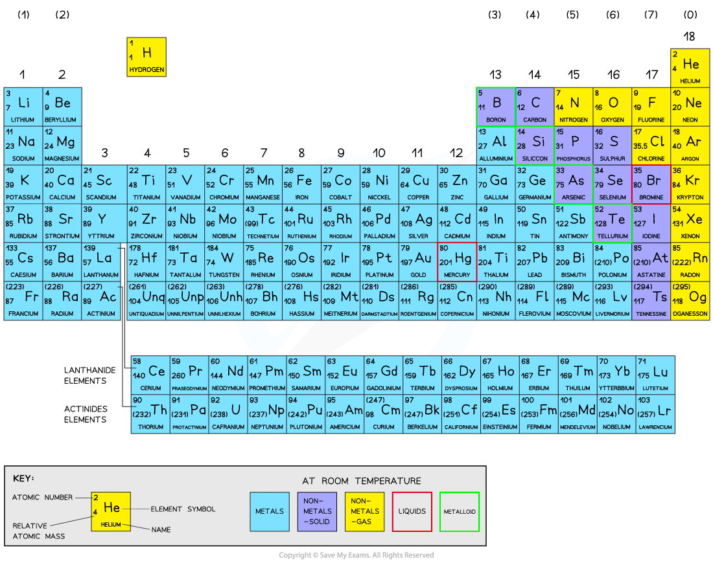
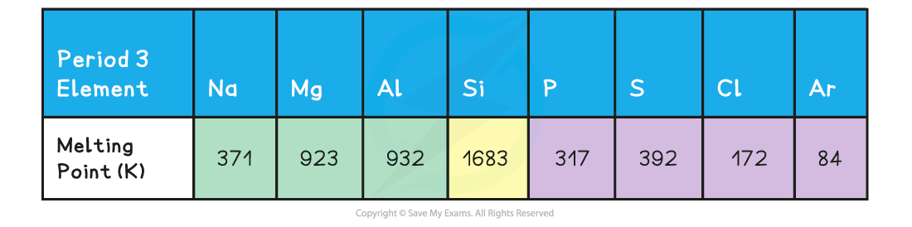
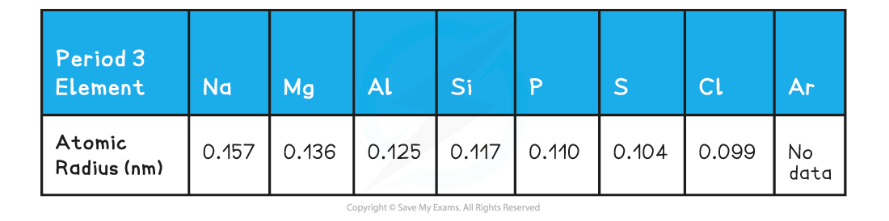

Melting & Boiling Point Trends
------------------------------

* Elements in the periodic table are arranged in order of increasing atomic number and placed in vertical columns (<b>groups</b>) and horizontal rows (<b>periods)</b>
* The elements across the periods show <b>repeating patterns</b> in chemical and physical properties
* This is called <b>periodicity</b>

### The Periodic Table

<i><b>All elements are arranged in the order of increasing atomic number from left to right</b></i>

#### Melting point

* Period 2 and 3 elements follow the <b>same pattern</b> in relation to their melting points

<b>Melting points of the elements across Period 3 table</b>

<i><b>Ions of Period 3 elements with increasing positive charge (metals) and increasing of number of outer electrons across the period</b></i>

* A general increase in <b>melting point </b>for the Period 3 elements up to silicon is observed
* <b>Silicon </b>has the highest <b>melting point</b>
* After the Si element the melting points of the elements <b>decreases </b>significantly

* The above trends can be explained by looking at the bonding and structure of the elements

<b>Bonding & structure of the elements table</b>

* The table shows that <b>Na</b>, <b>Mg</b> and <b>Al</b> are metallic elements which form positive ions arranged in a <b>giant</b> <b>lattice</b> in which the ions are held together by a 'sea' of delocalised electrons

<i><b>Metal cations form a giant lattice held together by electrons that can freely move around</b></i>

* The electrons in the ‘sea’ of delocalised electrons are those from the <b>valence shell</b> of the atoms
* <b>Na</b> will donate one electron into the ‘sea’ of delocalised electrons, <b>Mg</b> will donate two and <b>Al </b>three electrons
* As a result of this, the metallic bonding in <b>Al </b>is stronger than in <b>Na</b>
* This is because the electrostatic forces between a <b>3+ ion</b> and the larger number of negatively charged delocalised electrons is much larger compared to a <b>1+ ion</b> and the smaller number of delocalised electrons in Na
* Because of this, the <b>melting points increase </b>going from <b>Na </b>to <b>Al</b>
* <b>Si </b>has the highest melting point due to its giant molecular structure in which each Si atom is held to its neighbouring Si atoms by <b>strong covalent bonds</b>
* <b>P, S</b>, <b>Cl </b>and <b>Ar</b> are non-metallic elements and exist as <b>simple molecules</b> (P4, S8, Cl2 and Ar as a single atom)
* The <b>covalent bonds within</b> the molecules are strong, however, <b>between </b>the molecules, there are only weak <b>instantaneous dipole-induced dipole forces</b>
* It doesn’t take much energy to break these <b>intermolecular</b> forces
* Therefore, the melting points decrease going from <b>P </b>to <b>Ar </b>(note that the melting point of S is higher than that of P as sulphur exists as larger S8 molecules compared to the smaller P4 molecule)

#### Atomic radius

* The <b>atomic radius </b>is the distance between the nucleus and the outermost electron of an atom
* The atomic radius is measured by taking two atoms of the same element, measuring the distance between their nuclei and then halving this distance
* In <b>metals </b>this is also called the <b>metallic radius </b>and in <b>non-metals</b>, the <b>covalent radius</b>

<b>Atomic radii of period 3 elements</b>

* You can see a clear trend across the period which also <b>repeated</b> in period 2

<i><b>The graph shows a decrease in atomic radii of period 3 elements across the period</b></i>

* Across the period, the atomic radii decrease
* This is because the number of protons (<b>the nuclear charge</b>) and the number of <b>electrons</b> increases by one every time you go an element to the right
* The elements in a period all have the same number of shells (so the <b>shielding effect </b>is the same)
* This means that as you go across the period the nucleus attracts the electrons more <b>strongly pulling them closer</b> to the nucleus
* Because of this, the atomic radius (and thus the size of the atoms) <b>decreases</b> across the period

<i><b>The diagram shows that across period 3, the elements gain extra electrons in the same principal quantum shell</b></i>

Ionisation Energy Trends
------------------------

#### Ionisation energy across period 2 and 3

* The ionisation energy across a period generally <b>increases</b> due to the following factors:

  + Across a period the <b>nuclear charge increases</b>
  + This causes the <b>atomic radius</b> of the atoms to <b>decrease</b>, as the outer shell is pulled closer to the nucleus, so the distance between the nucleus and the outer electrons <b>decreases</b>
  + The <b>shielding </b>by inner shell electrons remain reasonably constant as electrons are being added to the same shell
  + It becomes <b>harder to remove an electron</b> as you move across a period; <b>more energy</b> is needed
  + So, the ionisation energy increases

#### Dips in the trend for period 2

* There is a slight <b>decrease </b>in <i>IE</i>1 between <b>beryllium </b>and <b>boron</b> as the fifth electron in boron is in the 2p subshell, which is further away from the nucleus than the 2s subshell of beryllium

  + Beryllium has a first ionisation energy of 900 kJ mol-1 as its electron configuration is 1s2 2s2
  + Boron has a first ionisation energy of 800 kJ mol-1 as its electron configuration is 1s2 2s2 2px1
* There is a slight <b>decrease </b>in <i>IE</i>1 between <b>nitrogen </b>and<b> oxygen </b>due to <b>spin-pair repulsion</b> in the 3px orbital of oxygen

  + Nitrogen has a first ionisation energy of 1400 kJ mol-1 as its electron configuration is 1s2 2s2 2px1 2py1 2pz1
  + Oxygen has a first ionisation energy of 1310 kJ mol-1 as its electron configuration is 1s2 2s2 2px2 2py1 2pz1
* In oxygen, there are 2 electrons in the 2px orbital, so the repulsion between those electrons makes it slightly easier for one of those electrons to be removed

#### Dips in the trend for period 3

* There is again a slight decrease between <b>magnesium </b>and <b>aluminium</b> as the thirteenth electron in aluminium is in the 3p subshell, which is further away from the nucleus than the 3s subshell of magnesium

  + Magnesium has a first ionisation energy of 738 kJ mol-1 as its electron configuration is 1s2 2s2 2p6 3s2
  + Aluminium has a first ionisation energy of 578 kJ mol-1 as its electron configuration is 1s2 2s2 2p6 3s2 3px1
* There is a slight decrease in <i>IE</i>1 between <b>phosphorus </b>and<b> sulfur </b>due to <b>spin-pair repulsion</b> in the 3px orbital of sulfur

  + Phosphorus has a first ionisation energy of 1012 kJ mol-1 as its electron configuration is 1s2 2s2 2p6 3s2 3px1 3py1 3pz1
  + Sulfur has a first ionisation energy of 1000 kJ mol-1 as its electron configuration is 1s2 2s2 2p6 3s2 3px2 3py1 3pz1
* In sulfur, there are 2 electrons in the 3px orbital, so the repulsion between those electrons makes it slightly easier for one of those electrons to be removed