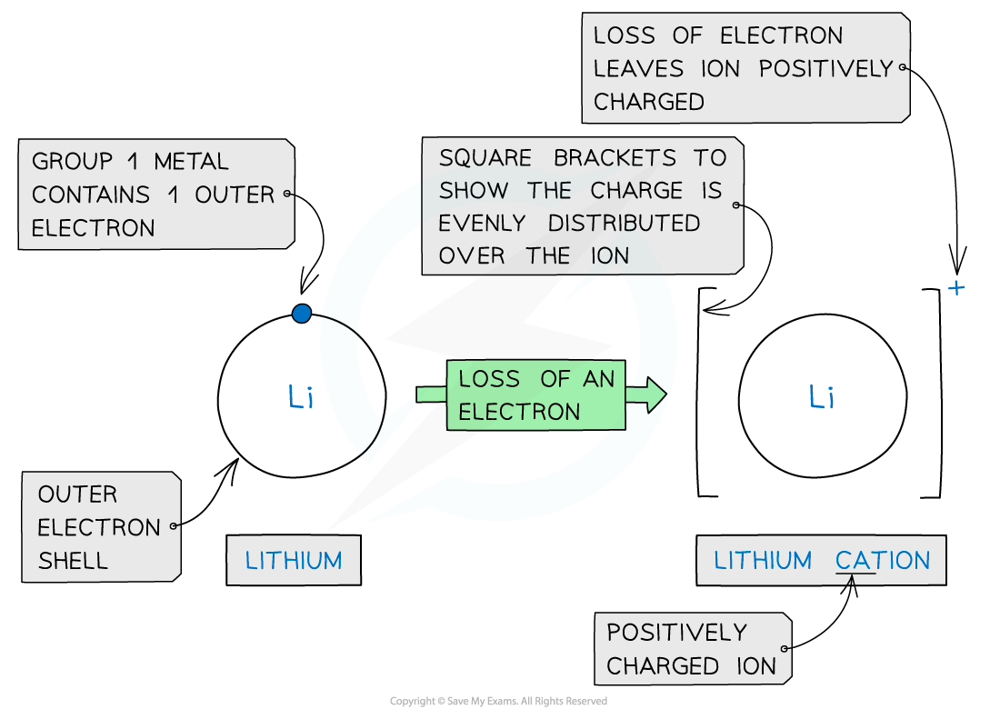
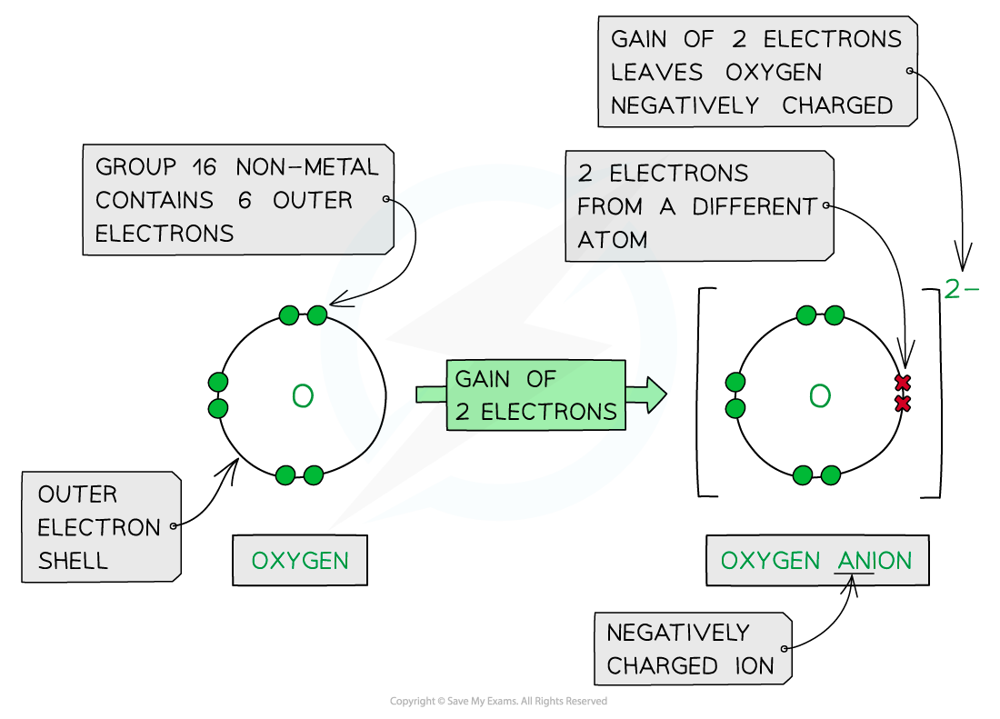

Ionic Bonds
-----------

* As a general rule, <b>metals</b> are on the <b>left</b> of the periodic table and <b>nonmetals</b> are on the <b>right-hand</b> side
* <b>Ionic</b> <b>bonding</b> involves the <b>transfer</b> of electrons from a <b>metallic</b> element to a <b>non-metallic</b> element
* Transferring electrons usually leaves the metal and the non-metal with a <b>full</b> <b>outer</b> <b>shell</b>
* Metals <b>lose</b> electrons from their valence shell forming <b>positively charged cations</b>
* Non-metal atoms <b>gain</b> electrons forming <b>negatively charged anions</b>
* Once the atoms become ions, their electronic configurations are the same as a noble gas

  + A potassium ion (K+) has the same electronic configuration as argon: [2,8,8]+
  + A chloride ion (Cl-) also has the same electronic configuration as argon: [2,8,8]-

<i><b>Forming cations by the removal of electrons from metals</b></i>

<i><b>Forming anions by the addition of electrons to nonmetals</b></i>

* <b>Cations</b> and <b>anions</b> are oppositely charged and therefore attracted to each other
* <b>Electrostatic</b> <b>attractions</b> are formed between the oppositely charged ions to form <b>ionic</b> <b>compounds</b>
* The <b>ionic bond</b> is the <b>electrostatic attraction</b> formed <b>between the oppositely charged ions</b>, which occurs in all directions ( this called <b>non-directional bonding</b>)
* This form of attraction is <b>very strong</b> and requires a <b>lot of energy</b> to overcome

  + This causes high melting points in ionic compounds

<i><b>Cations and anions bond together using strong electrostatic forces, which require a lot of energy to overcome</b></i>

* The ions form a <b>lattice</b> <b>structure</b> which is an evenly distributed <b>crystalline</b> structure
* Ions in a lattice are arranged in a <b>regular</b> <b>repeating</b> <b>pattern</b> so that positive charges cancel out negative charges
* The attraction between the cations and anions is occurring in all directions

  + Each ion is attracted to all of the oppositely charged ions around it
* Therefore the final lattice is overall electrically <b>neutral</b>

<i><b>Ionic solids are arranged in lattice structures</b></i>