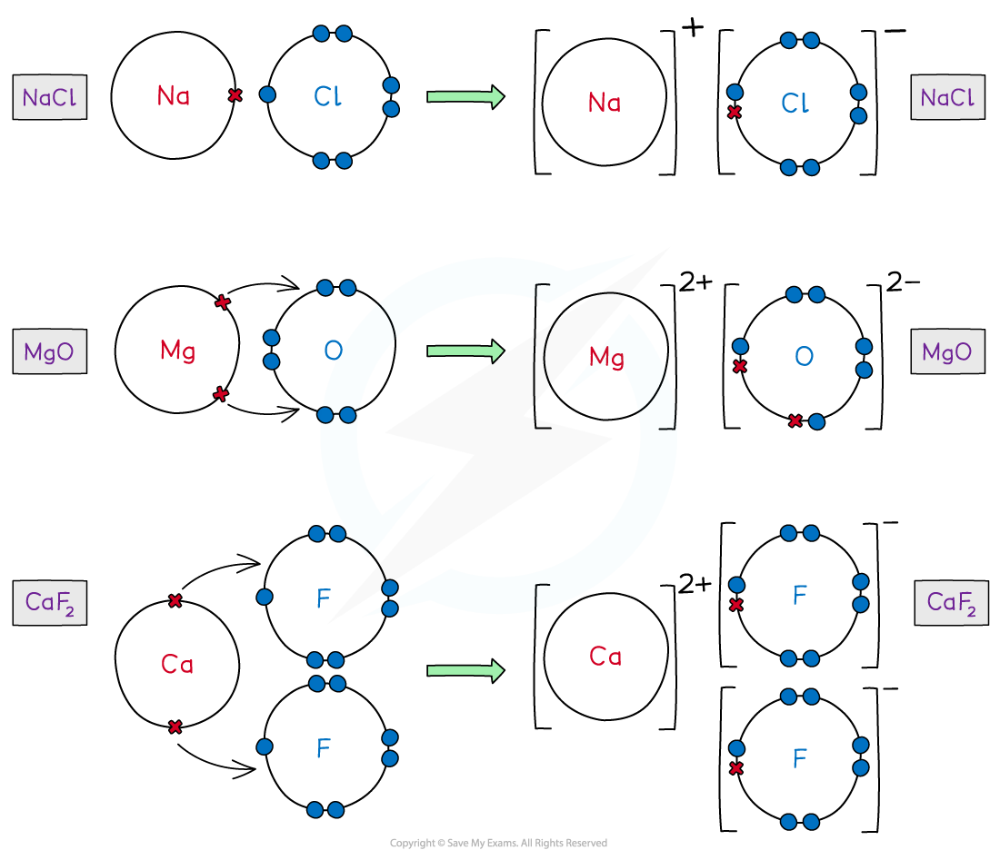
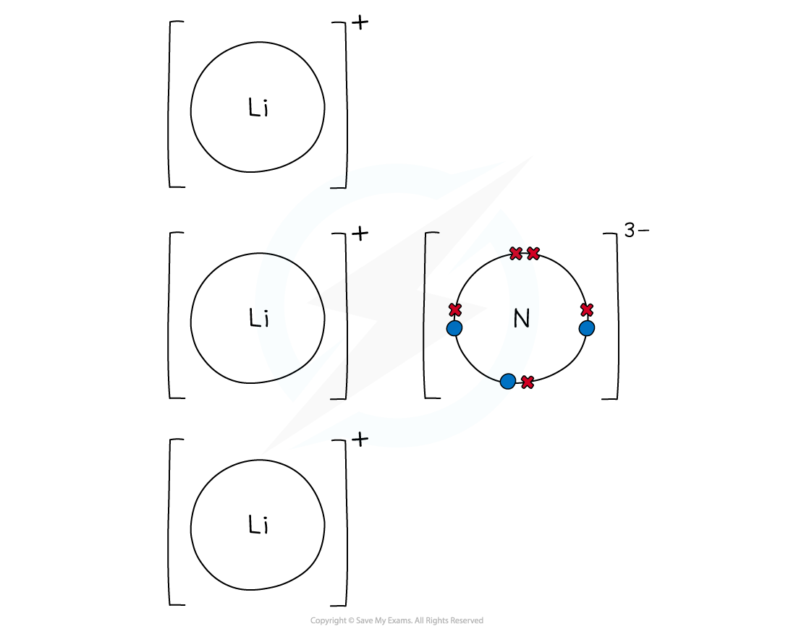
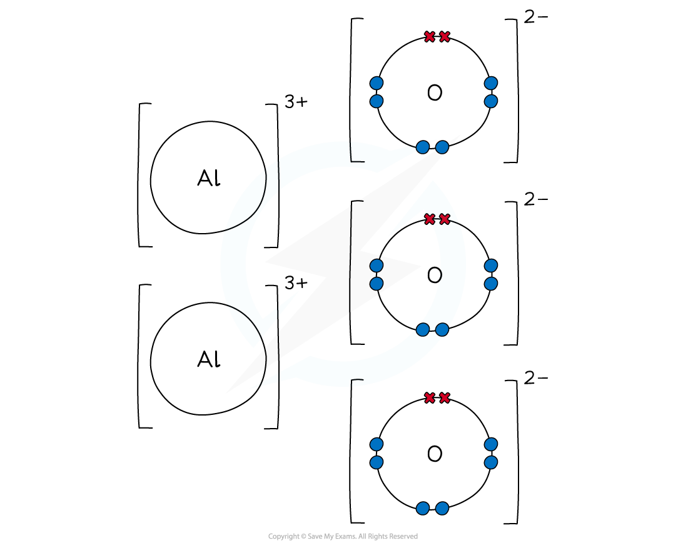

Ionic Dot-and-Cross Diagrams
----------------------------

* <b>Dot and cross diagrams </b>are diagrams that show the arrangement of the outer-shell electrons in an <b>ionic </b>or <b>covalent </b>compound or element

  + The electrons are shown as dots and crosses
* In a dot and cross diagram:

  + Only the outer electrons are shown
  + The charge of the ion is spread evenly which is shown by using brackets
  + The charge on each ion is written at the top right-hand corner

#### Ionic compounds

* Ionic bonds are formed when <b>metal atoms </b>transfer electrons to a <b>non-metal</b> to form a positively charged and negatively charged ion
* The atoms achieve a <b>noble gas </b>configuration

<i><b>Dot-and-cross diagrams of ionic compounds in which one of the atoms transfers their valence electrons to the other</b></i>

#### Calcium fluoride

* Calcium is a Group 2 <b>metal</b>

  + It <b>loses</b> its 2 outer electrons to form a calcium ion with a +2 charge (Ca2+)
* Fluorine is a Group 7 <b>non-metal</b>

  + It <b>gains</b> 1 electron to form a fluoride ion with a -1 charge (F-)
* As before, the positive and negative ions are attracted to each other via an ionic bond
* However, to cancel out the 2+ charge of the calcium ion, 2 fluorine atoms are needed

  + Each fluorine atom can only accept 1 electron from the calcium atom
  + 2 fluoride ions will be formed
* Calcium fluoride is made when 1 calcium ion and 2 fluoride ions form ionic bonds, CaF2
* The final ionic solid of CaF2 is <b>neutral</b> in charge

#### Worked Example

Draw a dot cross diagram for lithium nitride

<b>Answer</b>

* Lithium is a Group 1 <b>metal</b>

  + It <b>loses</b> its outer electron to form a lithium ion with a +1 charge (Li+)
  + Nitrogen is a Group 5 <b>non-metal</b>
  + It <b>gains</b> 3 electrons to form a nitride ion with a -3 charge (N3-)
  + To cancel out the -3 charge of the nitride ion, 3 lithium atoms are needed and 3 lithium ions will be formed
  + Lithium nitride is made when 1 nitride ion and 3 lithium ions form ionic bonds
  + The final ionic solid of Li3N is <b>neutral</b> in charge

<i><b>Dot and cross diagram to show the ionic bonding in lithium nitride</b></i>

#### Worked Example

Draw a dot cross diagram for aluminium oxide

<b>Answer</b>

* Aluminium is a Group 3 <b>metal</b>

  + It <b>loses</b> its outer electrons to form an aluminium ion with a +3 charge (Al3+)
  + Oxygen is a Group 6 <b>non-metal</b>
  + It <b>gains</b> 2 electrons to form an oxide ion with a -2 charge (O2-)
  + To cancel out the negative and positive charges, 2 aluminium and 3 oxygen atoms are needed
  + Aluminium oxide is made when 2 aluminium ions and 3 oxygen ions form ionic bonds
  + The final ionic solid of Al2O3 is <b>neutral</b> in charge

<i><b>Dot and cross diagram to show the ionic bonding in aluminium oxide</b></i>