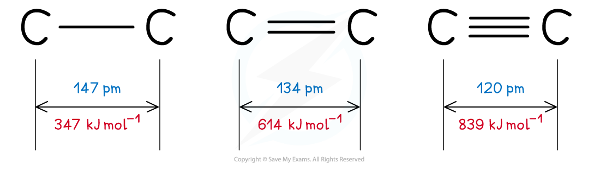

Bond Length & Bond Strength
---------------------------

#### Bond energy

* The <b>bond energy </b>is the energy required to <b>break </b>one mole of a particular covalent bond in the gaseous states

  + Bond energy has units of kJ mol-1
* The <b>larger </b>the bond energy, the <b>stronger </b>the covalent bond is

#### Bond length

* The <b>bond length </b>is <b>internuclear distance of two covalently bonded atoms</b>

  + It is the distance from the nucleus of one atom to another atom which forms the covalent bond
* The <b>greater </b>the forces of attraction between electrons and nuclei, the more the atoms are pulled closer to each other
* This <b>decreases </b>the <b>bond</b> <b>length</b> of a molecule and <b>increases </b>the <b>strength</b> of the covalent bond
* <b>Triple bonds </b>are the <b>shortest</b> and <b>strongest</b> covalent bonds due to the large electron density between the nuclei of the two atoms
* This increase the forces of attraction between the electrons and nuclei of the atoms
* As a result of this, the atoms are pulled closer together causing a shorter bond length
* The increased forces of attraction also means that the covalent bond is <b>stronger</b>

<i><b>Triple bonds are the shortest covalent bonds and therefore the strongest ones</b></i>