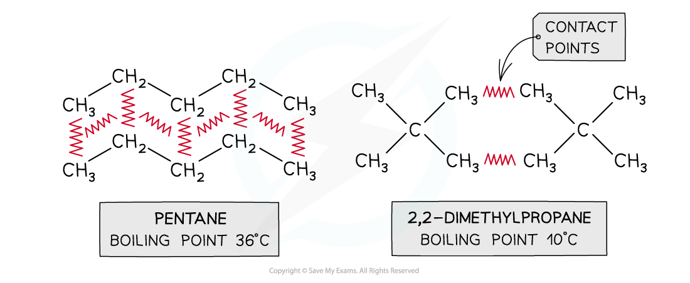
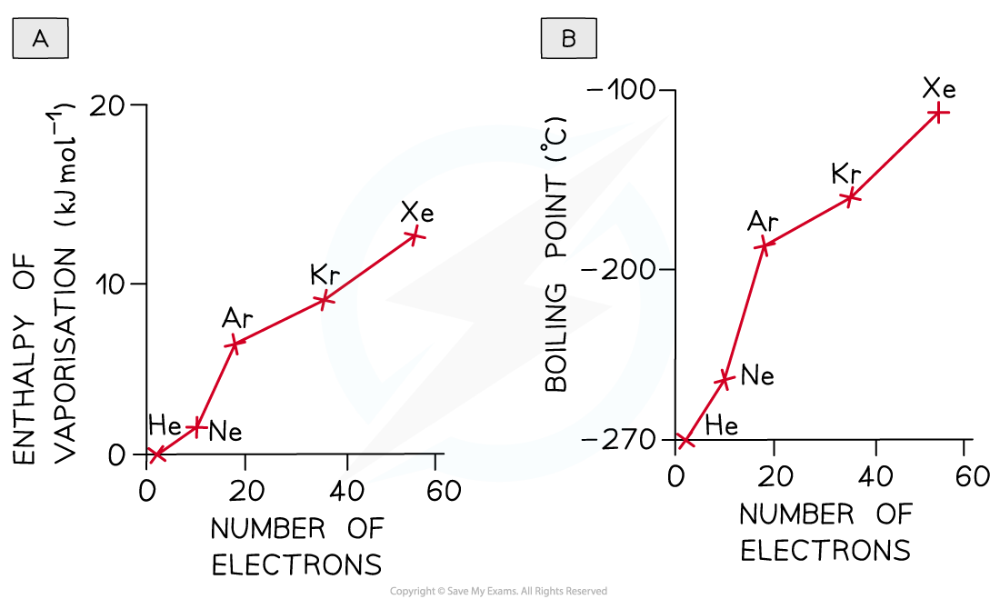
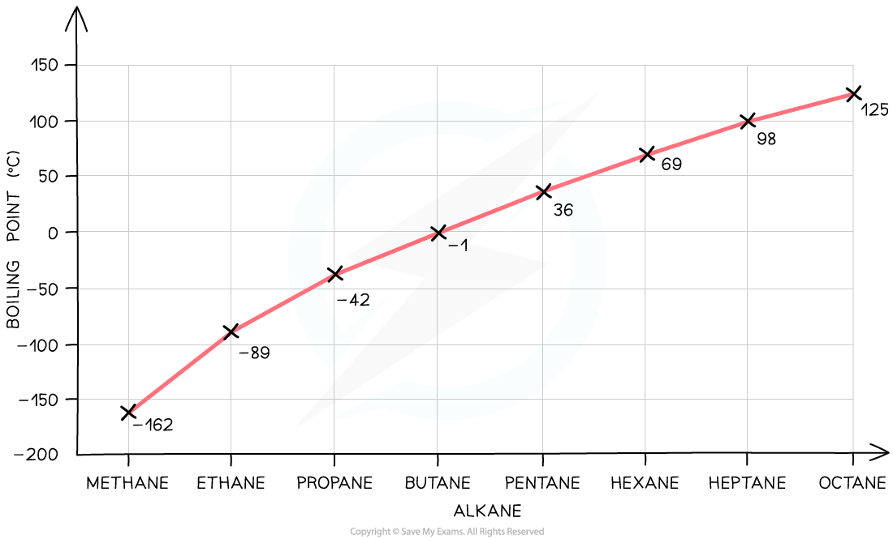
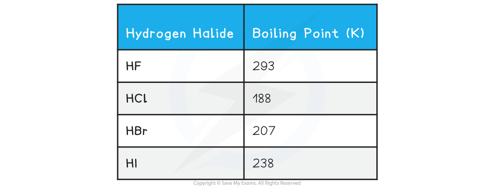
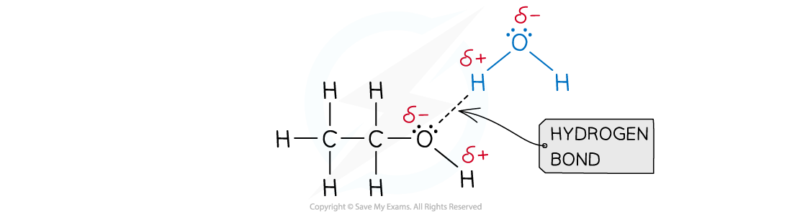

Intermolecular Forces & Physical Properties
-------------------------------------------

#### Branching

* The larger the surface area of a molecule, the more contact it will have with adjacent molecules
* The surface area of a molecule is <b>reduced by branching</b>
* The greater its ability to induce a dipole in an adjacent molecule, the greater the<b> London (dispersion) forces</b> and the higher the melting and boiling points
* This point can be illustrated by comparing different isomers containing the same number of electrons:

<i><b>Boiling points of molecules with the same numbers of electrons but different surface areas</b></i>

#### Number of electrons

* The greater the number of electrons (or the greater the molecular mass) in a molecule, the greater the likelihood of a distortion and thus the greater the frequency and magnitude of the temporary dipoles
* The dispersion forces between the molecules are stronger and the enthalpy of vaporisation, melting and boiling points are larger
* The greater boiling points of the noble gases illustrate this factor:

<i><b>As the number of electrons increases more energy is needed to overcome the forces of attraction between the noble gases atoms</b></i>

<i><b>Graph showing the increase in boiling point as the number of electrons increases</b></i>

#### Alcohols

* Hydrogen bonding occurs between molecules where you have a hydrogen atom attached to one of the very electronegative elements - fluorine, <b>oxygen</b> or nitrogen
* In an alcohol, there are <b>O-H bonds</b> present in the structure
* Therefore hydrogen bonds set up between the slightly positive hydrogen atoms (δ+ H) and lone pairs on oxygens in other molecules
* The hydrogen atoms are slightly positive because the bonding electrons are pulled away from them towards the very electronegative oxygen atoms
* In <b>alkanes</b>, the only intermolecular forces are <b>temporary induced dipole-dipole forces</b>
* Hydrogen bonds are much stronger than these and therefore it takes more energy to separate alcohol molecules than it does to separate alkane molecules
* Therefore, the boiling point of alkanes is lower than the boiling point of the respective alcohols
* For example, the boiling point of propane is -42 oC and the boiling point of propanol is 97 oC

#### Hydrogen Halides

* The boiling points of the hydrogen halides are as follows

* The boiling points of the rest of the hydrogen halides <b>increase</b> as the molecules become larger
* The extra electrons allow greater temporary dipoles and so increase the amount of London dispersion forces between the molecules
* Hydrogen fluoride also has hydrogen bonding between the HF molecules
* The bond is very polar so that the hydrogen has a significant amount of positive charge and the fluorine a significant amount of negative charge. In addition, the fluorine has small intense lone pairs
* Hydrogen bonds can form between the hydrogen on one molecule and a lone pair on the fluorine in its neighbour

Choosing Solvents
-----------------

#### Solubility

* The general principle is that 'like dissolves like' so non-polar substances mostly dissolve in non-polar solvents, like hydrocarbons and they form dispersion forces between the solvent and the solute
* Polar covalent substances generally dissolve in polar solvents as a result of dipole-dipole interactions or the formation of hydrogen bonds between the solute and the solvent
* A good example of this is seen in organic molecules such as alcohols and water:

<i><b>Hydrogen bonds form between ethanol and water</b></i>

* As covalent molecules become larger their solubility can decrease as the polar part of the molecule is only a smaller part of the overall structure

  + This effect is seen in alcohols for example where ethanol, C2H5OH, is readily soluble but hexanol, C6H13OH, is not
* Polar covalent substances are unable to dissolve well in non-polar solvents as their dipole-dipole attractions are unable to interact well with the solvent
* Giant covalent substances generally don't dissolve in any solvents as the energy needed to overcome the strong covalent bonds in the lattice structures is too great