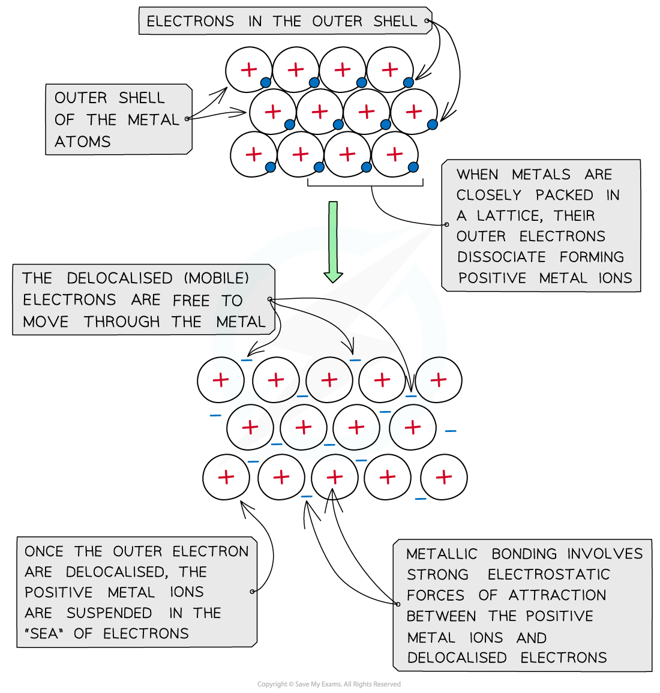

Metallic Bonding
----------------

* <b>Metal</b> atoms are tightly packed together in <b>lattice</b> structures
* When the metal atoms are in lattice structures, the electrons in their outer shells are free to move throughout the structure
* The free-moving<b> electrons</b> are called <b>‘delocalised electrons’</b> and they are not bound to their atom
* When the electrons are delocalised, the metal atoms become <b>positively</b> charged ions
* The positive charges <b>repel</b> each other and keep the neatly arranged lattice in place
* There are very strong <b>forces</b> between the positive metal centres and the ‘sea’ of delocalised electrons

<i><b>The positive metal ions are suspended in a ‘sea’ of delocalised electrons</b></i>