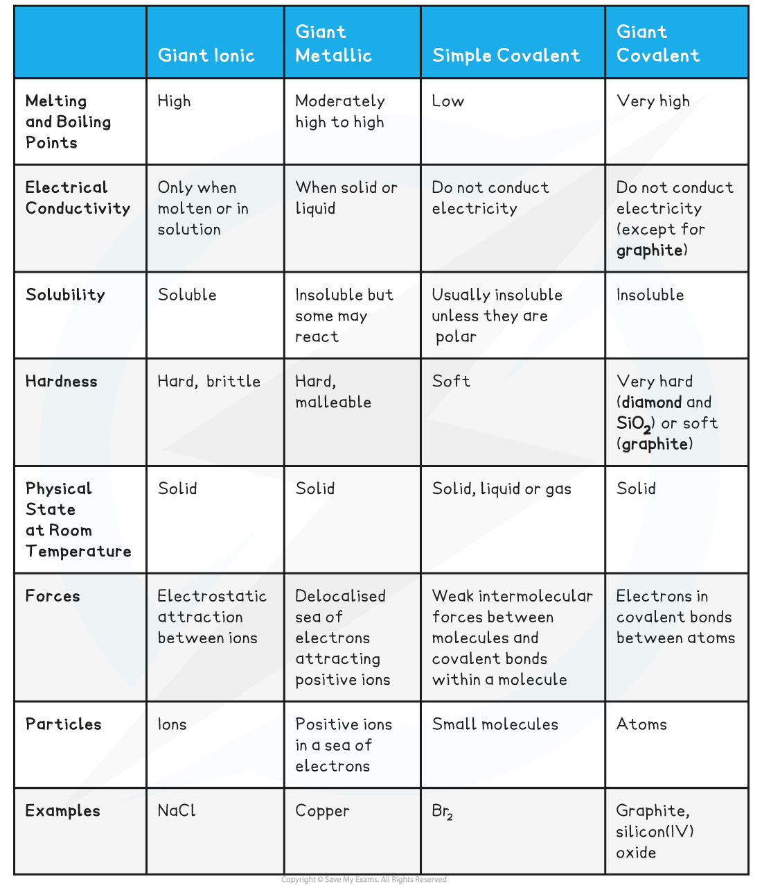
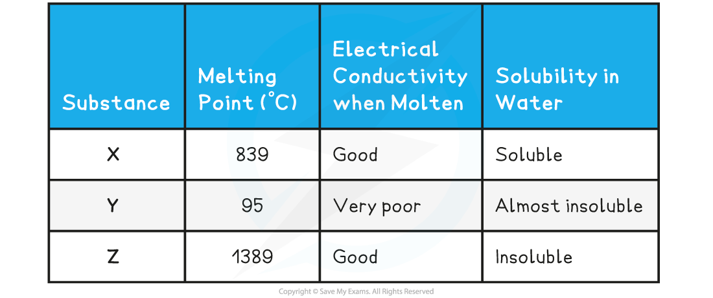

Predicting Structure & Bonding
------------------------------

* Different types of <b>structure </b>and <b>bonding</b> have different effects on the <b>physical properties </b>of substances such as their <b>melting </b>and<b> boiling points</b>, <b>electrical conductivity </b>and <b>solubility</b>

<b>Characteristics of Different Compound Structure Types Table</b>

Predicting Physical Properties
------------------------------

#### Worked Example

<b>Bonding & structure</b>

The table below shows the physical properties of substances X, Y and Z

Which one of the following statements about X and Y is completely true?

<b>Statement 1: </b>X has a giant ionic structure, Y has a giant molecular structure, Z is a metal

<b>Statement 2: </b>X is a metal, Y has a simple molecular structure, Z has a giant molecular structure

<b>Statement 3: </b>X is a metal, Y has a simple molecular structure, Z has a giant ionic structure

<b>Statement 4: </b>X has a giant ionic structure, Y has a simple molecular structure, Z is a metal

<b>Answer</b>

The correct answer is <b>Statement 4</b>

* The relatively high melting point, solubility in water and electrical conductivity when molten suggest that <b>X</b> is a <b>giant ionic structure.</b>

  + The low melting point of <b>Y </b>suggests that little energy is needed to break the lattice which corresponds to a <b>simple molecular structure</b>. This is further supported by the low electrical conductivity and its being almost insoluble in water.
  + Compound <b>Z </b>has a very high melting point which is characteristic of either metallic or giant molecular lattices, however since it conducts electricity, compound Z must be a <b>giant metallic lattice.</b>

#### Worked Example

<b>Bonding & structure</b>

Compound X has the following properties:

What is the most probable structure of X?

<b>A</b>. Network covalent

<b>B</b>. Polar covalent molecule

<b>C</b>. Ionic lattice

<b>D</b>. Metallic lattice

<b>Answer:</b>

The correct option is <b>A</b>

* A high melting point is characteristic of a giant structure, which could be metallic, ionic or covalent

  + The poor conductivity as a liquid and solid would match a giant covalent or network covalent structure