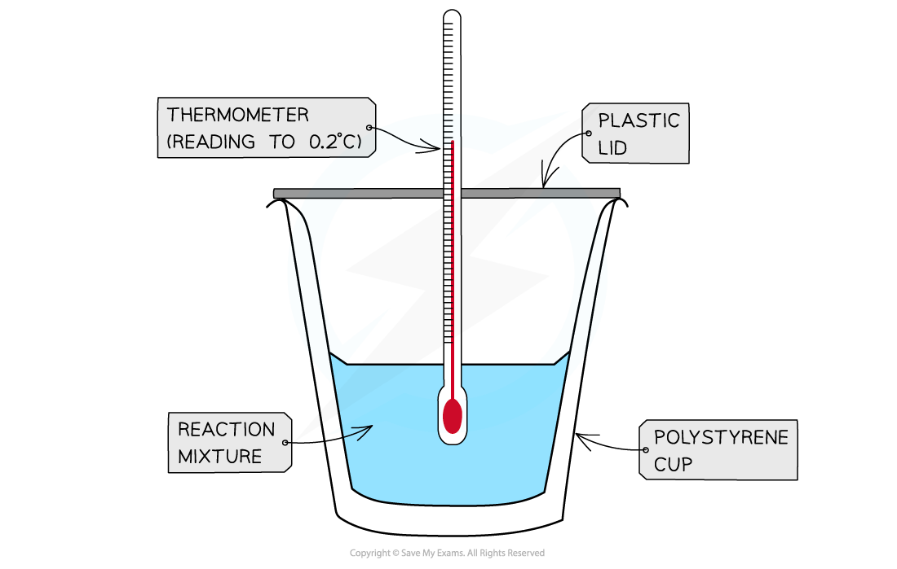

Calculating Energy Transferred, Q
---------------------------------

#### Measuring enthalpy changes

* <b>Calorimetry</b> is the measurement enthalpy changes in chemical reactions
* A simple <b>calorimeter</b> can be made from a <b>polystyrene drinking cup</b>, a <b>vacuum flask</b> or <b>metal can</b>

  

<b>A polystyrene cup can act as a calorimeter to find enthalpy changes in a chemical reaction</b>

* The energy needed to increase the temperature of 1 g of a substance by 1 oC is called the <b>specific heat capacity </b>(<i>c </i>) of the liquid
* The specific heat capacity of water is 4.18 J g-1 K-1
* The energy transferred as heat can be calculated by:

  

<i><b>Equation for calculating energy transferred in a calorimeter</b></i>

#### Worked Example

<b>Specific heat capacity calculations</b>

In a calorimetry experiment 2.50 g of methane is burnt in excess oxygen.

30% of the energy released during the combustion is absorbed by 500 g of water, the temperature of which rises from 25 °C to 68 °C.

The specific heat capacity of water is 4.18 J g-1 K−1

What is the total energy released per gram of methane burnt?

<b>Answer</b>

<b>   Step 1:</b>

* <i>q</i> = <i>m</i> x <i>c</i> x Δ<i>T</i>

  + <i>m</i> (of water) = 500 g
  + <i>c</i> (of water) = 4.18 J g-1 oC-1
  + Δ<i>T</i> (of water) = 68 oC - 25 oC = 43 oC

<b>Step 2: </b>

* <i>q </i>= 500 x 4.18 x 43 = 89 870 J

<b>Step 3: </b>

* This is only 30% of the total energy released by methane

  + Total energy x 0.3 = 89 870 J
  + Total energy = 299 567 J

<b>Step 4:  </b>

* This is released by 2.50 g of methane

  + Energy released by 1.00 g of methane = 299 567 ÷ 2.50 = 120 000 J g-1 (to 3 s.f.) or 120 kJ g-1

Calculating Enthalpy Changes
----------------------------

* Aqueous solutions of acid, alkalis and salts are assumed to be largely water so you can just use the m and c values of water when calculating the energy transferred.
* To calculate any changes in enthalpy per mole of a reactant or product the following relationship can be used:

Δ<i>H</i> = <math><semantics><mrow><mfrac><mi>q</mi><mi>n</mi></mfrac><mo> </mo><mi>or</mi><mo> </mo><mfrac><mrow><mi>m</mi><mo> </mo><mo>×</mo><mo> </mo><mi>c</mi><mo> </mo><mo>×</mo><mi>Δ</mi><mi>T</mi></mrow><mi>n</mi></mfrac></mrow><annotation>{"language":"en","fontFamily":"Times New Roman","fontSize":"18"}</annotation></semantics></math>

* When there is a rise in temperature, the value for Δ<i>H</i> becomes negative suggesting that the reaction is exothermic

  + This means that your value should be negative for an exothermic reaction, e.g. combustion
* When the temperature falls, the value for Δ<i>H</i> becomes positive suggesting that the reaction is endothermic

  + This means that your value should be positive for an endothermic reaction, e.g. combustion

#### Worked Example

1.50 g of an organic liquid (<i>M</i>r = 58.0) underwent complete combustion. The heat formed raised the temperature of 100 g of water from 20 oC to 75 oC.

Calculate the enthalpy of combustion for the organic liquid

<b>Answer</b>

<b>Step 1: </b>Calculate the energy released by the organic liquid

* <i>Q </i>= <i>mc</i>Δ<i>T</i>

  + <i>Q </i>= 100 x 4.18 x (75 - 20)
  + <i>Q </i>= 22990 J
  + <i>Q </i>= 22.99 kJ

<b>Step 2:</b> Calculate the number of moles of the organic liquid

* Number of moles = <math><semantics><mrow><mo>=</mo><mfrac><mrow><mi>m</mi><mi>a</mi><mi>s</mi><mi>s</mi></mrow><mrow><mi>m</mi><mi>o</mi><mi>l</mi><mi>a</mi><mi>r</mi><mo> </mo><mi>m</mi><mi>a</mi><mi>s</mi><mi>s</mi></mrow></mfrac><mo>=</mo><mfrac><mrow><mn>1</mn><mo>.</mo><mn>50</mn></mrow><mrow><mn>58</mn><mo>.</mo><mn>0</mn></mrow></mfrac><mo>=</mo></mrow><annotation>{"language":"en","fontFamily":"Times New Roman","fontSize":"18"}</annotation></semantics></math>0.0259 moles (to 3s.f.)

<b>Step 3:</b> Calculate the enthalpy change of combustion

* Δc<i>H</i>θ <math><semantics><mrow><mo>=</mo><mfrac><mi>Q</mi><mi>n</mi></mfrac><mo>=</mo><mfrac><mrow><mn>22</mn><mo>.</mo><mn>99</mn></mrow><mrow><mn>0</mn><mo>.</mo><mn>0259</mn></mrow></mfrac><mo>=</mo></mrow><annotation>{"language":"en","fontFamily":"Times New Roman","fontSize":"18"}</annotation></semantics></math>-887 kJ mol-1 (to 3s.f.)

  + Remember, combustion is an exothermic process and will, therefore, be a negative enthalpy change value