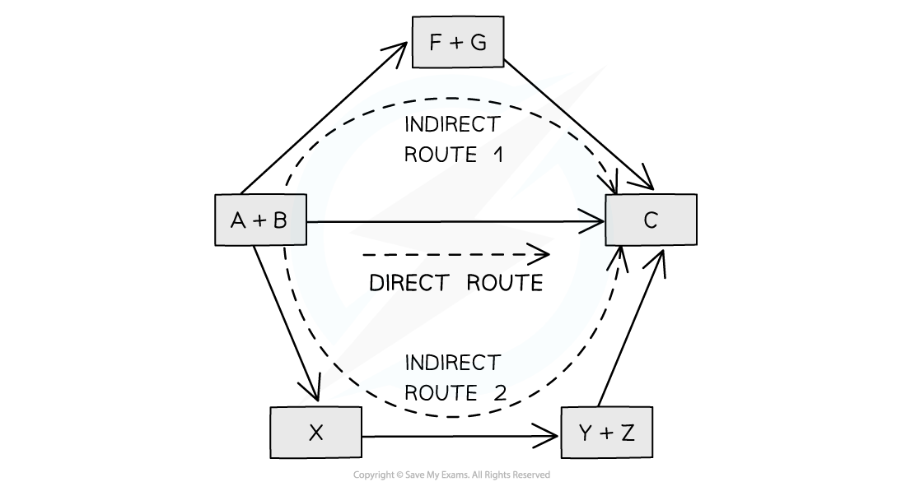

Constructing Hess Cycles
------------------------

* In 1840, the Russian chemist Germain Hess formulated a law which went on to be known as <b>Hess’s Law</b>
* This went on to form the basis of one of the laws of thermodynamics. The first law of thermodynamics relates to the <b>Law of Conservation of Energy</b>
* It is sometimes expressed in the following form:

<i><b>Energy cannot be created or destroyed, it can only change form</b></i>

* This means that in a <b>closed system</b>, the total amount of energy present is always constant
* Hess’s law can be used to calculate the standard enthalpy change of a reaction from known standard enthalpy changes
* Hess’s Law<b> </b>states that:

<b>"The total enthalpy change in a chemical reaction is independent of the route by which the chemical reaction takes place as long as the initial and final conditions are the same."</b>

* This means that whether the reaction takes place in one or two steps, the total enthalpy change of the reaction will still be the same

<i><b>The diagram above illustrates Hess’ Law: the enthalpy change of the direct route, going from reactants (A+B) to product (C) is equal to the enthalpy change of the indirect routes</b></i>

* Hess’ Law is used to calculate enthalpy changes which can’t be found experimentally using <b>calorimetry</b>, e.g.:

<b>3C (s) + 4H</b><b>2 </b><b>(g) → C</b><b>3</b><b>H</b><b>8</b><b>(g)</b>

* Δf<i>H</i> (propane) can’t be found experimentally as hydrogen and carbon don’t react under standard conditions

#### Calculating ΔrH from ΔfH using Hess’s Law energy cycles

* You can see the relationships on the following diagram:

  

<i><b>The enthalpy change from elements to products (direct route) is equal to the enthalpy change of elements forming reactants and then products (indirect route)</b></i>

* The products can be directly formed from the elements = <b>ΔH</b><b>2</b>

<b>OR</b>

* The products can be indirectly formed from the elements = <b>ΔH</b><b>1</b><b> + ΔH</b><b>r</b>

* <b>Equation</b>

<b>ΔH</b><b>2</b><b> = ΔH</b><b>1</b><b> + ΔH</b><b>r</b>

Therefore for energy to be conserved,

<b>ΔH</b><b>r </b><b>= ΔH</b><b>2</b><b> – ΔH</b><b>1</b>

#### Examiner Tips and Tricks

You do not need to learn Hess's Law word for word as it is not a syllabus requirement, but you do need to understand the principle as it provides the foundation for all the problem solving in Chemical Energetics

Hess Cycle Calculations
-----------------------

* Hess cycles can be used to calculate various enthalpy changes as long as sufficient information about the other sides of the cycle is known

#### Worked Example

<b>Calculating the enthalpy change of reaction</b>

Calculate the ΔHf for the following reaction:

2NaHCO3 (s)  <b>→ </b>Na2CO3 (s) + CO2 (g) + H2O (I)

The table below shows the standard enthalpy of formations (ΔHfꝋ) relevant to this reaction:

<b>Answer</b>

<b>Step 1: </b>Write the balanced equation at the top

<b>Step 2: </b>Draw the cycle with the elements at the bottom

<b>Step 3: </b>Draw in all arrows, making sure they go in the correct directions. <b>Remember: </b>You are working with enthalpies of formation which means that the arrows go up to show the compounds being made from the elements. Write the standard enthalpy of formations

<b>Step 4: </b>Apply Hess’s Law

* Δr<i>H</i> = Δ<i>H</i><i>2</i><i> - </i>Δ<i>H</i><i>1</i>

  + It is minus Δ<i>H</i><i>1</i> because you have to go in the opposite direction of the arrow
  + Δ<i>H</i><i>2</i> is Δf<i>H </i>[Na2CO3 (s)] + Δf<i>H </i>[CO2 (g)] + Δf<i>H </i>[H2O (l)]
  + ΔH1 is 2 x Δf<i>H </i>[NaHCO3 (s)]
  + Δr<i>H</i> = (Δf<i>H </i>[Na2CO3 (s)] + Δf<i>H </i>[CO2 (g)] + Δf<i>H </i>[H2O (l)]) - (2Δf<i>H </i>[NaHCO3 (s)])
  + Δr<i>H</i> = ((-1130.7) + (-393.5) + (-285.8)) - (2 x (-950.8))
  + Δr<i>H</i> = +91.6 kJ mol-1

#### Examiner Tips and Tricks

Keep your enthalpy values inside their own brackets so that you don't accidentally lose a minus sign