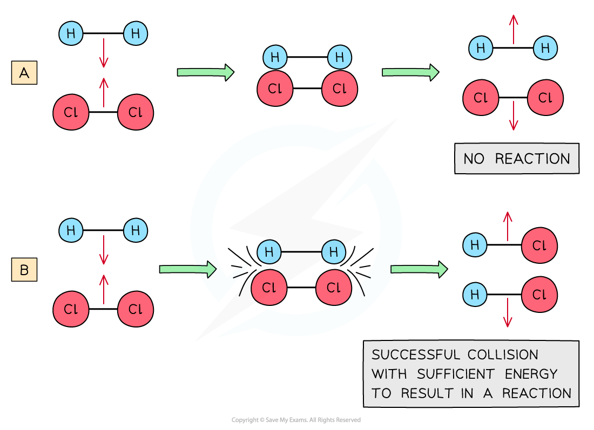
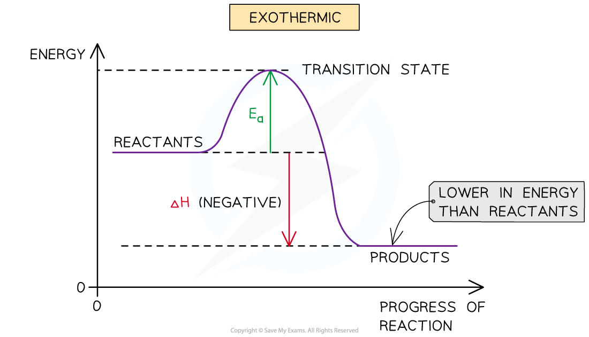
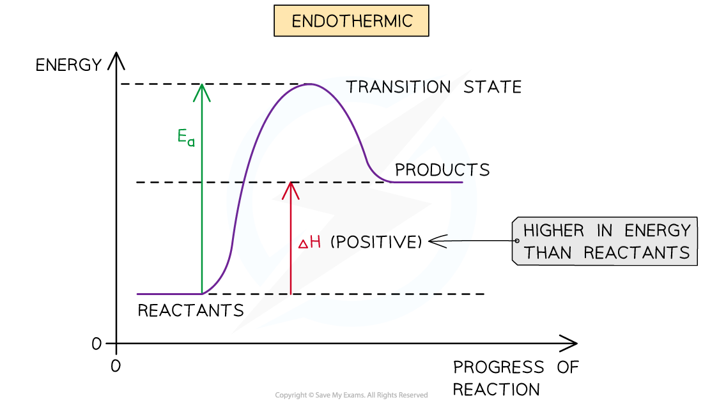

Collision Theory & Rates
------------------------

#### Collision Theory

* When reactants come together the kinetic energy they possess means their particles will collide and some of these collisions will result in chemical bonds being broken and some new bonds being formed
* The rate of a chemical reaction depends on factors including:

  + <b>collision frequency</b>
  + <b>collision energy</b>
  + <b>activation energy</b>

* Ultimately, the rate of reaction depends on the number of successful / effective collisions that happen per unit time

  + A <b>successful / effective collision</b> is where the particles collide in the correct orientation and with sufficient energy for a chemical reaction to occur
  + An <b>unsuccessful / ineffective collision </b>is when particles collide in the wrong orientation or when they don’t have enough energy and <b>bounce off </b>each other without causing a chemical reaction

<i><b>(a) shows an ineffective collision due to the particles not having enough energy whereas (b) shows an effective collision where the particles have the correct orientation and enough energy for a chemical reaction to take place</b></i>

#### Collision frequency

* If a chemical reaction is to take place between two particles, they must first collide
* The number of collisions between particles per unit time in a system is known as th<b>e collision frequency</b>
* The <b>collision frequency</b> of a given system can be altered by:

  + Changing the <b>concentration</b> of the reactants

    - Increasing the concentration will mean that there are more particles available to react in the same volume / amount of space leading to more frequent, successful collisions
  + Changing the total <b>pressure</b>

    - Increasing the pressure means that there will be the same number of particles but in a smaller volume leading to more frequent, successful collisions
  + Changing the<b> temperature</b>

    - This will increase the kinetic energy of the reacting particles, ultimately, resulting in more frequent, successful collisions
  + Changing the <b>size</b> of the reacting particles

    - This is achieved by increasing the <b>surface area</b> which means that there are more particles available to react in the same volume / amount of space leading to more frequent, successful collisions

#### Collision energy

* Not all collisions result in a chemical reaction

  + Most collisions just result in the colliding particles bouncing off each other
  + Collisions which do not result in a reaction are known as<b> unsuccessful collisions</b>
* <b>Unsuccessful collisions</b> happen when the colliding species do not have enough energy to break the necessary bonds
* If they do not have sufficient energy, the collision will not result in a chemical reaction
* If they have sufficient energy, they will react, and the collision will be successful

#### Activation Energy

* For a reaction to take place, the reactant particles need to overcome a minimum amount of energy
* This energy is called the <b>activation energy (</b><i><b>E</b></i><i><b>a</b></i><b>)</b>
* In <b>exothermic reactions, </b>the reactants are higher in energy than the products
* In <b>endothermic reactions, </b>the reactants are lower in energy than the products
* Therefore, the <i>E</i><i>a</i><i> </i>in <b>endothermic reactions</b> is relatively larger than in exothermic reaction

<i><b>The diagram shows that the reactants are higher in energy than the products in the exothermic reaction, so the energy needed for the reactants to go over the energy barrier is relatively small</b></i>

<i><b>The diagram shows that the reactants are lower in energy than the products in the endothermic reaction, so the energy needed for the reactants to go over the energy barrier is relatively large</b></i>

* Even though particles collide with each other in the same orientation, if they don’t possess a minimum energy that corresponds to the <i>E</i><i>a</i><i> </i>of that reaction, the reaction will <b>not</b> take place
* Therefore, for a collision to be <b>effective</b> the reactant particles must collide in the correct orientation <b>AND </b>possess a minimum energy equal to the <i>E</i><i>a</i> of that reaction
* The success of a reaction can be measured using the rate of reaction, which could be achieved by measuring:

  + The amount of reactant lost
  + The amount of product formed
  + The time it takes for a specific colour change to happen
  + The time it takes for a certain amount of precipitate to form