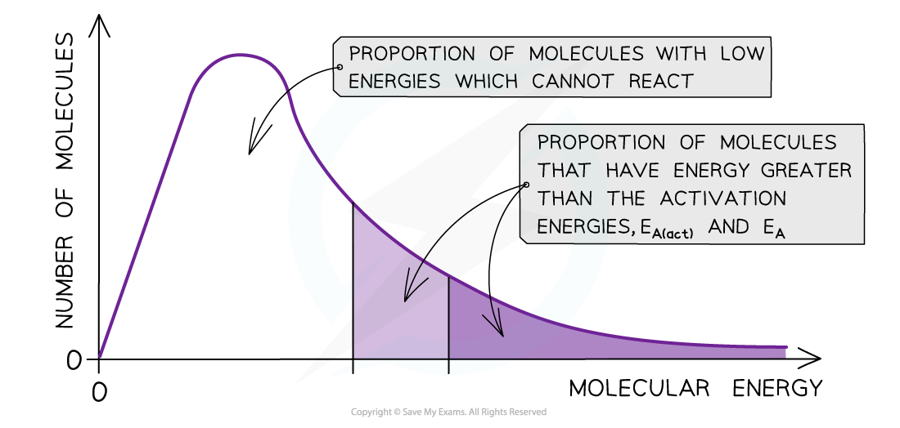

Temperature Effects
-------------------

#### Maxwell-Boltzmann distribution curve

* A<b> Maxwell-Boltzmann distribution curve</b> is a graph that shows the distribution of <b>energies</b> at a certain <b>temperature</b>
* In a sample of a gas, a few particles will have very low energy, a few particles will have very high energy, but most particles will have energy in between

<i><b>The Maxwell-Boltzmann distribution curve shows the distribution of the energies and the activation energy</b></i>

* The graph shows that only a small proportion of molecules in the sample have enough energy for an <b>effective collision </b>and for a <b>chemical reaction </b>to take place

#### Changes in temperature

* When the temperature of a reaction mixture is increased, the particles gain more kinetic energy
* This causes the particles to move around faster resulting in more <b>frequent collisions</b>
* Furthermore, the proportion of <b>successful collisions </b>increases, meaning a higher <b>proportion </b>of the particles possess the minimum amount of energy (activation energy) to cause a chemical reaction
* With higher temperatures, the Boltzmann distribution curve <b>flattens </b>and the peak <b>shifts </b>to the right

<i><b>The Maxwell-Boltzmann distribution curve at T </b></i><i><b>o</b></i><i><b>C and when the temperature is increased by 10 </b></i><i><b>o</b></i><i><b>C</b></i>

* Therefore, an increase in temperature causes an increased rate of reaction due to:

  + There being <b>more effective collisions</b> as the particles have <b>more kinetic energy</b>, making them move around faster
  + A <b>greater proportion</b> of the molecules having <b>kinetic energy</b> greater than the <b>activation energy</b>

#### Examiner Tips and Tricks

The increase in proportion of molecules having kinetic energy greater than the activation has a greater effect on the rate of reaction than the increase in effective collisions

Effects of Adding a Catalyst
----------------------------

* <b>Catalysis</b> is the process in which the rate of a chemical reaction is increased, by adding a <b>catalyst</b>
* A catalyst increases the rate of a reaction by providing the reactants with an <b>alternative reaction pathway</b> which is <b>lower in activation energy</b> than the uncatalysed reaction
* Catalysts can be divided into two types:

  + Homogeneous catalysts
  + Heterogeneous catalysts
* <b>Homogeneous</b> means that the catalyst is in the <b>same phase</b> as the reactants

  + For example, the reactants and the catalysts are all in solution
* <b>Heterogeneous</b> means that the catalyst is in a <b>different phase</b> to the reactants

  + For example, the reactants are gases but the catalyst used is a solid

<i><b>The diagram shows that the catalyst allows the reaction to take place through a different mechanism, which has a lower activation energy than the original reaction</b></i>

#### Maxwell-Boltzmann distribution curve

* <b>Catalysts</b> provide the reactants another pathway which has a lower activation energy
* On the graph below, the original number of successfully reacting particles is shown by the dark shaded area
* By lowering <i>E</i><i>a</i><i>, </i>a <b>greater proportion </b>of molecules in the reaction mixture have the activation energy, and therefore have sufficient energy for an <b>effective collision</b>

  + This is shown by the combined number of particles in the light and dark shaded areas
* As a result of this, the rate of the catalysed reaction is increased compared to the uncatalysed reaction

<i><b>The diagram shows that the total shaded area (both dark and light shading) under the curve shows the number of particles with energy greater than the E</b></i><i><b>a</b></i><i><b> when a catalyst is present. This area is much larger than the dark shaded area which shows the number of particles with energy greater than the E</b></i><i><b>a</b></i><i><b> without a catalyst</b></i>