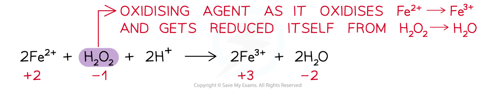
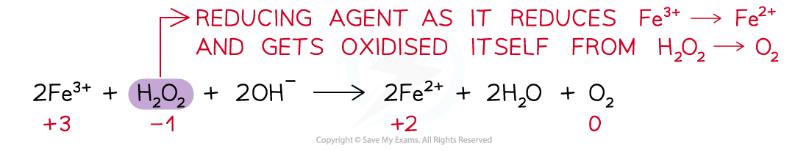

Electron Transfer & Change in Oxidation Number
----------------------------------------------

* Oxidation and reduction in a reaction can be demonstrated in terms of electron transfer

  + For example:

<b>2NH</b><b>3</b><b> + 3Br</b><b>2</b><b> → N</b><b>2</b><b> + 6HBr</b>

* The oxidation number of N in NH3 has changed from -3 to 0

  + As the oxidation number has increased, nitrogen has been oxidised
* The oxidation number of Br has changed from 0 to -1

  + As the oxidation number has decreased, bromine has been reduced
* Overall, nitrogen has reduced bromine by donating electrons

Oxidising & Reducing Agents
---------------------------

#### Oxidising agent

* <b>An oxidising agent</b> is a substance that <b>oxidises</b> another atom or ion by causing it to lose electrons
* An oxidising agent itself gets <b>reduced – gains electrons</b>
* Therefore, the <b>ox. no. </b>of the oxidising agent <b>decreases</b>

<i><b>Example of an oxidising agent in a chemical reaction</b></i>

#### Reducing agent

* <b>A reducing agent </b>is a substance that <b>reduces</b> another atom or ion by causing it to gain electrons
* A reducing agent itself gets <b>oxidised – loses / donates electrons</b>
* Therefore, the <b>ox.</b> <b>no. </b>of the reducing agent <b>increases</b>

<i><b>Example of a reducing agent in a chemical reaction</b></i>

* For a reaction to be recognised as a redox reaction, there must be both an oxidising and reducing agent
* Some substances can act both as oxidising and reducing agents
* Their nature is dependent upon what they are reacting with and the reaction conditions

#### Worked Example

Four reactions are shown.

In which reaction is the species in bold acting as an oxidising agent?

1. Cr2O72- + 8H+ + <b>3SO</b><b>3</b><b>2-</b> → 2Cr3+ + 4H2O + 3SO42-
2. Mg + <b>Fe</b><b>2+</b> → Mg2+ + Fe
3. Cl2 + <b>2Br</b><b>-</b> → 2Cl- + Br2
4. Fe2O3 + <b>3CO</b> → 2Fe + 3CO2

<b>Answer:</b>

* The correct option is 2

  + Oxidising agents are substances that oxidise other species, gain electrons and are themselves reduced.
  + Write down the oxidation numbers of each species in the reaction

|  |  |  |  |  |  |  |
| --- | --- | --- | --- | --- | --- | --- |
| 0 |  | +2 |  | +2 |  | 0 |
| Mg | + | Fe2+ | → | Mg2+ | + | Fe |

* In equation 2, Fe2+ oxidises Mg(0) to Mg2+(+2) and is itself reduced from Fe2+(+2) to Fe(0)

#### Examiner Tips and Tricks

* Some exam questions will ask for the strongest or weakest reducing / oxidising agent
* The strongest reducing agent comes from the equation with the most negative electrode potential

  + <b>Remember: </b>A reducing agent is itself oxidised
  + So, it will lose electrons / increase in oxidation number
* The strongest oxidising agent comes from the equation with the most positive electrode potential

  + <b>Remember: </b>An oxidising agent is itself reduced
  + So, it will gain electrons / decrease in oxidation number