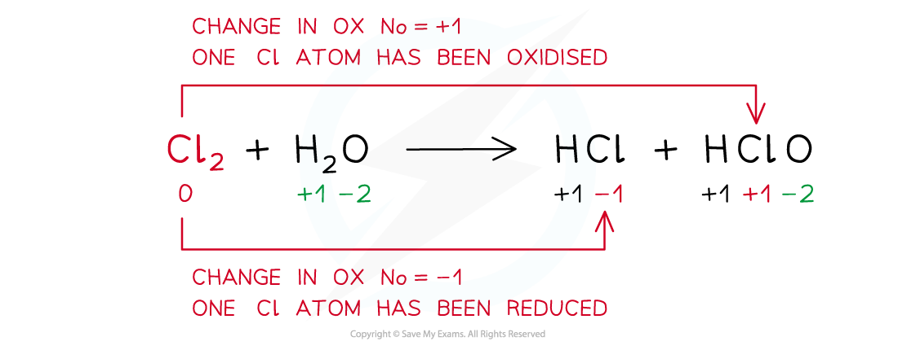
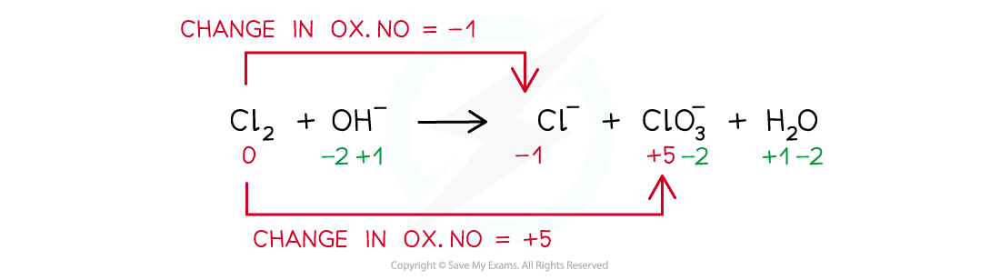

Disproportionation
------------------

#### Disproportionation reactions

* A <b>disproportionation</b> <b>reaction</b> is a reaction in which the same species is simultaneously oxidised and reduced

<i><b>Example of a disproportion reaction in which the same species (chlorine in this case) has been both oxidised and reduced</b></i>

Using Oxidation Numbers
-----------------------

#### Worked Example

<b>Balancing disproportionation reactions</b>

Balance the disproportionation reaction which takes place when chlorine is added to hot concentrated aqueous sodium hydroxide. The products are Cl- and ClO3- ions and water

<b>Answer</b>

<b>Step 1: </b>Write the unbalanced equation and identify the atoms that change in oxidation number:

<b>Step 2: </b>Deduce the oxidation number changes:

<b>Step 3: </b>Balance the oxidation number changes:

<b>Step 4: </b>Balance the charges

<b>Step 5: </b>Balance the atoms

#### Worked Example

<b>Oxidation and reduction</b>

In each of the following equations, state which reactant has been oxidised and which has been reduced.

1. <b>Na</b><b>+</b><b>+ Cl</b><b>-</b><b> →  NaCl</b>
2. <b>Mg + Fe</b><b>2+</b><b>  →  Mg</b><b>2+</b><b> + Fe</b>
3. <b>CO + Ag</b><b>2</b><b>O  →  2Ag + CO</b><b>2</b>

<b>Answer 1:</b>

* Oxidised: Cl- as the oxidation state has increased by 1

  + Reduced: Na+ as the oxidation state has decreased by 1

<b>Answer 2:</b>

* Oxidised: Mg as the oxidation state has increased by 2

  + Reduced: Fe2+ as the oxidation state has decreased by 2

<b>Answer 3:</b>

* Oxidised: C as it has gained oxygen

  + Reduced: Ag as it has lost oxygen