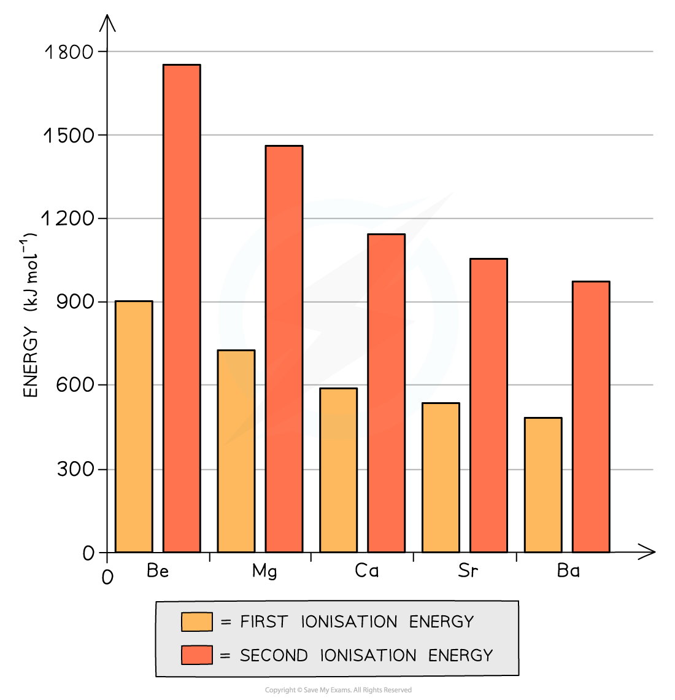

Ionisation Energy
-----------------

#### Chemical trends

* All elements in Group 2 (also called <b>alkali earth metals)</b> have two electrons in their <b>outermost principal quantum shell</b>
* All Group 2 metals can form <b>ionic</b> <b>compounds</b> in which they donate these <b>two outermost electrons </b>(so they act as <b>reducing agents) </b>to become an ion with +2 charge (so they themselves become <b>oxidised)</b>
* Going down the group, the metals become more <b>reactive</b>
* This can be explained by looking at the Group 2 ionisation energies:

<i><b>The graph shows that both the first and second ionization energies decrease going down the group</b></i>

* The <b>first ionisation energy </b>is the energy needed to remove the first outer electron of an atom
* The <b>second ionisation energy</b> is the energy needed to remove the second outer electron of an atom
* The graph above shows that going down the group, it becomes easier to remove the outer two electrons of the metals
* Though the <b>nuclear charge </b>increases going down the group (because there are more protons), factors such as an <b>increased shielding effect </b>and a <b>larger distance </b>between the outermost electrons and nucleus outweigh the attraction of the higher nuclear charge

Group 2 Reactivity
------------------

* As a result of the deceases in ionisation energy, the elements become <b>more reactive</b> going down the group as it gets easier for the atoms to lose two electrons and become 2+ ions
* This trend is shown by looking at reactions of the Group 2 metals:

  + With dilute hydrochloric acid: <b>bubbles</b> of <b>hydrogen gas</b> are given off much faster indicating that the reactions become more vigorous
  + For example:

<b>Mg (s) + 2HCl (aq) → MgCl</b><b>2 </b><b>(aq) + H</b><b>2 </b><b>(g)</b>

* With oxygen: the metals get more reactive with oxygen down the group (Ba is so reactive, that it must be stored in oil to prevent it from reacting with oxygen in air)

<b>2Mg (s) + O</b><b>2</b><b> (g) → 2MgO (s)</b>