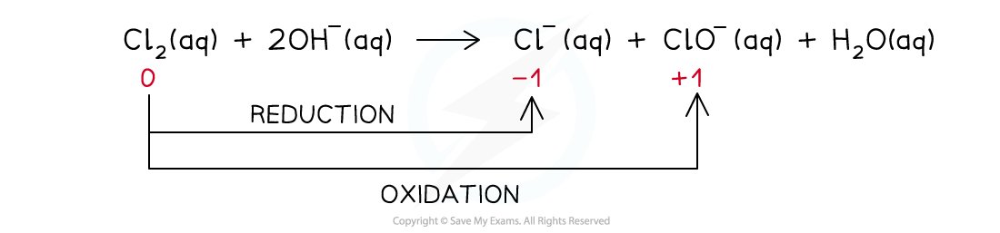

Halogen Redox Reactions
-----------------------

#### Reactions with Group 1 & 2 metals

* The halogens react with some metals to form<b> ionic compounds</b> which are <b>metal halide</b> <b>salts</b>
* In all reactions where halogens are reacting with metals, the metals are being oxidised
* Reaction of sodium and chlorine

  + 2Na (s) + Cl2 (g) → 2NaCl (s)
  + Na is being oxidised, the oxidation number is changing from 0 to +1
* Calcium is a group 2 metal:

  + Ca (s) + Br2 (l) → CaBr2 (s)
  + Ca is being oxidised, the oxidation number is changing from 0 to +2
* Therefore the halogens are acting as oxidising agents

#### Reactions with Iron(II)

* Chlorine and bromine can oxidise iron(II) to iron(III)

Cl2 (g) + 2Fe2+ (aq) → 2Cl- (aq) + 2Fe3+ (aq)

Br2 (g) + 2Fe2+ (aq) → 2Br- (aq) + 2Fe3+ (aq)

* However, iodine is not a strong enough oxidising agent to oxidise iron(II) to iron(III)
* Iodine is actually oxidised from iodide ions to iodine by iron(III)

2I- (aq) + 2Fe3+ (aq) → I2 (aq) + 2Fe2+ (aq)

#### Disproportionation reaction

* A <b>disproportionation</b> <b>reaction</b> is a reaction in which the same species is both oxidised and reduced
* The reaction of <b>chlorine </b>with <b>dilute alkali</b> is an example of a disproportionation reaction
* In these reactions, the chlorine gets oxidised and reduced at the same time
* Different reactions take place at different <b>temperatures </b>of the dilute alkali

#### Chlorine in cold alkali (15 oC)

* The reaction that takes place is:

* The ionic equation is:

* The ionic equation shows that the chlorine gets both oxidised and reduced
* Chlorine gets oxidised as there is an increase in ox. no. from 0 to +1 in ClO-(aq)

  + The half-equation for the oxidation reaction is:

* Chlorine gets reduced as there is a decrease in ox. no. from 0 to -1 in Cl-(aq)

  + The half-equation for the reduction reaction is:

#### Chlorine in hot alkali (70 oC)

* The reaction that takes place is:

* The ionic equation is:

* The ionic equation shows that the chlorine gets both oxidised and reduced
* Chlorine gets oxidised as there is an increase in ox. no. from 0 to +5 in ClO3-(aq)

  + The half-equation for the oxidation reaction is:

* Chlorine gets reduced as there is a decrease in ox. no. from 0 to -1 in Cl-(aq)

  + The half-equation for the reduction reaction is:

#### Drinking water

* Chlorine can be used to clean water and make it drinkable
* The reaction of chlorine in water is a <b>disproportionation reaction </b>in which the chlorine gets both <b>oxidised </b>and <b>reduced</b>

<i><b>The disproportionation reaction of chlorine with water in which chlorine gets reduced to HCl and oxidised to HClO</b></i>

* Chloric(I) acid (HClO) <b>sterilises </b>water by killing <b>bacteria</b>
* Chloric acid can further dissociate in water to form ClO-(aq):

<b>HClO (aq) → H</b><b>+ </b><b>(aq) + ClO</b><b>- </b><b>(aq)</b>

* ClO-(aq) also acts as a <b>sterilising agent </b>cleaning the water