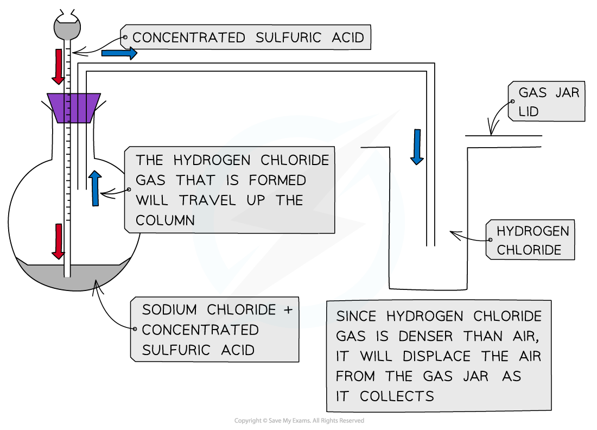
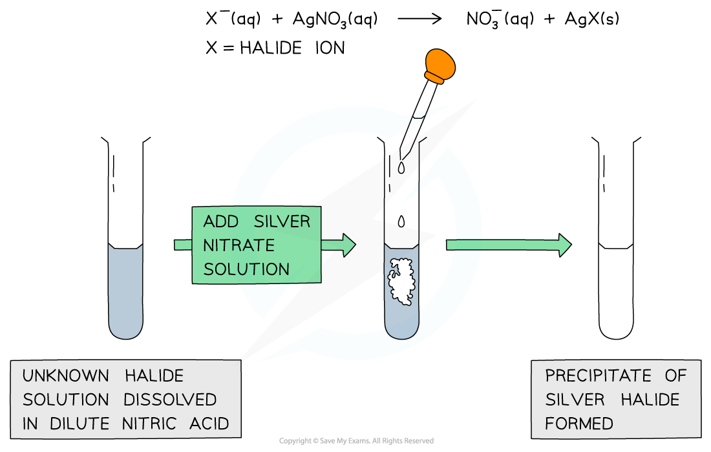
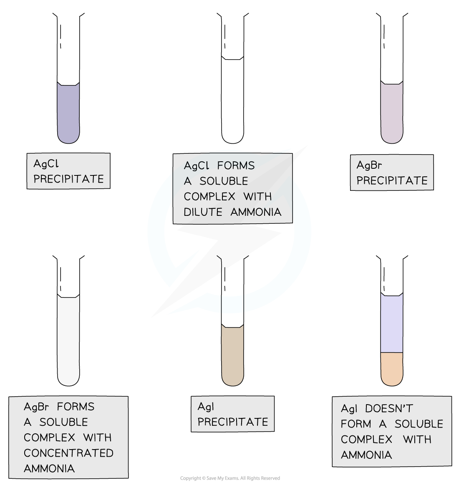
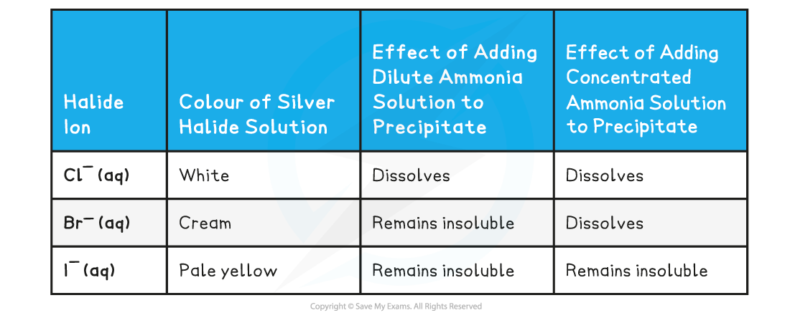

Halide Ion Reactions
--------------------

#### Concentrated sulfuric acid

* Chloride, bromide and iodide ions react with concentrated sulfuric acid to produce <b>toxic gases</b>
* These reactions should therefore be carried out in a fume cupboard
* The general reaction of the halide ions with concentrated sulfuric acid is:

<b>H</b><b>2</b><b>SO</b><b>4</b><b>(aq) + X</b><b>-</b><b>(aq) → HX(g) + HSO</b><b>4</b><b>-</b><b>(aq)</b>

(general equation)

Where <b>X</b><b>-</b> is the halide ion

#### Reaction of chloride ions with concentrated sulfuric Acid

* Concentrated sulfuric acid is dropwise added to sodium chloride crystals to produce <b>hydrogen chloride gas</b>

<i><b>Apparatus set up for the reaction of sodium chloride with concentrated sulfuric acid</b></i>

* The reaction that takes place is:

<b>H</b><b>2</b><b>SO</b><b>4 </b><b>(aq) + NaCl (s) → HCl (g) + NaHSO</b><b>4 </b><b>(s)      </b>

* The HCl gas produces is seen as <b>white fumes </b>

#### Reaction of bromide ions with concentrated sulfuric acid

* The <b>thermal stability </b>of the hydrogen halides decreases down the group
* The reaction of sodium bromide and concentrated sulfuric acid is:

<b>H</b><b>2</b><b>SO</b><b>4 </b><b>(aq) + NaBr (s) → HBr (g) + NaHSO</b><b>4 </b><b>(s)     </b>

* The concentrated sulfuric acid <b>oxidises </b>HBr which decomposes into <b>bromine </b>and <b>hydrogen gas </b>and sulfuric acid itself is <b>reduced </b>to <b>sulfur</b> <b>dioxide</b> <b>gas</b>:

<b>2HBr (g) + H</b><b>2</b><b>SO</b><b>4 </b><b>(aq) → Br</b><b>2 </b><b>(g) + SO</b><b>2 </b><b>(g) + 2H</b><b>2</b><b>O (l)</b>

* The bromine is seen as a <b>reddish-brown gas</b>

#### Reaction of iodide ions with concentrated sulfuric acid

* The reaction of sodium iodide and concentrated sulfuric acid is:

<b>H</b><b>2</b><b>SO</b><b>4 </b><b>(aq) + NaI (s) → HI (g) + NaHSO</b><b>4 </b><b>(s)          </b>

* <b>Hydrogen iodide </b>decomposes the <b>easiest</b>
* Sulfuric acid oxidises the hydrogen iodide to several extents:
* The concentrated sulfuric acid <b>oxidises </b>HI and is itself <b>reduced </b>to <b>sulfur</b> <b>dioxide</b> <b>gas</b>:

<b>2HI (g) + H</b><b>2</b><b>SO</b><b>4 </b><b>(aq) → I</b><b>2 </b><b>(g) + SO</b><b>2 </b><b>(g) + 2H</b><b>2</b><b>O (l)</b>

* Iodine is seen as a violet/purple vapour
* The concentrated sulfuric acid <b>oxidises </b>HI and is itself <b>reduced </b>to <b>sulfur</b>:

<b>6HI (g) + H</b><b>2</b><b>SO</b><b>4 </b><b>(aq) → 3I</b><b>2 </b><b>(g) + S (s) + 4H</b><b>2</b><b>O (l)</b>

* Sulfur is seen as a <b>yellow solid</b>
* The concentrated sulfuric acid <b>oxidises </b>HI and is itself <b>reduced </b>to <b>hydrogen sulfide</b>:

<b>8HI (g) + H</b><b>2</b><b>SO</b><b>4 </b><b>(aq) → 4I</b><b>2 </b><b>(g) + H</b><b>2</b><b>S (s) + 4H</b><b>2</b><b>O (l)</b>

* Hydrogen sulfide has a <b>strong smell of bad eggs</b>

#### Halide ion reactions with concentrated sulfuric acid table

| <b>Halide ion</b> | <b>Reaction with concentrated sulfuric acid</b> | <b>Observations</b> |
| --- | --- | --- |
| Cl– (aq) | H2SO4 (aq) + NaCl (s) → HCl (g) + NaHSO4 (s) | White fumes of HCl (g) |
| Br– (aq) | H2SO4 (aq) + NaBr (s) → HBr (g) + NaHSO4 (s)  H2SO4 (aq) + 2HBr (g) → Br2 (g) + SO2 (g) + 2H2O (l) | Reddish brown fumes of Br2 (g) |
| I– (aq) | H2SO4 (aq) + NaI (s) → HI (g) + NaHSO4 (s)  H2SO4 (aq) + 2HI (g) → I2 (g) + SO2 (g) + 2H2O (l)  H2SO4 (aq) + 6HI (g) → 3I2 (g) + S (s) + 4H2O (l)  H2SO4 (aq) + 8HI (g) → 4I2 (g) + H2S (s) + 4H2O (l) | Purple fumes of I2 (g)  Yellow sulfur solid  Strong "egg" smell of H2S |

#### Silver ions & ammonia

* Halide ions can be identified in an <b>unknown</b> <b>solution</b> by dissolving the solution in <b>nitric acid </b>and then adding a <b>silver nitrate solution </b>followed by <b>ammonia </b>solution
* The halide ions will react with the silver nitrate solution as follows:

<b>AgNO</b><b>3 </b><b>(aq) + X</b><b>- </b><b>(aq) → AgX (s) + NO</b><b>3</b><b>- </b><b>(aq)</b>

<b>Ag</b><b>+ </b><b>(aq) + X</b><b>- </b><b>(aq) → AgX (s)</b>

* <b>X</b><b>-</b> is the halide ion in both equations
* If the unknown solution contains halide ions, then a <b>precipitate</b> of the <b>silver halide</b> will be formed (AgX)

<i><b>A silver halide precipitate is formed upon addition of silver nitrate solution to halide ion solution</b></i>

* <b>Dilute </b>followed by <b>concentrated ammonia</b> is added to the silver halide solution to identify the halide ion
* If the precipitate dissolves in <b>dilute </b>ammonia the unknown halide is <b>chloride</b>
* If the precipitate does not dissolve in dilute but in <b>concentrated </b>ammonia the unknown halide is <b>bromide</b>
* If the precipitate does not dissolve in <b>dilute </b>nor <b>concentrated </b>ammonia the unknown halide is iodide

<i><b>Silver chloride and silver bromide precipitates dissolve on addition of ammonia solution whereas silver iodide doesn’t</b></i>

#### Reaction of halide ions with silver nitrate & ammonia solutions table

#### Reactions with hydrogen halides

* When a halogen reacts with hydrogen a hydrogen halide is produced, for example:

  + <b>Cl</b><b>2</b><b> (g) + H</b><b>2</b><b> (g) → 2HCl (g) </b>
* These hydrogen halides react with ammonia gas to form <b>ammonium halides</b>

  + <b>NH</b><b>3</b><b> (g) + HCl (g) → NH</b><b>4</b><b>Cl (s) </b>
* Hydrogen halides will also react with water
* For example, hydrogen chloride also dissolves in water to form <b>hydrochloric acid</b>

  + <b>HCl (g) → H</b><b>+ </b><b>(aq) + Cl</b><b>-</b><b> (aq) </b>