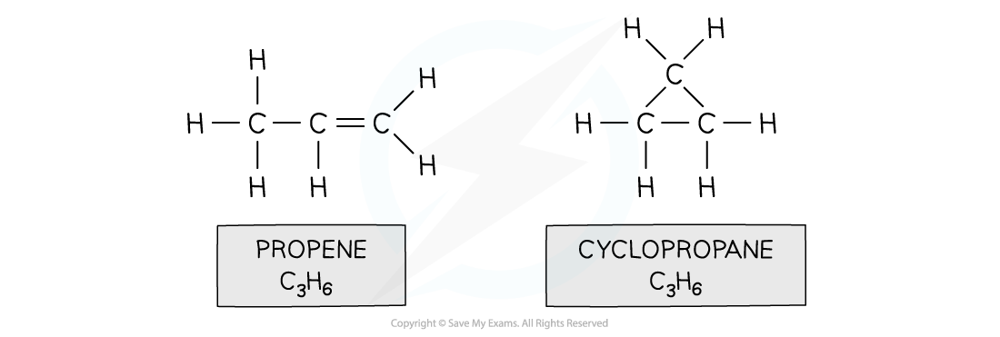
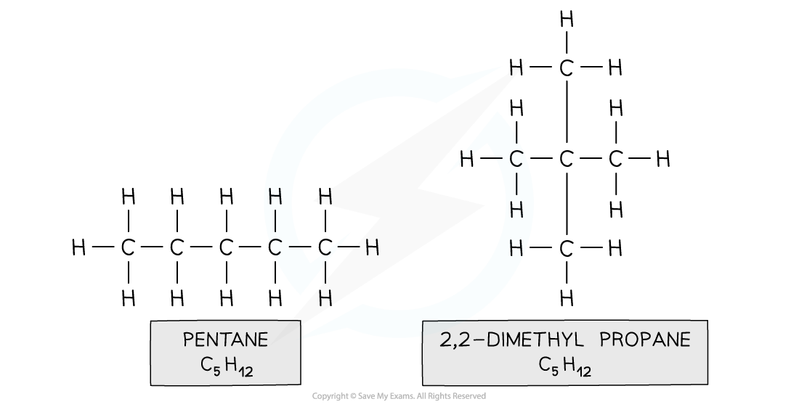
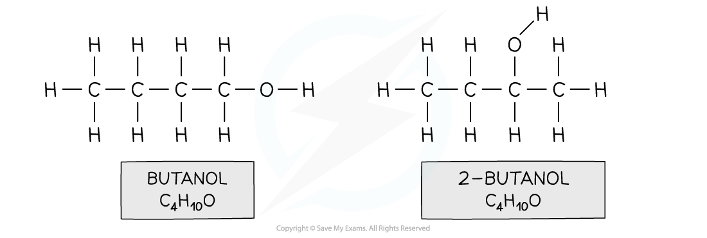
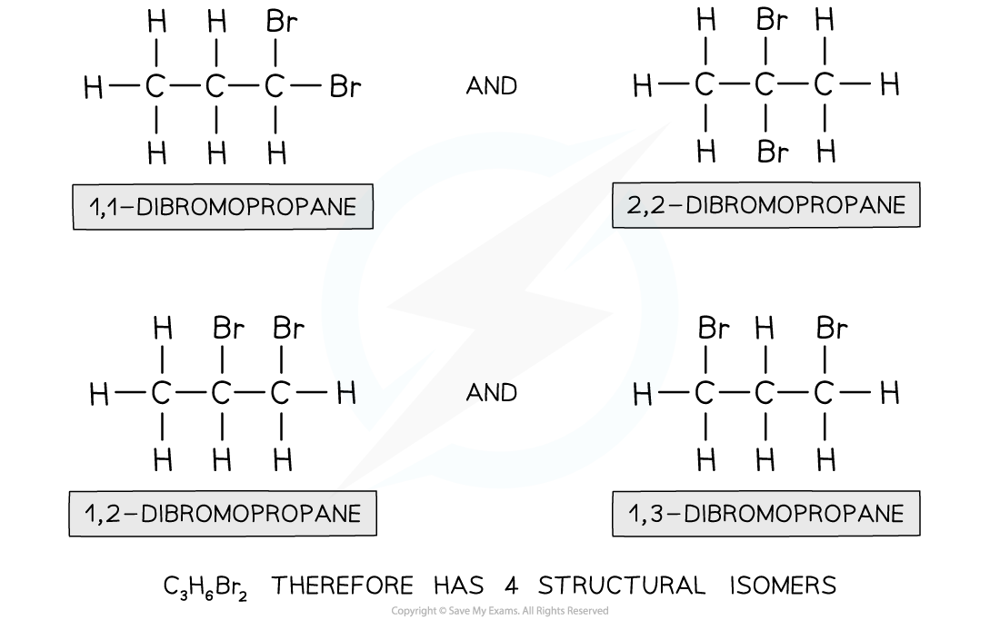
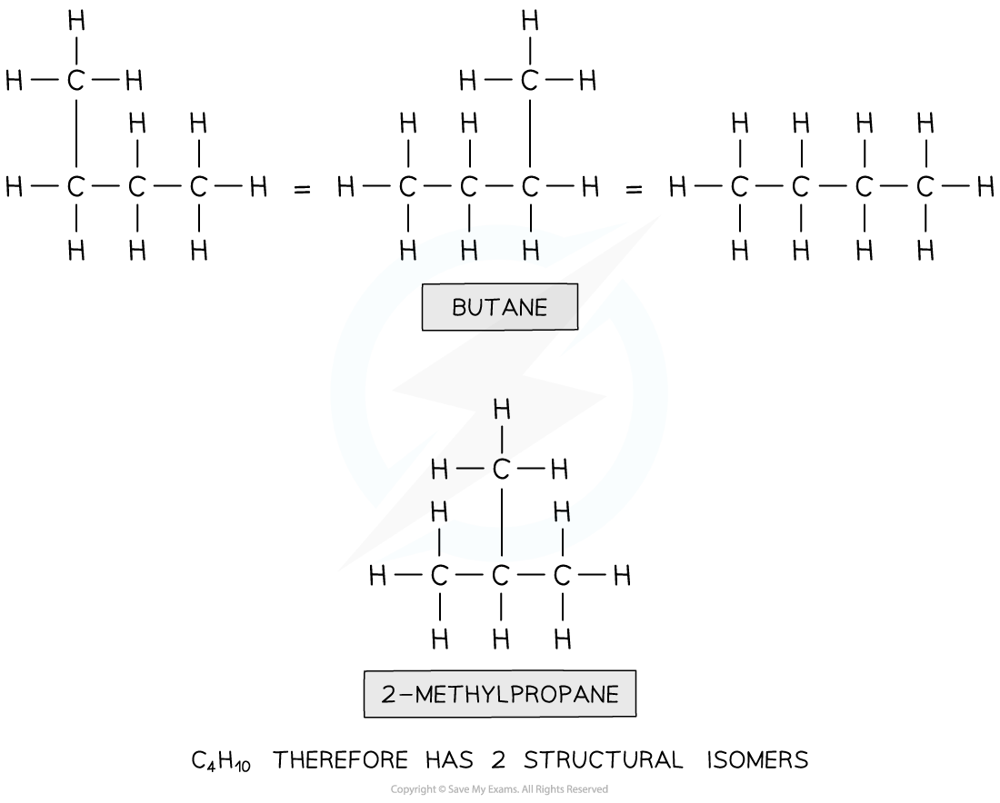

Structural Isomerism
--------------------

* <b>Structural isomers </b>are compounds that have the same <b>molecular</b> formula but different <b>structural</b> formulae

  + E.g. propene and cyclopropane

<i><b>Both propene and cyclopropane are made up of 3 carbon and 6 hydrogen atoms but the structure of the two molecules differs</b></i>

* There are two different types of structural isomerism you need to be aware of:

  + <b>Chain</b> isomerism
  + <b>Positional</b> isomerism

#### Chain isomerism

* <b>Chain isomerism </b>is when compounds have the same molecular formula, but their longest hydrocarbon chain is not the same
* This is caused by branching

  + E.g. pentane and 2,2-dimethylpropane<i><b> </b></i>

<i><b>Both compounds are made up of the same atoms, however the longest carbon chain in pentane is 5 and in 2,2-dimethylpropane it is 3 (with two methyl branches)</b></i>

#### Positional isomerism

* <b>Positional isomers </b>arise from differences in the position of a functional group in each isomer

  + The functional group can be located on different carbons
  + For example, butan-1-ol and butan-2-ol<i><b> </b></i>

<i><b>Both compounds have an alcohol group and are made up of 4 carbons, 10 hydrogens and one oxygen, however in butanol the functional group is located on the first carbon and in 2-butanol on the second carbon</b></i>

#### Worked Example

<b>Isomers of dibromopropane </b>How many isomers are there of dibromopropane, C3H6Br2?

<b>Answer</b>

<b>Step 1:</b> Draw the structural formula of the compound

<b>Step 2: </b>Determine whether it is a stereo or structural isomer

There is no restricted bond rotation around the C-C bond, so it is structural isomerism

<b>Step 3:</b> Determine whether it is a functional group, chain or positional isomerism

* Functional group? No, as Br is the only functional group possible

  + Chain? No, as the longest chain can only be 3
  + Positional? Yes, as the two bromine atoms can be bonded to different carbon atoms

#### Worked Example

<b>Deducing isomers of C</b><b>4</b><b>H</b><b>10</b><b> </b>How many isomers are there of the compound with molecular formula C4H10?

<b>Answer</b>

<b>Step 1:</b> Draw the structural formula of the compound

<b>Step 2: </b>Determine whether it is a stereo or structural isomer.

There is no restricted bond rotation around the C-C bond so it is structural isomerism

<b>Step 3:</b> Determine whether it is a functional group, chain or positional isomerism

* Functional group? No, as there are no functional groups

  + Positional? No, as there are no functional groups which can be positioned on different carbon atoms
  + Chain? Yes!

