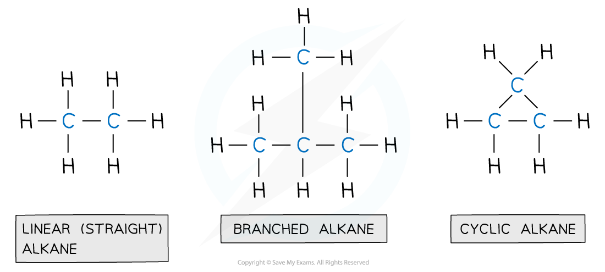

Describing Alkanes
------------------

* <b>Hydrocarbons</b> are compounds containing hydrogen and carbon only
* There are four families of hydrocarbons you should know: <b>alkanes, alkenes, alkynes</b> and<b> arenes</b>

  + Alkanes, alkenes and alkynes can be described as <b>aliphatic</b>
  + Arenes can be described as <b>aromatic</b>
* Alkanes have the general molecular formula <b>C</b><b>n</b><b>H</b><b>2n+2</b><b> </b>
* They contain only <b>single bonds</b> and are said to be <b>saturated</b>
* Alkanes are named using the nomenclature rule <b>alk + ane</b>

  + The <b>alk</b> portion of the name depends on the number of carbons

    - 1 carbon = meth
    - 2 carbons = eth
    - 3 carbons = prop
    - 4 carbons = but
    - 5 carbons = pent
    - After 5 carbons, the naming of alkanes matches the names of the polygons in Maths
  + The <b>ane</b> portion of the name suggests single bonds between the carbon atoms

<b>The First Six Members of the Alkane Family</b>

* Alkanes can be linear, branched or cyclic

  + The key points are that there are no functional groups and only single bonds between the carbon atoms

<i><b>Alkanes are compounds made up of carbon and hydrogen atoms only and contain no functional group</b></i>