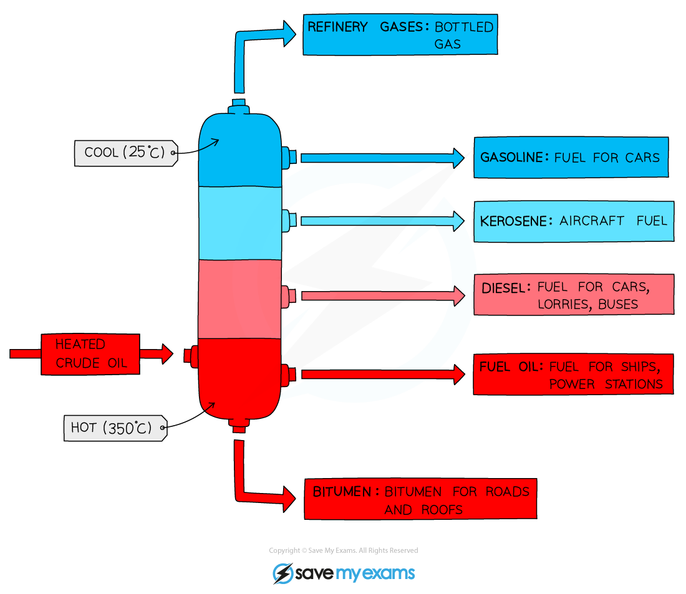

Alkane Fuels
------------

* Alkanes are obtained from the <b>fractional distillation</b> and <b>cracking </b>of crude oil

#### Fractional distillation of crude oil

* Crude oil is a <b>mixture </b>of hydrocarbons containing <b>alkanes</b>, <b>cycloalkanes</b> and <b>arenes</b> (compounds with a benzene ring)
* The crude oil is extracted from the earth in a drilling process and transported to an oil refinery
* At the oil refinery the crude oil is separated into useful fuels by fractional distillation

  + This is a separating technique in which the wide range of different hydrocarbons are separated into fractions based on their boiling points

<i><b>Crude oil is initially separated into fractions with similar boiling points in a process called fractional distillation</b></i>

#### Cracking of crude oil fractions

* However, the smaller hydrocarbon fractions (such as gasoline fractions) are in high demand compared to the larger ones
* Therefore, some of the <b>excess </b>heavier fractions are broken down into smaller, <b>more</b> <b>useful</b> <b>compounds</b>
* These more useful compounds include <b>alkanes</b> and <b>alkenes</b> of <b>lower</b> relative formula mass (<b>M</b><b>r</b>)
* This process is called <b>cracking</b>

<i><b>The heavier fractions that are obtained in fractional distillation are further cracked into useful alkane and alkenes with lower M</b></i><i><b>r</b></i><i><b> values</b></i>

* When a large hydrocarbon is cracked, a <b>smaller</b> <b>alkane</b> and <b>alkene</b> molecules are formed

  + E.g.. octane and ethene from decane

<i><b>Long hydrocarbon fraction is cracked into two smaller ones</b></i>

* The <b>low-molecular mass</b> <b>alkanes</b> formed make good fuels and are in high demand

* There are two types of cracking:
* <b>Thermal cracking</b> requires high temperatures (up to 1000 oC) and high pressure (up to 70 atmospheres) and produces alkanes and a lot of alkenes
* <b>Catalytic cracking</b> uses a lower temperature (around 450 oC) and slight pressure in the presence of a catalyst such as a zeolite or aluminium oxide to produce mainly aromatic hydrocarbons

#### Reforming alkanes

* Many vehicles run on petrol or diesel which are both a mixture of alkanes along with other hydrocarbons, impurities and additives
* Many of the alkanes in these fuels are straight chain alkanes
* These straight chain alkanes are more likely to explode, rather than combust, inside the engine

  + This is known as <b>knocking </b>and makes the combustion less efficient
* To reduce this straight chain alkanes are <b>reformed </b>into:

  + Branched alkanes, e.g. octane → 2,5-dimethylhexane

CH3CH2CH2CH2CH2CH2CH2CH3 → CH3CH<b>(CH</b><b>3</b><b>)</b>CH2CH2CH<b>(CH</b><b>3</b><b>)</b>CH3

* Cycloalkanes, e.g. hexane → cyclohexane

CH3CH2CH2CH2CH2CH3 → C6H12 + H2

* Reforming often uses a platinum catalyst