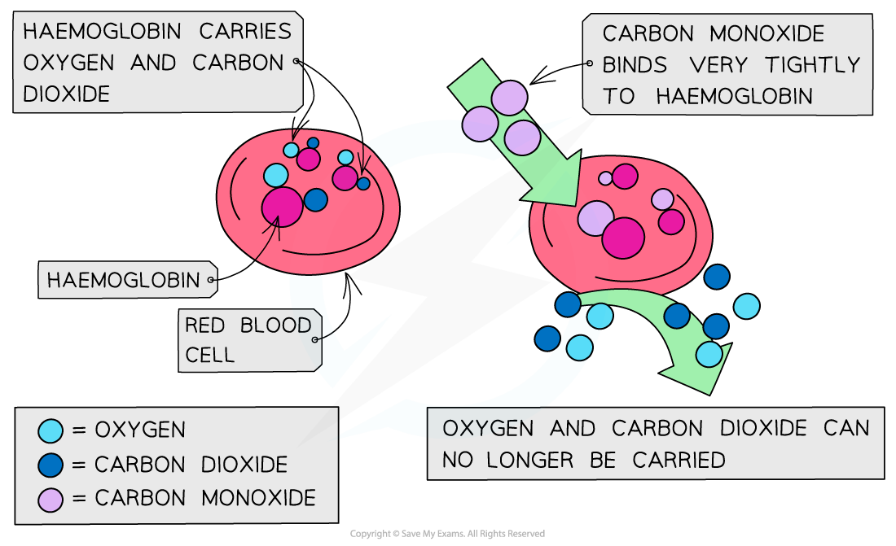

Causes & Effects of Pollution
-----------------------------

* Alkanes are <b>combusted </b>(burnt) on a large scale for their use as fuels

#### Complete combustion

* When alkanes are burnt in <b>excess </b>(plenty of) oxygen, <b>complete combustion </b>will take place and all carbon and hydrogen will be oxidised to <b>carbon dioxide </b>and <b>water</b> respectively

  + For example, the complete combustion of octane to carbon dioxide and water

<i><b>The complete combustion of alkanes</b></i>

#### Incomplete combustion

* When alkanes are burnt in only a <b>limited supply </b>of oxygen, <b>incomplete combustion</b> will take place and not all the carbon is fully oxidised
* Some carbon is only <b>partially </b>oxidised to form <b>carbon monoxide</b>

  + For example, the incomplete combustion of octane to form carbon monoxide

<i><b>The incomplete combustion of alkanes</b></i>

* Incomplete combustion often takes place inside a <b>car engine </b>due to a limited amount of oxygen present
* With a reduced supply of oxygen, <b>carbon</b> will be produced in the form of soot:

  

* Car <b>exhaust fumes </b>include toxic gases such as <b>carbon monoxide </b>(CO), <b>oxides of nitrogen </b>(NO/NO2) and <b>volatile organic compounds </b>(VOCs)
* When released into the atmosphere, these pollutants have serious environmental consequences damaging nature and health

#### Carbon monoxide

* CO is a toxic and odourless gas which can cause dizziness, loss of consciousness and eventually death

  + The CO binds well to haemoglobin which therefore cannot bind oxygen and carbon dioxide
  + Oxygen is transported to organs
  + Carbon dioxide is removed as waste material from organs

<i><b>The high affinity of CO to haemoglobin prevents it from binding to O</b></i><i><b>2</b></i><i><b> and CO</b></i><i><b>2</b></i>

#### Oxides of nitrogen

* Normally, nitrogen is too unreactive to react with oxygen in air
* However, in a car engine, high temperatures and pressures are reached causing the oxidation of nitrogen to take place:

<b>N</b><b>2</b><b>(g) + O</b><b>2</b><b>(g) → 2NO(g)</b>

<b>N</b><b>2</b><b>(g) + 2O</b><b>2</b><b>(g) → 2NO</b><b>2</b><b>(g)</b>

* The <b>oxides of nitrogen</b> are then released in the exhaust fumes into the atmosphere
* Car exhaust fumes also contain <b>unburnt</b> <b>hydrocarbons</b> from fuels and their <b>oxides</b> (VOCs)
* In air, the nitrogen oxides can react with these VOCs to form <b>peroxyacetyl</b> <b>nitrate</b> (PAN) which is the main pollutant found in <b>photochemical smog</b>

  + PAN is also harmful to the lungs, eyes and plant-life
* Nitrogen oxides can also dissolve and react in water with oxygen to form nitric acid which is a cause of <b>acid rain</b>
* Acid rain can cause corrosion of buildings, endangers plant and aquatic life (as lakes and rivers become too <b>acidic</b>) as well as directly damaging human health

#### Particulates

* Solid carbon particles (or particulates) released from incomplete combustion clump together to form <b>soot</b> which gradually falls back to the ground
* Particulates can cause several problems:
* If they are inhaled they can damage the lungs and cause <b>respiratory</b> problems
* They can cover buildings and statues, making them look <b>unclean </b>and accelerating corrosion
* They can reflect sunlight back into space reducing the amount of light reaching the earth, this is called <b>global dimming</b>

#### Pollutants, their Effect & Removal Table

