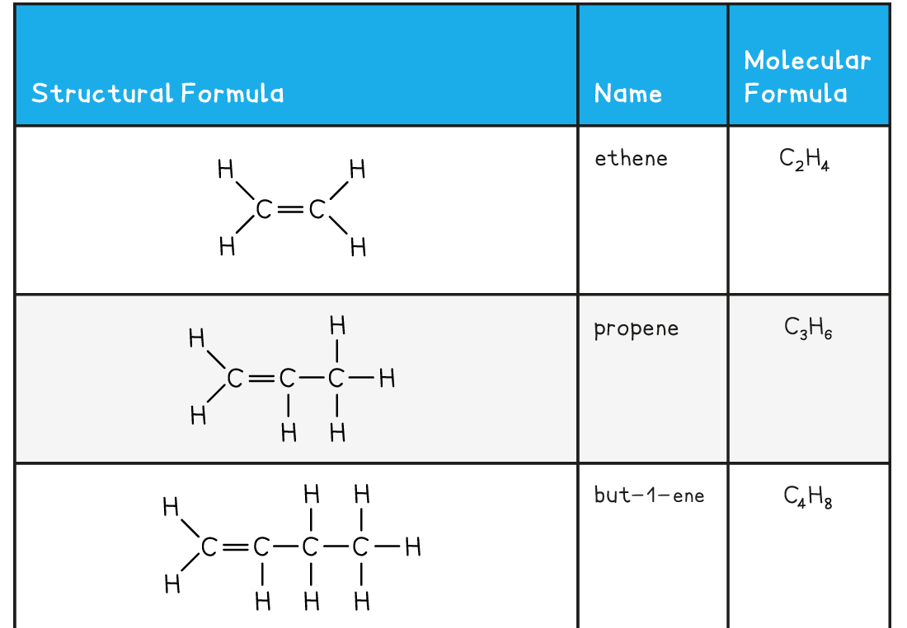
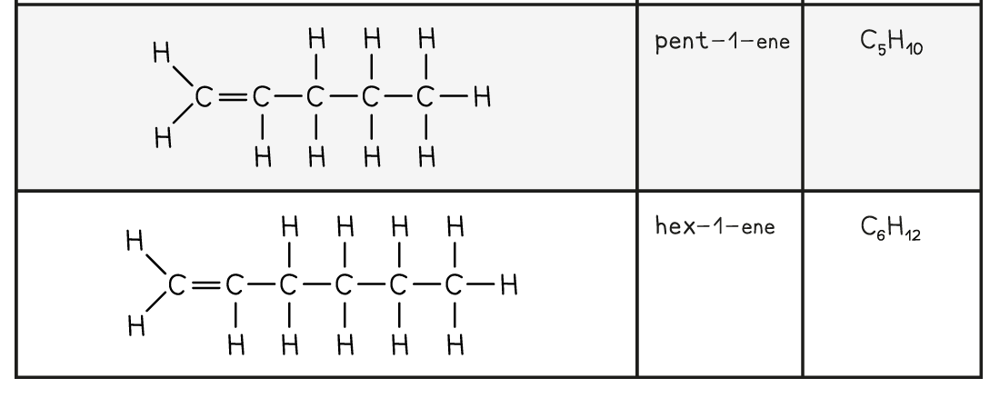

Describing Alkenes
------------------

* All alkenes contain a <b>double carbon bond</b>, which is shown as two lines between two of the carbon atoms i.e. C=C
* All alkenes contain a double carbon bond, which is the functional group and is what allows alkenes to react in ways that alkanes cannot
* <b>Alkenes</b> have the general molecular formula<b> C</b><b>n</b><b>H</b><b>2n</b>
* They are said to be <b>unsaturated hydrocarbons</b>

  + They contain carbon-carbon double bonds
  + They are made up of hydrogen and carbon atoms only
* Alkenes are named using the nomenclature rule <b>alk + ene</b>
* In molecules with a straight chain of 4 or more carbon atoms, the position of the C=C double bond must be specified
* The carbon atoms on the straight chain must be numbered, starting with the end closest to the double bond
* The lowest-numbered carbon atom participating in the double bond is indicated just before the -ene:

#### The First Five Members of the Alkene Family

