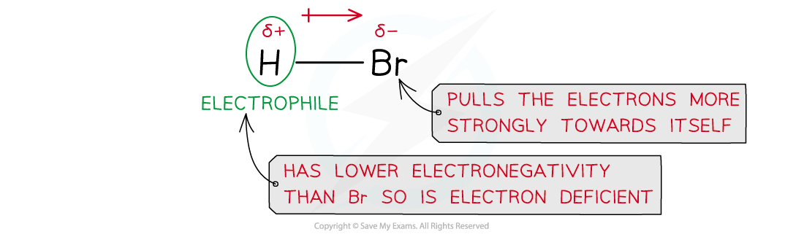
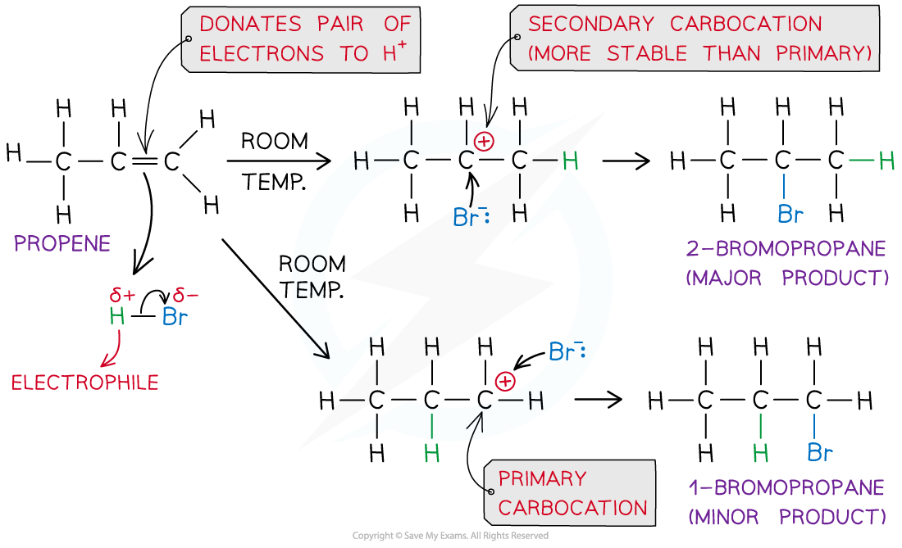
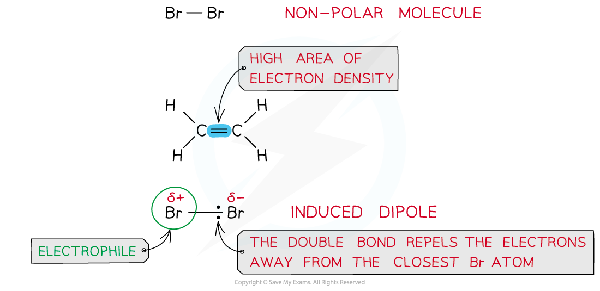
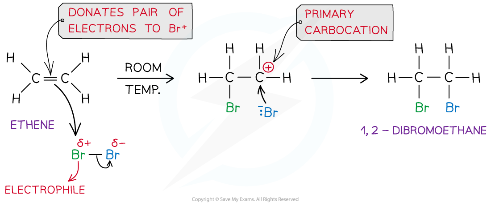
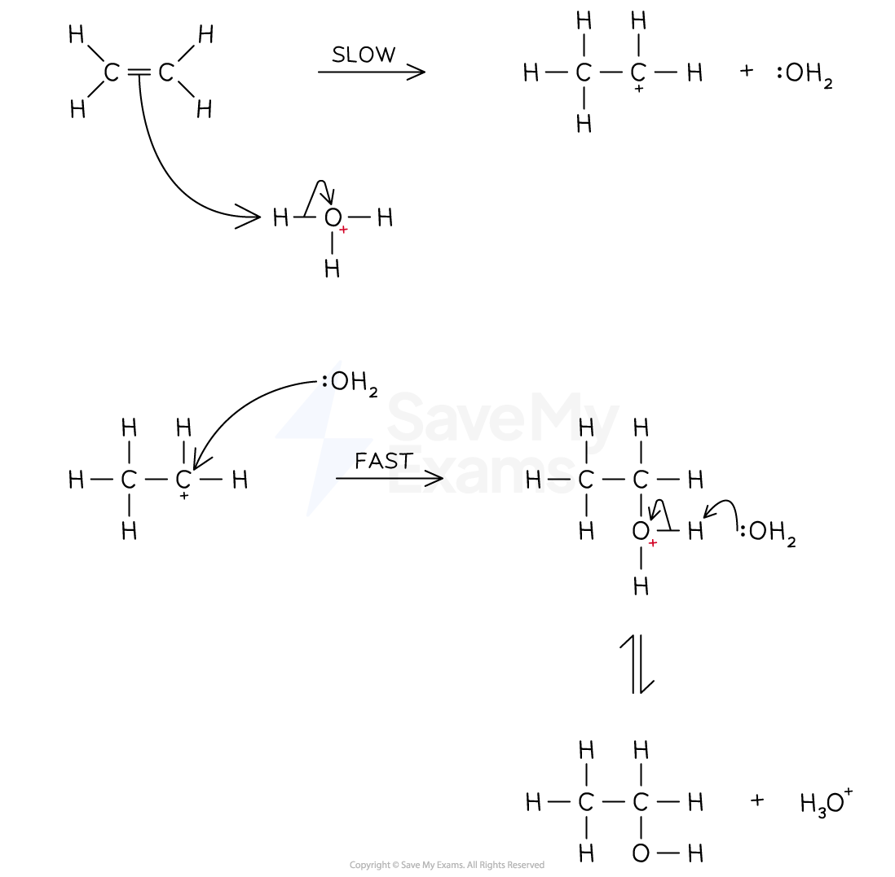

Electrophilic Addition Mechanism
--------------------------------

#### Electrophilic addition of hydrogen halides

* Hydrogen halides such as hydrogen bromide (HBr) are polar as the hydrogen and halogen atoms have different electronegativities
* The bromine atom has a stronger pull on the electrons in the H-Br bond
* As a result of this, the Br atom has a partial negative and the H atom a partial positive charge

<i><b>Due to differences in electronegativities of the hydrogen and bromine atom, HBr is a polar molecule</b></i>

* In an addition reaction, the H atom acts as an electrophile and accepts a pair of electrons from the C-C bond in the alkene

  + The H-Br bond breaks heterolytically, forming a Br- ion
* This result in the formation of a highly reactive carbocation intermediate which reacts with the Br- (nucleophile)

<i><b>Example of an electrophilic addition reaction of HBr and propene to form 1-bromopropane and 2-bromopropane</b></i>

#### Electrophilic addition of Halogens

* Halogens such as bromine (Br2) are a non-polar molecules as both atoms have similar electronegativities and therefore equally share the electrons in the covalent bond
* However, when a bromine molecule gets closer to the double bond of an alkene, the high electron density in the double bond repels the electron pair in Br-Br away from the closest Br atom
* As a result of this, the closest Br atom to the double bond is slightly positive and the further Br atom is slightly negatively charged

<i><b>Br</b></i><i><b>2</b></i><i><b> is a non-polar molecule however when placed close to an area of high electron density it can get polarised</b></i>

* In an addition reaction, the closest Br atom acts as an electrophile and accepts a pair of electrons from the C-C bond in the alkene

  + The Br-Br bond breaks heterolytically, forming a Br- ion
* This results in the formation of a highly reactive carbocation intermediate which reacts with the :Br- (nucleophile)

<i><b>Example of an electrophilic addition reaction of Br</b></i><i><b>2</b></i><i><b> and ethene to form dibromoethane</b></i>

#### Examiner Tips and Tricks

The stability of the carbocation intermediate is as follows:

tertiary > secondary > primary

When more than one carbocations can be formed, the major product of the reaction will be the one that results from the nucleophilic attack of the most stable carbocation.

### Electrophilic addition of water

* Water is a weak electrophile, so does not undergo addition reactions with alkenes unless in the presence of a strong acid which can act as a catalyst

  + H3O+ acts as the electrophile
* The reaction occurs in two steps:

  + Step 1

    - The π electrons in the C=C are attracted to H3O+
    - Heterolytic fission occurs and a carbocation is formed
  + Step 2

    - Water acts as a nucleophile and donates a pair of electrons to the positive carbon atom forming the C-O bond
    - An equilibrium is established between the positive product and the deprotonated product (the alcohol)
    - The H3O+ is regenerated as the catalyst

<i><b>This mechanism is catalysed by concentrated acid</b></i>