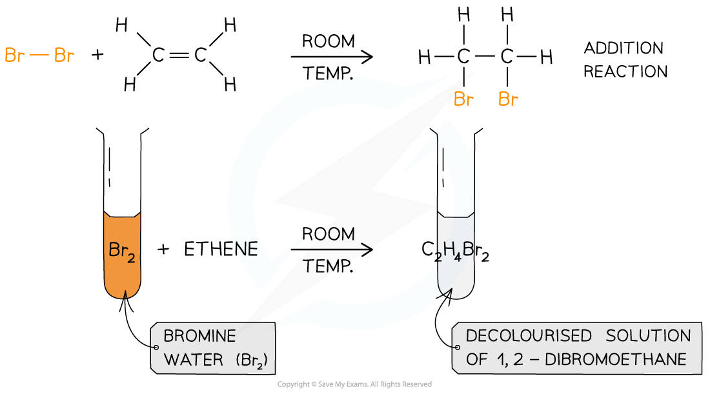

Saturation Test
---------------

* Halogens can be used to test if a molecule is <b>unsaturated </b>(i.e. contains a double bond)
* Br2(aq) is an orange or yellow solution, called <b>bromine water </b>and this is the halogen most commonly used
* The unknown compound is <b>shaken </b>with the bromine water
* If the compound is unsaturated, an addition reaction will take place and the coloured solution will decolourise

<i><b>The decolourisation of bromine water by an unsaturated compound as a result of an addition reaction</b></i>