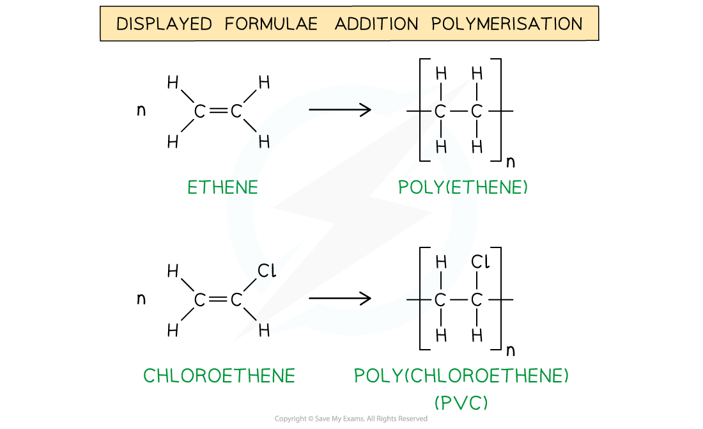
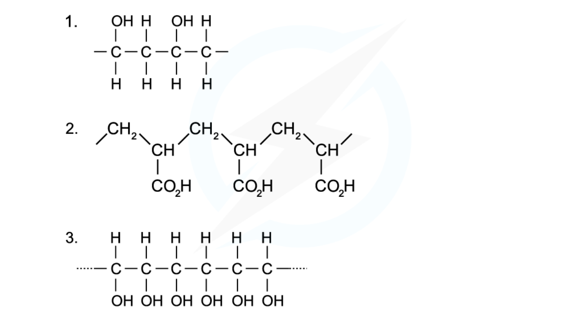
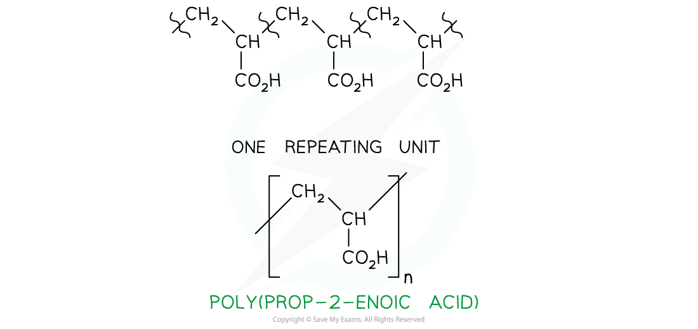
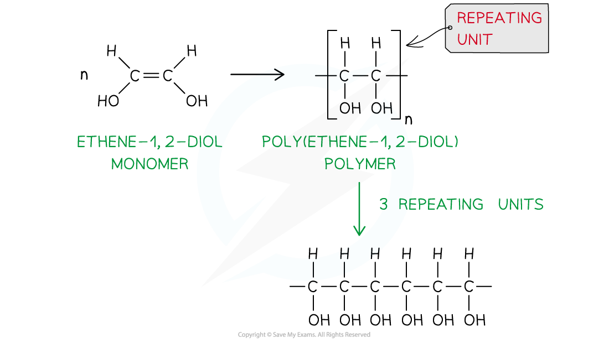

Addition Polymerisation
-----------------------

#### Addition polymerisation

* <b>Addition polymerisation </b>is one of the most important addition reactions of alkenes which form the basis of the plastics industry
* Addition polymerisation is the reaction in which many <b>monomers</b> containing at least one C=C double bond form long chains of <b>polymers</b> as the only product

  + Just like in other addition reactions of alkenes, the π-bond in each C-C bond breaks and then the monomers link together to form new C-C single bonds
* A <b>polymer </b>is a long-chain molecule that is made up of many repeating units
* The small, reactive molecules that join together to form the polymer are called <b>monomers</b>
* A polymerisation reaction can be represented by a <b>general formula </b>or by using <b>displayed formulae</b>

  + Eg. poly(ethene) and poly(chloroethene) (also known as <b>PVC</b>) are polymers made up of the ethene and chloroethene monomers respectively and are commonly used in making plastics

<i><b>The general formulae of the addition polymerisation of ethene (1) and chloroethene (2)</b></i>

<i><b>The displayed formulae of the addition polymerisation of ethene (1) and chloroethene (2)</b></i>

* Just like any other <b>addition </b>reaction of alkenes, addition polymerisation gives only <b>one </b>product

#### Deducing repeat units

* A <b>repeat unit </b>is the smallest group of atoms that when connected one after the other make up the polymer chain

  + It is represented by <b>square brackets </b>in the displayed and general formula
* In <b>poly(alkenes) </b>(such as poly(ethene)) and <b>substituted poly(alkenes) </b>(such as PVC) made of <b>one type of monomer </b>the repeating unit is the same as the monomer except that the C=C double bond is changed to a C-C single bond

<i><b>The repeating units of poly(ethene) and poly(chloroethene) are similar to their monomer except that the C=C bond has changed into a C-C bond</b></i>

#### Worked Example

<b>Identifying monomers</b>

Identify the monomers present in the given sections of addition polymer molecules:

<b>Answer 1:</b>

* When ethenol, CH(OH)=CH2, is polymerised, the C=C double bond opens to produce a repeating unit of -CH(OH)-CH2- This gives the polymer poly(ethenol)

<b>Answer 2:</b>

* To find the monomer, first the repeating unit should be deduced. Repeating units have only 2 carbons in the polymer main chain

* Since the repeating unit is now found, it can be concluded that the monomer is prop-2-enoic acid

<b>Answer 3:</b>

* Again, the repeating unit only has 2 carbons in the polymer chain which in this case are two carbon atoms that each contain one OH group

  + Thus, when ethene-1,2-diol, CH(OH)=CH(OH), is polymerised, the C=C double bond opens to produce a repeating unit of  -CH(OH)-CH(OH)- which gives the polymer poly(ethene-1,2-diol)

#### Examiner Tips and Tricks

The section of the polymer chain shown inside the square brackets by the structural or displayed formula is the <b>repeat unit </b>and<b> not</b> the monomer. The monomer is the same as the repeat unit except for that it has C=C bonds instead of C-C bonds