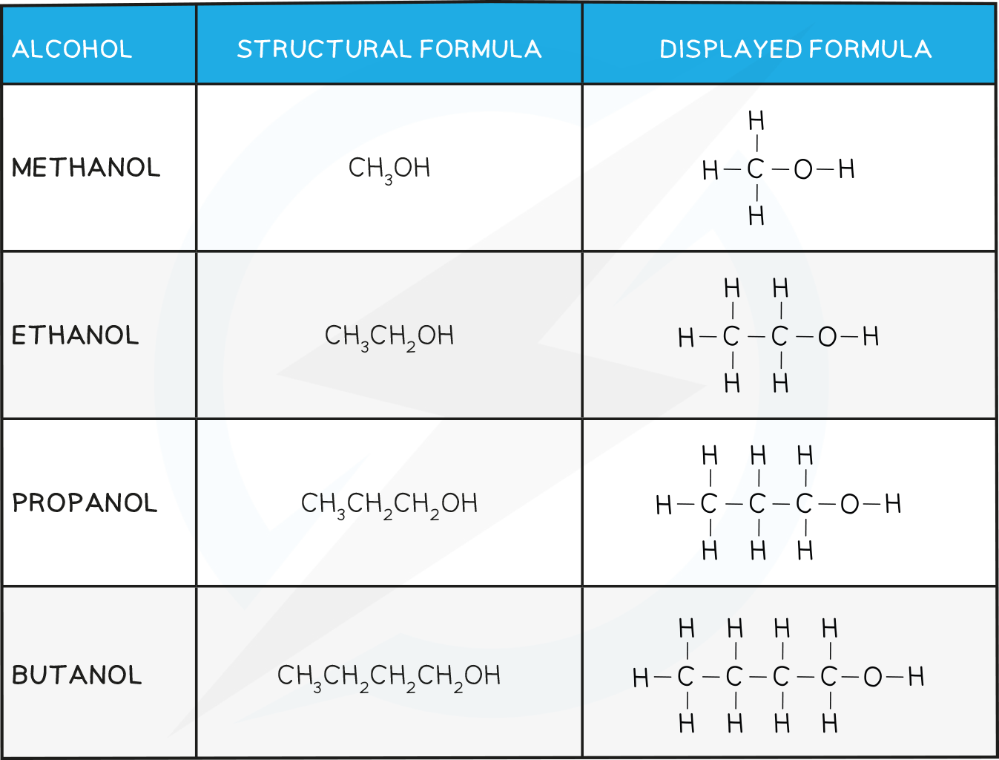

Classifying Alcohols
--------------------

* <b>Alcohols</b> are a family of molecules that contain the <b>hydroxyl functional group</b>, <b>-OH</b>
* Their general formula is  <b>C</b><b>n</b><b>H</b><b>2n+1</b><b>OH</b>
* The nomenclature of alcohols follows the pattern<b> alkan + ol</b>
* If there are two <b>-OH</b> groups present the molecule is called a <b>diol</b>

#### The first four Alcohols and their Structures Table

* Alcohols are classified as <b>primary, secondary</b> or <b>tertiary</b> depending on the number of carbons attached to the<b> functional group</b> carbon

  + <b>Primary</b> <b>alcohols</b> are alcohols in which the carbon atom bonded to the -OH group is attached to <b>one</b> other carbon atom (or alkyl group)
  + <b>Secondary</b> <b>alcohols</b> are alcohols in which the carbon atom bonded to the -OH group is attached to <b>two</b> other carbon atoms (or alkyl groups)
  + <b>Tertiary</b> <b>alcohols</b> are alcohols in which the carbon atom bonded to the -OH group is attached to <b>three</b> other carbon atoms (or alkyl groups)

<i><b>Classifying primary, secondary and tertiary alcohols and alcohols with more than one alcohol group</b></i>