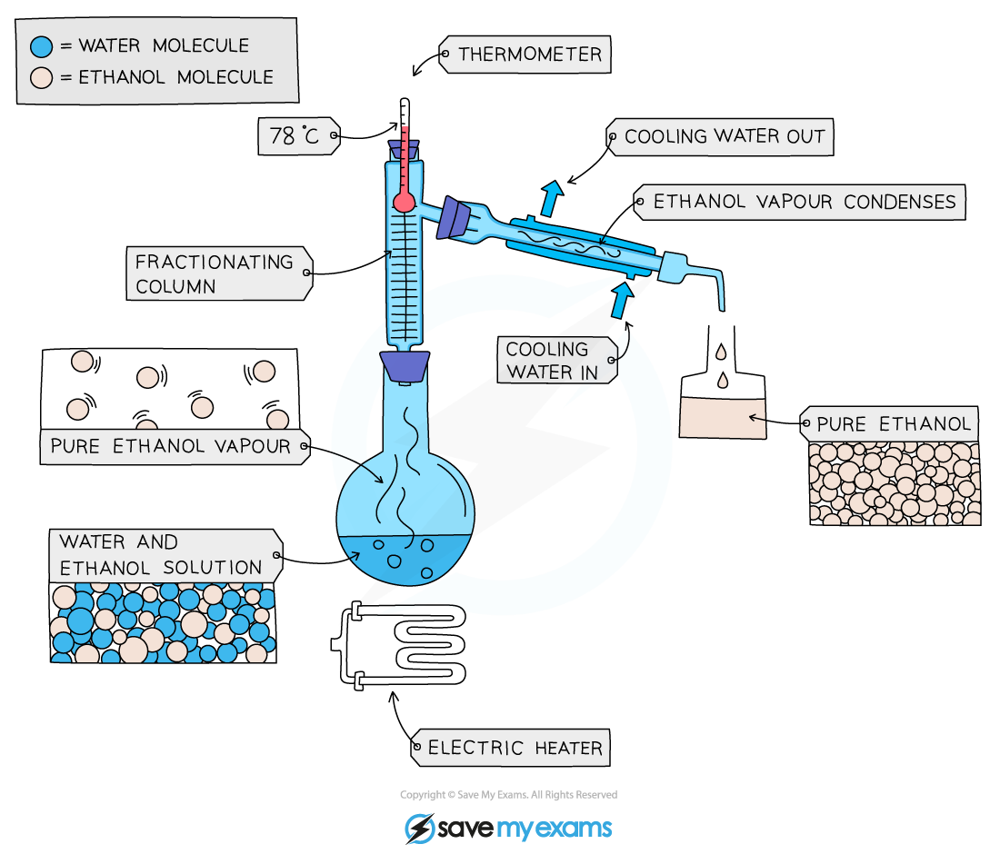
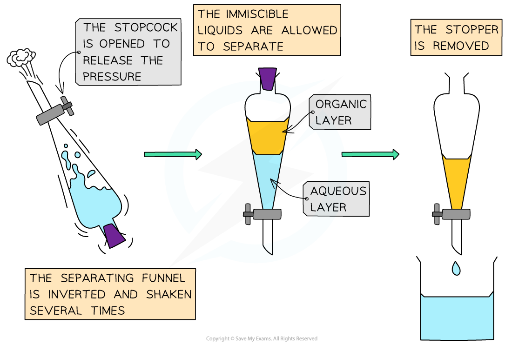

Organic Liquid Preparation & Purification
-----------------------------------------

#### Simple Distillation

* This is used to separate a liquid and <b>soluble solid</b> from a solution (e.g. water from a solution of salt water) or a pure liquid from a mixture of liquids
* The solution is heated, and pure water evaporates producing a vapour which rises through the neck of the round bottomed flask
* The vapour passes through the condenser, where it cools and condenses, turning into the pure liquid that is collected in a beaker
* After all the water is evaporated from the solution, only the solid solute will be left behind

<i><b>Diagram showing the distillation of a mixture of salt and water</b></i>

#### Fractional Distillation

* This is used to separate two or more liquids that are <b>miscible</b> with one another (e.g., ethanol and water from a mixture of the two)
* The solution is heated to the temperature of the substance with the lowest boiling point
* This substance will rise and evaporate first, and vapours will pass through a condenser, where they cool and condense, turning into a liquid that will be collected in a beaker
* All of the substance is evaporated and collected, leaving behind the other components(s) of the mixture
* For water and ethanol

  + Ethanol has a boiling point of 78 ºC and water of 100 ºC
  + The mixture is heated until it reaches 78 ºC, at which point the ethanol boils and distills out of the mixture and condenses into the beaker
* When the temperature starts to increase to 100 ºC heating should be stopped. Water and ethanol are now separated

<i><b>Fractional distillation of a mixture of ethanol and water</b></i>

#### Solvent Extraction

* This method uses a solvent to remove a desired organic product from a reaction mixture
* Various solvents can be used but the solvent should have the following features:

  + Immiscible (does not mix) with the solvent containing the desired organic product
  + The desired organic product should be much more soluble than the added solvent
* The process is summarised as follows

  + Place the reaction mixture in a separating funnel and add the chosen solvent forming a separate layer
  + Place a stopper in the neck of the funnel and gently shake the contents of the funnel for a while
  + Allow the contents of the funnel to settle into two layers
  + Remove the stopper and open the tap to allow the lower layer to drain into a flask
  + Pour the remaining layer into a clean dry conical flask and add two spatulas of anhydrous magnesium sulfate

    - This will remove water
    - It should be added until there is no further clumping and it can then be removed by gravity filtration

<b>Process of solvent extraction</b>

* Using smaller volumes of solvent in stages is more efficient at removing the desired organic product compared to using the same volume in one portion

#### Crystallisation

* Used to separate a <b>dissolved solid</b> from a solution, when the solid is much more soluble in hot solvent than in cold (e.g., copper sulphate from a solution of copper (II) sulphate in water)
* The solution is heated, allowing the solvent to evaporate, leaving a saturated solution behind
* Test if the solution is saturated by dipping a clean, dry, cold glass rod into the solution

  + If the solution is saturated, crystals will form on the glass rod
* The saturated solution is allowed to cool slowly
* Crystals begin to grow as solids will come out of solution due to decreasing solubility
* The crystals are collected by filtering the solution, they are washed with cold distilled water to remove impurities and are then allowed to dry

<i><b>Diagram showing the process of crystallisation</b></i>

#### Boiling point determination

* A liquids purity can be determined by measuring its boiling point
* Impurities present in the liquid will raise its boiling temperature
* The boiling points of pure organic compounds have been carefully measured and are widely available in data books and online
* The measured boiling point can be compared to the data book value to determine how pure the compound is