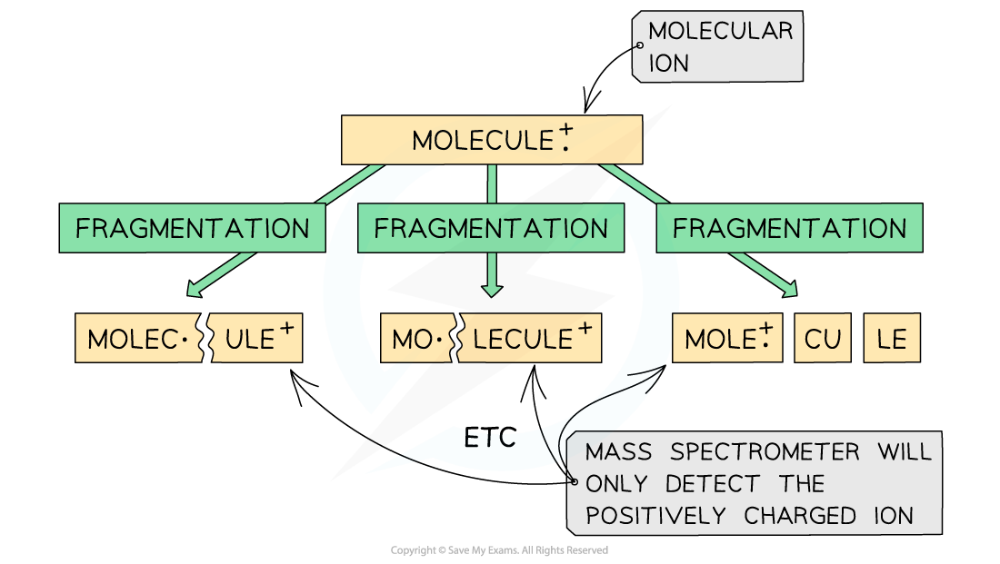
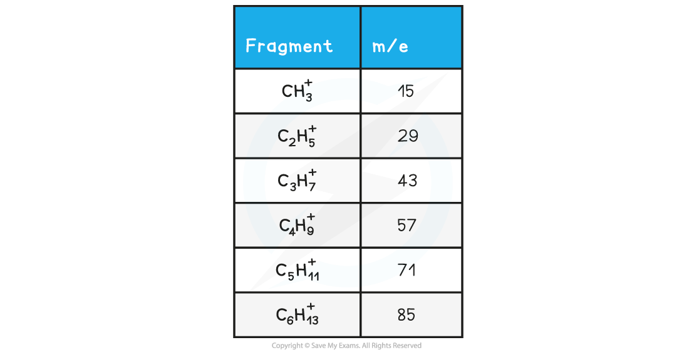
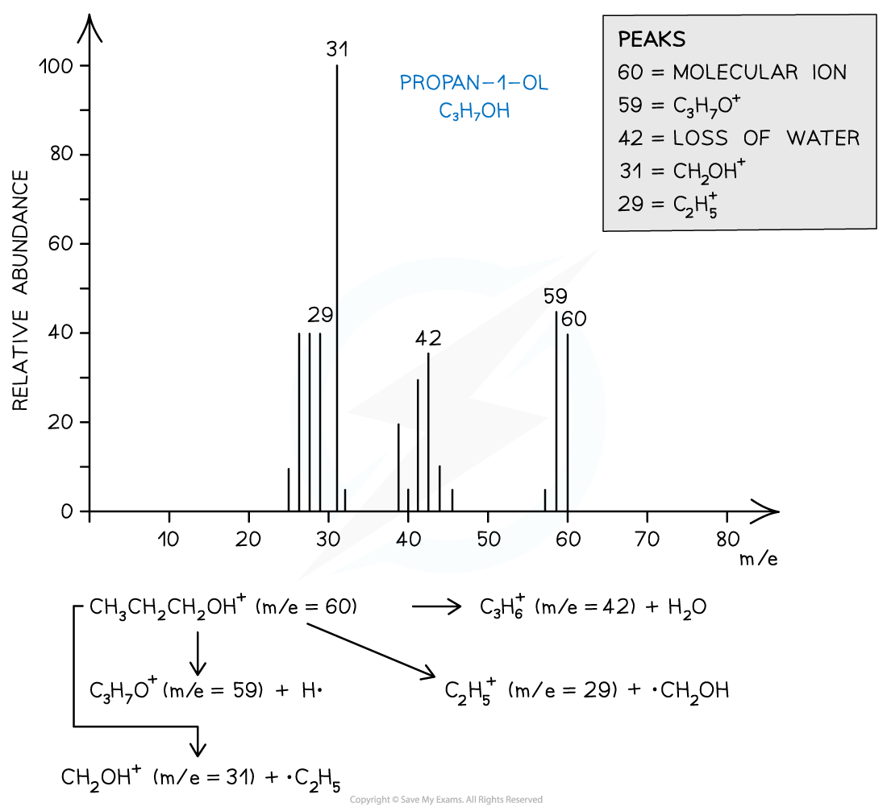

Mass Spectrometry
-----------------

* <b>Mass spectroscopy </b>is an analytical technique used to identify unknown compounds
* The molecules in the small sample are <b>bombarded</b> with high energy electrons which can cause the molecule to lose an electron
* This results in the formation of a positively charged <b>molecular</b> <b>ion</b> with one unpaired electron

  + One of the electrons in the pair has been <b>removed</b> by the beam of electrons

* The <b>[M+1] </b>peak is a smaller peak which is due to the natural abundance of the isotope carbon-13
* The amount of naturally occurring C-13 is a little over 1%, so the [M+1] peak is very small
* The height of the [M+1] peak for a particular ion depends on how many carbon atoms are present in that molecule; the more carbon atoms, the larger the [M+1] peak is

  + For example, the height of the [M+1] peak for an hexane (containing six carbon atoms) ion will be greater than the height of the [M+1] peak of an ethane (containing two carbon atoms) ion

#### Worked Example

<b>Analysing mass spectra</b>

Determine whether the following mass spectrum corresponds to but-1-ene or pent-1-ene:

<b>Answer</b>

* The mass spectrum corresponds to pent-1-ene as the molecular ion peak is at <i>m/z</i> = 70

  + The small peak at m/z = 71 is a C-13 peak, which does not count as the molecular ion peak
  + But-1-ene arises from the C4H8+ ion which has a molecular mass of 56
  + Pent-1-ene arises from the C5H10+ ion which has a molecular mass of 70

* The molecular ion can further <b>fragment </b>to form new ions, molecules, and radicals

<i><b>Fragmentation of a molecule in mass spectroscopy</b></i>

* These <b>fragmented</b> ions are <b>accelerated </b>by an electric field
* Based on their mass (<i><b>m</b></i>) to charge (<i><b>z</b></i>) ratio, the ion fragments are then separated by deflecting them into the <b>detector</b>

  + Most ions will only gain a charge of 1+ and therefore a ion with mass 12 and charge 1+ will have an <i>m/z</i> value of 12
  + It is, however, possible for a greater charge to occur. For example, an ion with mass 16 and charge 2+ will have a <i>m/z</i> value of 8
* The smaller and more positively charged fragment ions will be <b>detected</b> first as they will get <b>deflected</b> the most and are more attracted to the <b>negative</b> <b>pole</b> of the magnet
* Each fragment corresponds to a specific <b>peak</b> with a particular <i>m/z </i>value in the mass spectrum
* The <b>base peak </b>is the peak corresponding to the most <b>abundant</b> ion
* The <i>m/z</i> is sometimes referred to as the <i>m/e </i>ratio and it is almost always <b>1:1</b>

#### Isotopes

* Isotopes are different atoms of the <b>same</b> <b>element</b> that contain the same number of <b>protons</b> and <b>electrons</b> but a different number of <b>neutrons</b>.

  + These are atoms of the same <b>elements </b>but with different mass number
  + For example, Cl-35 and Cl-37 are isotopes as they are both atoms of the same element (chlorine, Cl) but have a different mass number (35 and 37 respectively)
* Mass spectroscopy can be used to find the <b>relative abundance </b>of the isotopes experimentally
* The <b>relative abundance </b>of an isotope is the proportion of one particular isotope in a mixture of isotopes found in nature

  + For example, the relative abundance of Cl-35 and Cl-37 is 75% and 25% respectively
  + This means that in nature, 75% of the chlorine atoms is the Cl-35 isotope and 25% is the Cl-37 isotope
* The <b>heights</b> of the peaks in mass spectroscopy show the proportion of each isotope present

<i><b>The peak heights show the relative abundance of the boron isotopes: boron-10 has a relative abundance of 19.9% and boron-11 has a relative abundance of 80.1%</b></i>

#### Worked Example

<b>Calculating m/z ratio</b>

In a sample of iron, the ions 54Fe2+ and 56Fe3+ are detected. Calculate their m/z ratio and determine which ion is deflected more inside the spectrometer.

<b>Answer</b>

* 56Fe3+ has a smaller <i>m/z</i> ratio and will therefore be deflected more.

  + It also has the largest positive charge and will be more attracted to the negative pole of the magnet within the mass spectrometer.

#### Examiner Tips and Tricks

A small <i>m/z </i>value corresponds to fragments that are either <b>small </b>or have a <b>high positive charge </b>or a combination of <b>both</b>.

#### Fragmentation

* The molecular ion peak can be used to identify the <b>molecular mass</b> of a compound
* However, different compounds may have the same molecular mass
* To further determine the structure of the unknown compound, <b>fragmentation </b>is used
* Fragments may appear due to the formation of <b>characteristic</b> <b>fragments</b> or the <b>loss</b> <b>of</b> <b>small</b> <b>molecules</b>

  + For example, a peak at 29 is due to the characteristic fragment C2H5+­­
  + Loss of small molecules give rise to peaks at 18 (H2O), 28 (CO), and 44 (CO2)

#### Alkanes

* Simple alkanes are fragmented in mass spectroscopy by breaking the C-C bonds
* <i><b>M/e </b></i>values of some of the common alkane fragments are given in the table below

<i><b>m/e</b></i><b> Values of Fragments Table</b>

<i><b>Mass spectrum showing the fragmentation of C</b></i><i><b>10</b></i><i><b>H</b></i><i><b>22</b></i>

#### Halogenoalkanes

* Halogenoalkanes often have multiple peaks around the molecular ion peak
* This is caused by the fact that there are different isotopes of the halogens

<i><b>Mass spectrum showing different isotopes of bromine in the molecular ion</b></i>

#### Alcohols

* Alcohols often tend to lose a <b>water molecule </b>giving rise to a peak at <b>18 below the molecular ion</b>
* Another common peak is found at <i>m/e </i>value 31 which corresponds to the CH2OH+­­ fragment
* For example, the mass spectrum of propan-1-ol shows that the compound has fragmented in four different ways:

  + Loss of H• to form a C3H7O+ fragment with <i>m/e</i> = 59
  + Loss of a water molecule to form a C3H6+ fragment with <i>m/e</i> = 42
  + Loss of a •C2H5 to form a CH2OH+ fragment with <i>m/e</i> = 31
  + And the loss of •CH2OH to form a C2H5+ fragment with <i>m/e</i> = 29

<i><b>Mass spectrum showing the fragmentation patterns in propan-1-ol (alcohol)</b></i>

#### Worked Example

<b>Ion fragmentation</b>

Which of the following statements about the mass spectrum of CH3Br is correct?

<b>   A</b>. There is one peak for the molecular ion with an m/e value of 44

<b>   B</b>. There is one peak for the molecular ion with an m/e value of 95

<b>   C</b>. The last two peaks have abundances in the ratio 3:1 and occur at m/e values of 94 and 96

<b>   D</b>. The last two peaks are of equal size and occur at m/e values of 94 and 96

<b>Answer</b>

The correct answer is option <b>D</b>

* Bromomethane (CH3Br) can produce 3 peaks

  + CH381Br → [CH381Br]+ + e− at m/e 96
  + CH379Br → [CH379Br]+ + e− at m/e 94
  + CH3Br → [CH3]+ + •Br at m/e 15
  + The last two peaks (which correspond to the molecular ion peak) therefore are equal in size and occur at <i>m/e</i> values of 94 and 96

#### Worked Example

<b>Alcohol fragmentation</b>

Which alcohol is not likely to have a fragment ion at m/e at 43 in its mass spectrum?

<b>A</b>. (CH3)2CHCH2OH

<b>B</b>. CH3CH(OH)CH2CH2CH3

<b>C</b>. CH3CH2CH2CH2OH

<b>D</b>. CH3CH2CH(OH)CH3

<b>Answer</b>

The correct answer is option <b>D</b>

* Because a line at m/e = 43 corresponds to an ion with a mass of 43 for example:

  + [CH3CH2CH2]+
  + [(CH3)2CH]+
  + 2-butanol is not likely to have a fragment at m/e = 43 as it does not have either of these fragments in its structure.