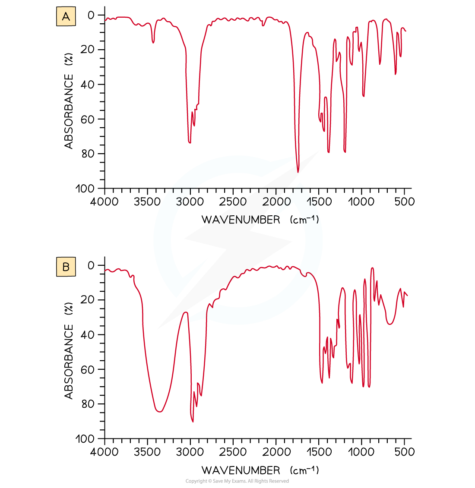

Interpreting an IR Spectrum
---------------------------

* <b>Infrared (IR) spectroscopy </b>is a technique used to identify compounds based on changes in <b>vibrations</b> of atoms when they <b>absorb</b> IR of certain <b>frequencies</b>
* A <b>spectrophotometer </b>irradiates the sample with electromagnetic waves in the infrared region and then detects the <b>intensity</b> of the wavelength of IR radiation which goes through the sample
* All organic molecules absorb IR radiation and depending on which energies of radiation are absorbed, bonds between atoms will vibrate by <b>stretching</b>, <b>bending </b>and <b>twisting</b>
* The molecules will only vibrate at a specific frequency
* The <b>resonance frequency </b>is the specific frequency at which the molecules will vibrate to stimulate larger vibrations
* Depending on the rest of the molecule, each vibration will absorb specific wavelengths of IR radiation which are also shown as the <b>reciprocal </b>of the wavelength

  + This unit is called the <b>wavenumber </b>(cm-1)
* Particular absorbance have characteristic <b>widths </b>(broad or sharp) and <b>intensities </b>(strong or weak)

  + For example, hydrogen bonds cause the O-H bonds in alcohols and carboxylic acids to be <b>broad</b> whereas the C-O bond in carbonyl (C=O) groups have a strong, sharp absorbance peak
* The energies absorbed by different functional groups are given as a range and an unknown compound can be identified by comparing its IR spectrum to the IR spectrum of a known compound

| <b>Bond</b> | <b>Functional groups containing the bond</b> | <b>Characteristic infrared absorption range</b> <b>Wavenumber (cm</b><b>-1</b><b>)</b> |
| --- | --- | --- |
| <b>C–H</b> <b>(stretching)</b> | Alkane Alkene Alkyne Arene Aldehyde | 2962 - 2853 3095 - 3010 3300 3030 2900-2820 and 2775 - 2700 |
| <b>C–H</b> <b>(bending)</b> | Alkane Arene (5 adjacent H) Arene (4 adjacent H) Arene (3 adjacent H) Arene (2 adjacent H) Arene (1 adjacent H) | 1485 - 1365 750 and 700 750 780 830 880 |
| <b>N–H</b> <b>(stretching)</b> | Amine Amide | 3500 - 3300 3500 - 3140 |
| <b>O–H</b> <b>(stretching)</b> | Alcohols and phenols Carboxylic acids | 3750 - 3200 3300 - 2500 |
| <b>C=C</b> <b>(stretching)</b> | Isolated alkene Arene | 1669 - 1645 1600, 1580, 1500, 1450 |
| <b>C=O</b> <b>(stretching)</b> | Aldehydes, saturated alkyl Ketones, alkyl Ketones, aryl Carboxylic acids, alkyl Carboxylic acids, aryl Carboxylic acids, anhydrides Acyl halides, chlorides Acyl halides, bromides Esters, saturated Amides | 1740 - 1720 1720 - 1700 1700 - 1680 1725 - 1700 1700 - 1680 1850 - 1800 and 1790 - 1740 1795 1810 1750 - 1735 1700 - 1630 |
| <b>C</b><math><semantics><mo>≡</mo><annotation>{"language":"en","fontFamily":"Times New Roman","fontSize":"18","autoformat":true}</annotation></semantics></math><b>N</b> <b>(stretching)</b> | Nitrile | 2260 - 2215 |
| <b>C</b><math><semantics><mo>≡</mo><annotation>{"language":"en","fontFamily":"Times New Roman","fontSize":"18","autoformat":true}</annotation></semantics></math><b>C</b> <b>(stretching)</b> | Alkyne | 2260 - 2100 |

#### Worked Example

<b>Analysing IR Spectra</b>

Look at the two infrared spectra below and determine which one corresponds to propanone and which one to propan-2-ol

<b>Answer</b>

* IR spectrum <b>A</b> is <b>propanone </b>and spectrum <b>B</b> is <b>propan-2-ol</b>.

  + In IR spectrum <b>A </b>the presence of a strong, sharp absorption around 1710 cm-1 corresponds to the characteristic C=O, carbonyl, group in a ketone.
  + In spectrum <b>B</b> the presence of a strong, broad absorption around 3200-3500 cm-1 suggests that there is an alcohol group present, which corresponds to the -OH group in propan-2-ol.