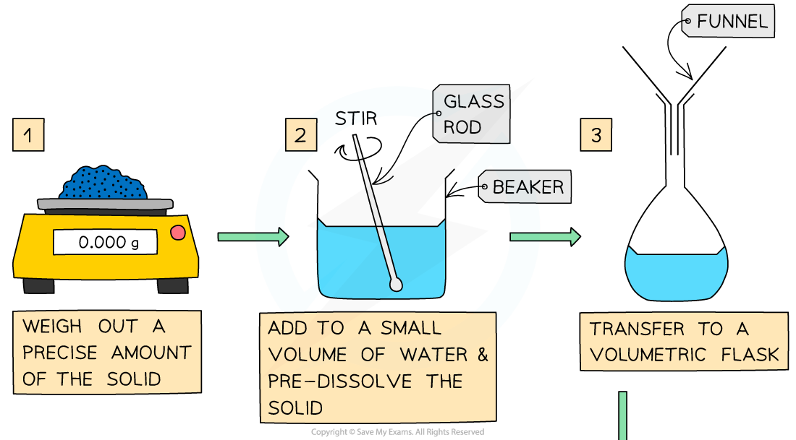
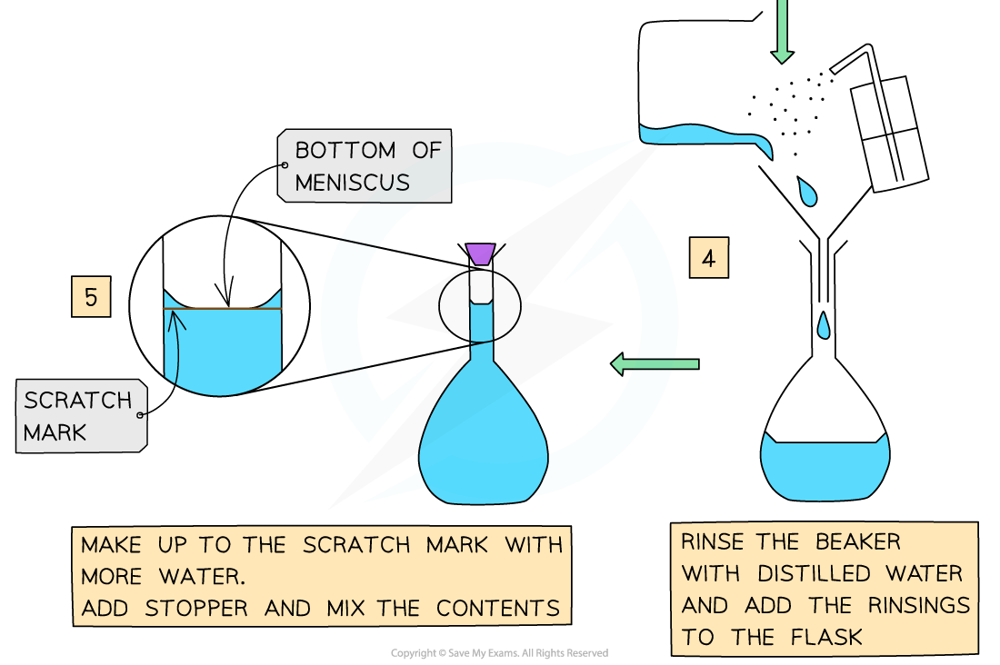

Core Practical 2: Preparing a Standard Solution
-----------------------------------------------

#### Volumetric Analysis

* <b>Volumetric analysis</b> is a process that uses the volume and concentration of one chemical reactant (<b>a volumetric solution</b>) to determine the concentration of another unknown solution
* The technique most commonly used is a <b>titration</b>
* The volumes are measured using two precise pieces of equipment, a <b>volumetric </b>or<b> graduated pipette </b>and a <b>burette</b>
* Before the titration can be done, the standard solution must be prepared
* Specific apparatus must be used both when preparing the standard solution and when completing the titration, to ensure that volumes are measured precisely

<i><b>Some key pieces of apparatus used to prepare a volumetric solution and perform a simple titration </b></i>

1. Beaker
2. Burette
3. Volumetric Pipette
4. Conical Flask
5. Volumetric Flask

#### Making a Volumetric Solution

* Chemists routinely prepare solutions needed for analysis, whose concentrations are known precisely
* These solutions are termed <b>volumetric solutions</b> or <b>standard solutions</b>
* They are made as accurately and precisely as possible using three decimal place balances and volumetric flasks to reduce the impact of measurement uncertainties
* The steps are:

#### Volumes & concentrations of solutions

* The <b>concentration </b>of a solution is the amount of <b>solute </b>dissolved in a <b>solvent</b> to make 1 dm3 of  <b>solution</b>

  + The solute is the substance that dissolves in a solvent to form a solution
  + The solvent is often water
* A <b>concentrated </b>solution is a solution that has a <b>high </b>concentration of solute
* A <b>dilute </b>solution is a solution with a <b>low </b>concentration of solute
* Concentration is usually expressed in one of three ways:

  + moles per unit volume
  + mass per unit volume
  + parts per million

#### Worked Example

Calculate the mass of sodium hydroxide, NaOH, required to prepare 250 cm3 of a 0.200 mol dm-3 solution

<b>Answer:</b>

<b>Step 1</b>: Find the number of moles of NaOH needed from the concentration and volume:

* <i>number of moles  = concentration (mol dm</i><i>-3</i><i>) x volume (dm</i><i>3</i><i>)  </i>

  + n = 0.200 <i>mol dm</i><i>-3</i> x 0.250 <i>dm</i><i>3</i>
  + n = <b>0.0500 mol</b>

<b>Step 2</b>: Find the molar mass of NaOH

* <i>M</i> = 22.99 + 16.00 + 1.01 = 40.00 g mol-1

<b>Step 3</b>: Calculate the mass required

* mass = moles x molar mass

  + mass =  0.0500 mol x 40.00 g mol-1   = <b>2.00 g</b>