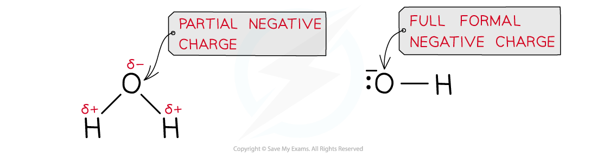

Core Practical 4: Investigating Halogenoalkane Hydrolysis
---------------------------------------------------------

* Halogenoalkanes can be <b>hydrolysed </b>with an <b>aqueous</b> solution of sodium hydroxide (NaOH) or potassium hydroxide (KOH)
* This reaction is very slow at room temperature, so the reaction mixture is warmed
* The rate of this reaction depends on the type of halogen in the halogenoalkane

  + The stronger the C-X bond, the slower the rate of the reaction
  + In terms of bond enthalpy, C-F > C-Cl > C-Br > C-I
  + Fluoroalkanes do not react at all, but iodoalkanes have a very fast rate of reaction

<i><b>The halogen is replaced by the nucleophile, OH</b></i><i><b>-</b></i><i><b> </b></i>

* This reaction could also be done with water as the nucleophile, but it is very slow

  + The hydroxide ion is a better nucleophile than water as it carries a full negative charge
  + In water, the oxygen atom only carries a partial charge

<i><b>A hydroxide ion is a better nucleophile as it has a full formal negative charge whereas the oxygen atom in water only carries a partial negative charge; this causes the nucleophilic substitution reaction with water to be much slower than the aqueous alkali</b></i>

#### Measuring the rate of hydrolysis

* Acidified silver nitrate can be used to measure the rate of hydrolysis of halogenoalkanes
* Set up three test tubes in a 50 oC water bath, with a mixture of ethanol and acidified silver nitrate
* Add a few drops of a chloroalkane, bromoalkane and an iodoalkane to each test tube and start a stop watch
* Time how long it takes for the precipitates to form
* The precipitate will form as the reaction progresses and the halide ions are formed
* A white precipitate will form from the chloroalkane, a cream precipitate will form from the bromoalkane and a yellow precipitate will form from the iodoalkane

  + The yellow precipitate will form the fastest
  + This is because the C-I bond has the lowest bond enthalpy, so it is the easiest to break and will cause the I- ions to form the fastest
  + The white precipitate will form the slowest
  + This is because the C-Cl bond has the highest bond enthalpy, so it is the hardest to break and will cause the Cl- ions to form the slowest