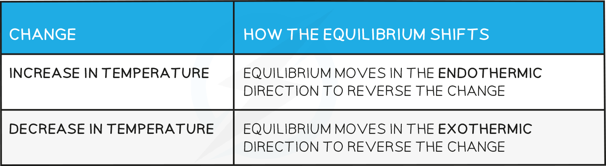

Temperature & the Equilibrium Constant
--------------------------------------

* Changes in temperature <b>change </b>the equilibrium constants <i>K</i><i>c</i><i> </i>and <i>K</i><i>p</i>
* For an endothermic reaction such as:

   An increase in temperature:

   [H2] and [I2] <b>increases</b>

   [HI] <b>decreases</b>

   Because [H2] and [I2] are <b>increasing</b> and [HI] is <b>decreasing</b>, the equilibrium constant <b>increases</b>

* For an exothermic reaction such as:

   An increase in temperature:

   [SO3] <b>decreases</b>

   [SO2] and [O2] <b>increases</b>

   Because [SO3] <b>decreases</b> and [SO2] and [O2] <b>increases </b>the equilibrium constant  decreases

#### Worked Example

<b>Factors which increase </b><i><b>K</b></i><i><b>p </b></i><b>value:</b>

What will increase the value of Kp of the following equilibrium?

2A (g) + B (g)  ⇌  2C (g)       ΔH = +6.5 kJ mol-1 

<b>Answer</b>

* Only temperature changes permanently affect the value of <i>K</i><i>p</i>

  + An increase in temperature shifts the reaction in favour of the products.
  + The [ products ] increases and [ reactants ] decreases, therefore, the <i>K</i><i>p </i>value increases.

Temperature & the Equilibrium Position
--------------------------------------

* How the equilibrium shifts with temperature changes:

<b>Effect on the value of the equilibrium constant</b>

* For a reaction that is exothermic in the forward direction, increasing the temperature pushes the equilibrium from right to left
* Therefore, the value of the equilibrium constant<i> </i>will decrease as the ratio of [ products ] to [ reactants ] decreases
* Conversely, if the temperature is raised in an endothermic reaction, the value of the equilibrium constant<i> </i>will increase

Changing Reaction Conditions
----------------------------

* If all other conditions stay the same, the equilibrium constant<i> K</i><i>c</i> is <b>not affected</b> by any changes in concentration of the reactants or products
* For example, the decomposition of hydrogen iodide:

<b>2HI ⇌ H</b><b>2</b><b> + I</b><b>2</b>

   The equilibrium expression is:

   Adding more HI makes the ratio of [ products ] to [ reactants ] smaller

To restore equilibrium, [H2] and [I2] increases and [HI] decreases

Equilibrium is restored when the ratio is 6.25 x 10-3 again

#### Changes in pressure

* A change in pressure <b>only </b>changes the <b>position</b> <b>of the equilibrium</b>
* If all other conditions stay the same, the equilibrium constant<i> K</i><i>c</i> is <b>not affected </b>by any changes in pressure of the reactants and products
* The value of <i>K</i><i>p </i>is not affected by any changes in pressure.
* Changes in pressure cause a shift in the position of equilibrium to a new position which restores the value of <i>K</i><i>p </i>
* This is analogous to what happens to <i>K</i><i>c </i>when you change concentration in an aqueous equilibrium; a shift restores equilibrium to a new position maintaining <i>K</i><i>c</i>

#### Presence of a catalyst

* If all other conditions stay the same, the equilibrium constants<i> K</i><i>p</i><i> </i>and <i>K</i><i>c</i> are <b>not affected </b>by the presence of a catalyst
* A catalyst speeds up both the forward and reverse reactions at the same rate so the ratio of  [ products ] to [ reactants ] remains unchanged
* Catalysts only cause a reaction to reach equilibrium <b>faster</b>
* Catalysts, therefore, have <b>no effect </b>on the <b>position of the equilibrium </b>once this is reached

#### Worked Example

Hydrogen iodide is formed in the gas phase by the reaction of hydrogen and iodine:

H2 (g) + I2 (g)<math><semantics><mo>⇌</mo><annotation>{"language":"en","fontFamily":"Times New Roman","fontSize":"18","autoformat":true}</annotation></semantics></math>2HI (g)

The equilibrium constants at two different temperatures are related by the following expression:

<math><semantics><mi>ln</mi><mfenced><mfrac><msub><mi>K</mi><mn>2</mn></msub><msub><mi>K</mi><mn>1</mn></msub></mfrac></mfenced><mo>=</mo><mfrac><mrow><mo>∆</mo><mi>H</mi></mrow><mi>R</mi></mfrac><mfenced><mrow><mfrac><mn>1</mn><msub><mi>T</mi><mn>1</mn></msub></mfrac><mo>-</mo><mfrac><mn>1</mn><msub><mi>T</mi><mn>2</mn></msub></mfrac></mrow></mfenced><annotation>{"language":"en","fontFamily":"Times New Roman","fontSize":"18","autoformat":true}</annotation></semantics></math>

At 763 K, the equilibrium constant <i>K</i>1 is 45.9. The enthalpy change for the reaction is Δ<i>H</i> = -26 500 J mol-1.

Calculate the value of the equilibrium constant <i>K</i>2 for this reaction at 718 K.  [Use the value of R= 8.31 J mol-1 K-1]

<b>Answer:</b>

<math><semantics><mrow><mi>ln</mi><mo>[</mo><mfrac><msub><mi>K</mi><mn>2</mn></msub><msub><mi>K</mi><mn>1</mn></msub></mfrac><mo>]</mo><mo>=</mo><mfrac><mrow><mo>∆</mo><mi>H</mi></mrow><mi>R</mi></mfrac><mo>[</mo><mfrac><mn>1</mn><msub><mi>T</mi><mn>1</mn></msub></mfrac><mo>-</mo><mfrac><mn>1</mn><msub><mi>T</mi><mn>2</mn></msub></mfrac><mo>]</mo></mrow><annotation>{"language":"en","fontFamily":"Times New Roman","fontSize":"18","autoformat":true}</annotation></semantics></math>

<math><semantics><mi>ln</mi><mo>[</mo><mfrac><msub><mi>K</mi><mn>2</mn></msub><mrow><mn>45</mn><mo>.</mo><mn>9</mn></mrow></mfrac><mo>]</mo><mo>=</mo><mfrac><mrow><mo>-</mo><mn>26</mn><mo> </mo><mn>500</mn></mrow><mrow><mn>8</mn><mo>.</mo><mn>31</mn></mrow></mfrac><mo>[</mo><mfrac><mn>1</mn><mn>763</mn></mfrac><mo>-</mo><mfrac><mn>1</mn><mn>718</mn></mfrac><mo>]</mo><annotation>{"language":"en","fontFamily":"Times New Roman","fontSize":"18","autoformat":true}</annotation></semantics></math>

<math><semantics><mrow><mi>ln</mi><mo>[</mo><mfrac><msub><mi>K</mi><mn>2</mn></msub><mrow><mn>45</mn><mo>.</mo><mn>9</mn></mrow></mfrac><mo>]</mo><mo>=</mo><mn>0</mn><mo>.</mo><mn>26194</mn></mrow><annotation>{"language":"en","fontFamily":"Times New Roman","fontSize":"18","autoformat":true}</annotation></semantics></math>

<math><semantics><mfrac><msub><mi>K</mi><mn>2</mn></msub><mrow><mn>45</mn><mo>.</mo><mn>9</mn></mrow></mfrac><mo>=</mo><mo> </mo><msup><mi>e</mi><mrow><mn>0</mn><mo>.</mo><mn>26194</mn></mrow></msup><annotation>{"language":"en","fontFamily":"Times New Roman","fontSize":"18","autoformat":true}</annotation></semantics></math>

<math><semantics><msub><mi>K</mi><mn>2</mn></msub><mo> </mo><mo>=</mo><mo> </mo><mn>45</mn><mo>.</mo><mn>9</mn><mo> </mo><mo>×</mo><mo> </mo><mn>1</mn><mo>.</mo><mn>2995</mn><mo> </mo><mo>=</mo><mn>59</mn><mo>.</mo><mn>64</mn><annotation>{"language":"en","fontFamily":"Times New Roman","fontSize":"18","autoformat":true}</annotation></semantics></math>

* This is an exothermic reaction, so you would expect a decrease temperature to cause the equilibrium to shift to the right. This is borne out by seeing an increase in the value of <i>K</i> as the temperature decreases

#### Examiner Tips and Tricks

* In exams, you do not need to know the equation in this worked example
* You will be given this equation if you are expected to work with it